# curso-java-1

## Links úteis

[Atalhos no Eclipse](keyboard-eclipse.md)

[Github Nelio Alves](https://github.com/acenelio)

[URI Online Judge](https://www.urionlinejudge.com.br/judge/en/login)


## Seção 1: Introdução

### 1. Introdução: visão geral do curso

* Profissional Java
	* Fundamentos
		* Lógica de programação
			* Estrutura de dados
			* Programação Orientada a objetos
		* Banco de dados
		* Análise e Design de Sistemas
	* Comercial
		* Backend
		* Web
		* Mobile
		* Desktop

* Assuntos abordados
  * Lógica de Programação e Algoritmo usando Java
    * Conceitos de programação
    * Introdução à linguagem Java
    * Estrutura sequencial
    * Estrutura condicional
    * Estruturas repetitivas
  * Java e Programação Orientada a Objetos (Parte 1)
    * Introdução à programação Orientada a Objetos
    * Construtores, palavra *this*, sobrecarga e encapsulamento
    * Comportamento de memória, array, listas
    * Tópicos especiais em Java
    * *Bônus* - Nivelamento sobre Git e Github
    * Enumeração, composição
    * Herança e polimorfismo
    * Tratamento de exceções
  * Projeto - Sistema Jogo de Xadrez
    * Composição de objetos, herança, coleções, etc.
    * Desenvolvemento em camadas
    * Padrões de projetos
  * Java e Programação Orientada a Objetos (parte 2) + Programação Funcional (lambda)
    * Trabalhando com arquivos
    * Interfaces
    * Generics, Set, map
    * Programação funcional e expressões lambda
    * *Bônus* - Nivelamento Álgebra Relacional, SQL, MySQL
    * Acesso a banco de dados com JDBC
    * Interface Gráfica com JavaFX
  * Projeto - Aplicação desktop com JavaFX e banco de dados MySQL com JDBC
    * Padrão MVC - Model View Controller
    * Padrão Camadas
    * FXML, SceneBuilder
    * Tratamento de eventos de UI
    * CRUD completo
    * Padrão de projetos
  * Projeto - Web Services com Spring Boot e JPA / Hibernate
    * *Bônus* - Nivelamento ORM com JPA / Hibernate
    * Padrão camadas
    * Web e HTTP
    * REST / Web Services
    * Modelo de domínio complexo
    * Maven
    * Banco de dados H2
    * Spring Data JPA
    * CRUD completo
    * Tratamento de exceções
  * Projeto - Web Services com Spring Boot e NoSQL (MongoDB)
    * *Bônus* - Nivelamento NoSQL e MongoDB
    * Modelo de domínio: agregados e desnormalização
    * Padrão DTO
    * Spring Data MongoDB
    * CRUD complemento
    * Tratamento de exceções

[Arquivo Curso Java Completo](PDFs/Aula%20001%20-%20Curso%20Java%20Completo.pdf)

## Seção 2: Conceitos de programação

### 2. Visão geral do capítulo

### 3. Material de apoio do capítulo

[Material do capítulo](PDFs/Aula%20003%20-%20Conceitos%20de%20programação.pdf)

### 4. Algoritmo, Automação, Programa de Computador

* **Algoritmo** - Sequência finita de instruções para se resolver um problema. Este conceito aplica-se a diversas áreas do conhecimento.

* **Automação** - Consiste em utilizar máquina(s) para executar o procedimento desejado de forma automática ou semiautomática.

* **Computador** - É composto de *Hardware* e *Software*
    * **Hardware** - Parte física, a máquina em si.
    * **Software** - Parte lógica, que são os programas:
        * **Sistema Operacional** - Windows, linux, iOS, ...
        * **Aplicativos** - apps de escritório, apps de câmera, navegador web, ...
        * **Jogos**
        * **Utilitários** - Antivirus, compactador de arquivos
        * **entre outros**

* **Programas** - São *Algoritmos* executados pelo computador. Assim podemos dizer que o computador é uma máquina que *automatiza* a execução de algoritmos computacionais, como por exemplo, processamento de dados, cálculos, etc.

### 5. O que é preciso para se fazer um programa de computador

* Para construir um programa de computador nós vamos precisar:
    * Uma **linguagem de programação**: regras **léxicas** e **sintáticas** para se escrever o programa.
    * Uma **IDE**: Software para editar e testar o programa
    * Um **compilador**: software para transformar o **código fonte** em **código objeto**
    * Um **gerador de código** ou **máquina virtual**: software que permite que o programa seja executado

### 6. Linguagem de programação, léxica e sintática

* **Linguagem de programação** - É um conjunto de regras **léxicas** (ortografia) e **sintáticas** (gramática) para se escrever programas.
* **Léxica** - Diz respeito à correção das **palavras** "*isoladas*" (ortografia).
* **Sintática** - Diz respeito à correção das **sentenças** (gramática).
* **Exemplos de linguagens de programação** - C, Pascal, C++, Java, C#, Python, Ruby, PHP, JavaScript, etc.

### 7. IDE - Ambiente Integraedo de Desenvolvimento

* **IDE** - É um conjunto de softwares utilizado para a construção de programas.
    * Exemplos:
        * C/C++: **Code Blocks**
        * Java: **Eclipse**, **Netbeans**
        * C#: **Microsoft Visual Studio**
* **Funcionalidades de uma IDE**:
    * Edição de código fonte (indentação, autocompletar, destaque de palavras, etc.)
    * Depuração e testes
    * Construção do produto final (build)
    * Sugestão de modelos (templates)
    * Auxiliar em várias tarefas do seu projeto
    * Etc.

### 8. Compilação, interpretação, código fonte, código objeto e máquina virtual

* **Código fonte** - É o código escrito pelo programador em linguagem de programação. Este código não é entendido pelo computador, precisando ser convertido em código objeto.
* **Compilação** - É o processo que transforma código fonte em código objeto. Este código objeto, posteriormente passará por um processo de *build* para a geração do arquivo executável. Exemplos de linguagens compiladas: C, C++ e etc.
* **Interpretação** - É o processo em que a partir do código fonte, um interpretador irá realizar a análise léxica, sintática e a geração do código executável, sob demanda. Exemplo de linguagens interpretadas: PHP, JavaScript, Python, Ruby e etc.
* **Abordagem híbrida** - Além da compilação e a interpretação, existe uma abordagem híbrida. Nela, um compilador realiza uma "*pré-compilação*", neste processo será realizada a análise léxica e sintática gerando um código objeto chamado de *Bytecode*. Este *Bytecode* será interpretado sob demanda por uma máquina virtual. Exemplo de linguagens híbridas: Java e C#.

#### Vantagens:
  * **Compilação**:
    * Velocidade do programa
    * Auxílio do compilador antes da execução
  * **Interpretação**:
    * Flexibilidade de manutenção do aplicativo em produção
    * Expressividade da linguagem (menos verbosidade, normalmente são linguagens fracamente tipadas)
    * Código fonte não precisa ser recompilado para rodar em plataformas diferentes
  * **Híbridas**:
    * Auxílio do compilador antes da execução
    * Código fonte não precisa ser recompilado para rodar em plataformas diferentes
    * Auxílio do compilador antes da execução
    * Flexibilidade de manutenção do aplicativo em produção

## Seção 3: Introdução à linguagem Java

### 9. Visão geral do capítulo

### 10. Material de apoio do capítulo

[Material do capítulo](PDFs/Aula%20009%20-%20Introdução%20a%20linguagem%20Java.pdf)

### 11. Entendendo as versões do Java

[Página do download](https://www.oracle.com/java/technologies/java-se-glance.html)

* Será instalada a versão do jdk-11, por ser a mais recente versão LTS disponível.

### 12. Histórico e edições de Java

* **Java** além de uma linguagem de programação (regras sintáticas), java também é uma plataforma de programação.
* Como uma Plataforma de desenvolvimento e execução, ela fornece:
  * Biblioteca (API)
  * Ambiente de execução

#### Histórico
* Problemas resolvidos e motivo de seu sucesso:
  * Ponteiros / gerenciamento de memória
  * Portabilidade falha: reescrever parte do código ao mudar de OS
  * Utilização em dispositivos diversos
  * custo

* Criada pela Sun Microsystems no meio da década de 1990.

* Adquirida pela Oracle Corporation em 2010.

####  **Aspectos Notáveis**
* Código compilado para *bytecode* e executado em máquina virtual (JVM)
* Portável, segura e robusta
* Roda em vários tipos de dispositivos
* Domina o mercado corporativo desde o fim do século 20.
* Padrão Android por muitos anos

#### **Edições do Java**
* Java ME - Java Micro Edition - dispositivos embarcados e móveis - IoT - [Link](https://www.oracle.com/java/technologies/javameoverview.html)
* Java SE - Java Standard Edition - core - desktop e servidores - [Link](https://www.oracle.com/java/technologies/java-se-glance.html)
* Java EE - Java Enterprise Edition - aplicações corporativas - [Link](https://www.oracle.com/java/technologies/java-ee-glance.html)

### 13. JDK / JVM - Máquina Virtual do Java

#### **JVM - Java Virtual Machine**
* *Máquina Virtual do Java* - necessário para executar sistemas java
* Documentação do Java SE - [Link](https://docs.oracle.com/en/java/javase/11/)

#### **Compilação e Interpretação**
* Linguagens **compiladas**: C, C++
* Linguagens **interpretadas**: PHP, JavaScript
* Linguagens **pré-compiladas + máquina virtual**: Java, C#

### 14. Estrutura de uma aplicação Java

* **Java** é uma linguagem de programação orientada a objetos e a unidade lógica básica de um programa orientado a objeto é a **classe**.
* **Package** (pacote) - é um agrupamento lógico de classes relacionadas. Ex.: Entities, Services e Repositories.
* **Módulo** - Recurso introduzido no Java 9, é um agrupamento lógico de pacotes relacionados. Ex.: Módulo financeiro, gráfico, etc.
* **Runtime** - É o agrupamento físico. Enquanto o Módulo é o agrupamento a nível de código, o Runtime ocorre com o **build** da aplicação onde os diferentes módulos ficarão separados em arquivos.
* **Aplicação** - Agrupamento de módulos relacionados

### 15. Instalando o Java JDK

#### Instalando o Java JDK
* Vídeo/Tutorial de instalação para as diferentes plataformas:
  * [Windows](https://youtu.be/laC0fiI-IOM)
  * [Línux](https://www.youtube.com/watch?v=Sv0EwYPLw8w&list=PLNuUvBZGBA8mcAF-YX7RJhA26TBLdG5yk&index=3)
  * [Mac](https://github.com/devsuperior/sds2/tree/master/instalacao/mac#java-11-on-macos)

### 16. Instalando Java JDK

* [Link para download do Java Zulu](https://www.azul.com/downloads/)

### 17. Instalando o Eclipse

[Link](https://www.eclipse.org/downloads/packages/) para download do Eclipse

### 18. Primeiro programa em Java no Eclipse

#### Passo a passo para criação do projeto no Eclipse:
* Workspace (selecione a pasta aonde os projetos serão salvos)
* Mudar o layout: Window -> Perspective -> Open Perspective -> Java
* Zerar o layout: Window -> Perspective -> Reset Perspective
* Mostrar a aba Console: Window -> Show View -> Console
* Criar projeto: File -> New -> Java Project

#### Criar uma classe
* Botão direito na pasta "src" -> New -> Class
* Package: deixe em branco
* Nome da classe: Main (com M maiúsculo)
* Marque a opção: public static void main(String[] args)

[Atalhos do eclipse](keyboard-eclipse.md)

[Link para o projeto](ws-eclipse/secao3/Aula18-Exemplo1)

## Seção 4: Estrutura sequencial

### 19. Visão geral do capítulo

### 20. Material de apoio do capítulo

[Material do capítulo](PDFs/Aula%20018%20-%20Estrutura%20sequencial.pdf)

### 21. Expressões aritméticas

* **Expressões aritméticas** são aquelas expressões que quando calculadas, resultam em um valor númérico.

#### Operadores aritméticos

| Operador | Significado              |
| -------- | ------------------------ |
| +        | Adição                   |
| -        | Subtração                |
| *        | Multiplicação            |
| /        | Divisão                  |
| %        | Resto da divisão ("mod") |

#### Precedência
  * 1º Lugar: * / %
  * 2º Lugar: + -

#### Exemplos de expressões aritméticas

| Expressão          | Resultado |
| ------------------ | --------- |
| 2 * 6 / 3          | 4         |
| 3 + 2 * 4          | 11        |
| (3 + 2) * 4        | 20        |
| 60 / (3 + 2) * 4   | 48        |
| 60 / ((3 + 2) * 4) | 3         |
| 14 % 3             | 2         |
| 19 % 5             | 4         |

### 22. Variáveis e tipos básicos em Java

* Um programa de computador em execução lida com dados. Estes dados são armazenados em variáveis.
* Em programação, uma variável é um porção de memória (RAM) utilizada para armazenar dados durante a execução dos programas.
* Sintaxe: `<tipo> <nome> = <valor inicial (opcional)>;`
  
* Ex.:
```java
int idade = 25; // Número inteiro
double altura = 1.68; // Número ponto flutuante
char sexo = 'F'; // Caractere Unicode
```

* Em resumo, uma variável possui:
  * Nome (ou identificador)
  * Tipo
  * valor
  * Endereço (local na memória onde o valor está armazenado)

#### Tipos primitivos em Java

| Descrição                | Tipo        | Tamanho | Valores                                    | Valor padrão |
| ------------------------ | ----------- | ------- | ------------------------------------------ | ------------ |
| tipos numéricos inteiros | **byte**    | 8 bits  | -128 a 127                                 | 0            |
| tipos numéricos inteiros | **short**   | 16 bits | -32768 a 32767                             | 0            |
| tipos numéricos inteiros | **int**     | 32 bits | -2147483648 a 2147483647                   | 0            |
| tipos numéricos inteiros | **long**    | 64 bits | -9223372036854770000 a 9223372036854770000 | 0L           |
| tipos numéricos com      | **float**   | 32 bits | -1,4024E-37 a 3,4028E+38                   | 0.0f         |
| ponto flutuante          | **double**  | 64 bits | -4,94E-307 a 1,79E+308                     | 0.0          |
| um caractere Unicode     | **char**    | 16 bits | '\u0000' a '\uFFFF'                        | '\u0000'     |
| valor verdade            | **boolean** | 1 bit   | {false, true}                              | false        |


* **String** - Cadeia de caracteres (palavras ou textos)
* Para descobrir um código unicode referente a um caracter, podemos utilizar o link [unicode-table.com](https://unicode-table.com/pt/). Ex.: 'a' = '\u0061'

* A quantidade de bits determina a quantidade de valores diferentes que determinada tipo pode armazenar. Para sabermos este limite basta utilizarmos o número de bits como expoente de 2. Ex.:
  * 8 bits = 2 x 2 x 2 x 2 x 2 x 2 x 2 x 2 = 2⁸ = 256

#### **Nome de variáveis**
* Não pode começar com dígito: use uma letra ou _ (underscore)
* Não pode ter espaço em branco
* Não usar acentos ou til
* Sugestão: use o padrão "*camel case*"

| Errado                     | Correto                  |
| -------------------------- | ------------------------ |
| int 5minutos;              | int _5minutos;           |
| int salário;               | int salario;             |
| int salário do funcionário | int salarioDoFuncionario |

### 23. As três operações básicas de programação

* Um programa de computador é capaz de realizar essencialmente três operações:
  * *Entrada de dados*
  * *Processamento de dados*
  * *Saída de dados*

#### **Entrada de dados**
* É quando o usuário informa dados para o programa. 
* Estes dados serão armazenados em variáveis.
* Os dados são inseridos através de dispositivos de entrada. Ex.: Teclado
* A operação de entrada de dados também é chamada de **leitura**

#### **Processamento de dados**
* É quando o programa realiza os cálculos.
* O processamento de dados é realizado pelo processador do computador.
* O processamento da dados se dá por um comando de **atribuição**. ex.: `media = (x + y) / 2`

#### **Saída de dados**
* É quando o programa informa dados para o usuário.
* A apresentação destes dados se dá por dispositivos de saída. Ex.: Monitor do computador.
* Esta operação também é conhecida como **escrita**

### 24. Saída de dados em Java

#### Para escrever na tela um texto qualquer:

```java
// Sem quebra de linha ao final
System.out.print("Bom dia!");

// Com quera de linha no ao final
System.out.println("Bom dia!");
```

#### Para escrever na tela o conteúdo de uma variável de algum tipo básico:

```java
int y = 32;
System.out.println(y);
```

#### Para escrever o conteúdo de uma variável com ponto flutuante

```java

double x = 10.35784;

System.out.println(x); // 10.35784
System.out.printf("%.2f%n", x); // 10,35
System.out.printf("%.4f%n", x); // 10,3578
Locale.setDefault(Locale.US);
System.out.printf("%.2f%n", x); // 10.35
System.out.printf("%.4f%n", x); // 10.3578
```

  * *Obs*.: O comando `printf` por padrão irá formatar conforme a configuração do sistema operacional. Dessa forma ele irá apresentar os números de ponto flutuante com o separador da vírgula em computadores em português. Ex.: `10,3578`. Para que seja apresentado com o ponto (.) deverá ser definido o `locale` conforme exemplo acima.

#### Para concatenar vários elementos em um mesmo comando de escrita (print e println)

```java
// Regra geral para o comando print e println
// ele1 + ele2 + ... + eleN

int x = 5;
System.out.println("Resultado = " + x + " Metros");
```

#### Para concatenar vários elementos em um mesmo comando de escrita (printf)

```java
// Regra geral para o comando printf
// texto1 %f texto2 %f, variavel1, variavel2
// onde:
// %f = número de ponto flutuante
// \n = quebra de linha

System.out.printf("Resultado = %.2f metros\n", x);
```

#### Para concatenar vários elementos em um mesmo comando de escrita (printf - diferentes tipos de dados)

```java
// %f = número flutuante
// %d = inteiro
// %s = texto
// \n = quebra de linha

String nome = "Maria";
int idade = 31;
double renda = 4000.0;

System.out.printf("%s tem %d anos e ganha R$ %.2f reais\n", nome, idade, renda);
```

* Mais informações sobre [formatação de números](https://docs.oracle.com/javase/tutorial/java/data/numberformat.html)

### 25. Processamento de dados em Java, Casting

* Em programação, o processamento de dados é feito através do comando de atribuição.

```
// Sintaxe
<variável> = <expressão>;

Regra:
1 - A expressão é calculada;
2 - O resultado da expressão é armazenado na variável
```

```java
  // exemplo 1

  int x, y;
  x = 5;
  y = 2 * x;
  System.out.println(x); // retorna 5
  System.out.println(y); // retorna 10
```

```java
  // exemplo 2

  int x;
  double y;
  x = 5;
  y = 2 * x;
  System.out.println(x); // retorna 5
  System.out.println(y); // retorna 10.0
```

```java
  // exemplo 3

  Locale.setDefault(Locale.US);
      
  double b, B, h, area;

  b = 6.0;
  B = 8.0;
  h = 5.0;

  area = (b + B) / 2 * h;

  System.out.printf("A área do trapézio é %.2f", area);
  // A área do trapézio é 35.00
```

* *Boa prática* - Sempre indique o tipo do número, se a exporessão for de ponto flutuante (não inteira).
  * Para **double** use: `.0`
  * Para **float** use: `f`

```java
  // exemplo 4

  int a, b;

  double resultado;
  
  a = 5;
  b = 2;
  
  resultado = (double) a / b;
  
  System.out.println(resultado);
```
* neste exemplo é realizado o casting para *double*, pois, caso contrário, o resultado mesmo armazenado em uma variávvel do tipo *double* será *inteira* (*2.0*)

```java
  // exemplo 5

  double a;
  int b;
  
  a = 5.0;
  b = (int) a;
  
  System.out.println(b);
```
  * Neste exemplo o casting é feito para poder armazenar um valor de uma variável do tipo *double* em uma variável do tipo *int*.

### 26. Entrada de dados em Java - Parte 1

* Para realizarmos a entrada de dados em um programa java, utilizamos um objeto chamado *Scanner*. O **Scanner** é importado de `java.util.Scanner`.
* Este objeto é instanciado da seguinte forma:

```java
Scanner sc = new Scanner(System.in);

sc.close()
```
* No exemplo podemos ver a utilização da função `close()`. Esta função serve para desalocar este recurso disponibilizado e deve ser utilizada quando não precisamos mais deste recurso.

#### Para ler uma palavra (texto sem espaços)

```java
// Suponha uma variável do tipo String declarada:

String x;
x = sc.next();
```

#### Para ler um número inteiro

```java
// Suponha uma variável tipo int declarada:

int x;
x = sc.nextInt();
```

#### Para ler um número com ponto flutuante

```java
// Suponha uma variável tipo double declarada:

double x;
x = sc.nextDouble();
```

* **Atenção** - Para considerar o separador de decimais como ponto, **ANTES** da declaração do *Scanner*, faça `Locale.setDefault(Locale.US);`

#### Para ler um caractere

```java
// Suponha uma variável tipo char declarada:

char x;
x = sc.next().charAT(0);
```

#### Para ler vários dados na mesma linha

```java
String x;
int y;
double z;

x = sc.next();
y = sc.nextInt();
z = sc.nextDouble();
```

### 27. Entrada de dados em Java - Parte 2

#### Para ler um texto até a quebra de linha

```java
Scanner sc = new Scanner(System.in);

String s1, s2, s3;

System.out.println("Digite 3 parágrafos:");
s1 = sc.nextLine();
s2 = sc.nextLine();
s3 = sc.nextLine();

System.out.println("Dados digitados");
System.out.println(s1);
System.out.println(s2);
System.out.println(s3);

sc.close();
```

* Neste exemplo vemos a diferença entre o método `next()` que lê apenas uma palavra, ou seja, uma cadeia de caracteres sem espaço, do `nextLine()` que irá ler toda a cadeia de caracteres até que seja digitado o *Enter*.

#### Quebra de linha pendente

* Quando você usa um comando de leitura diferente do ´nextLine()´ e dá alguma quebra de linha, essa quebra de linha fica "*pendente*" na entrada padrão. Se você então fizer um `nextLine()`, aquela quebra de linha pendente será absorvida pela `nextLine()`.

##### Solução:

* Faza um `nextLine()` extra antes de fazer o `nextLine()` de seu interesse, conforme exemplo abaixo.

```java
Scanner sc = new Scanner(System.in);
		
int x;
String s1, s2, s3;

System.out.println("Digite 1 inteiro e três parágrafos:");
x = sc.nextInt();
sc.nextLine();
s1 = sc.nextLine();
s2 = sc.nextLine();
s3 = sc.nextLine();

System.out.println("Dados digitados:");
System.out.println(x);
System.out.println(s1);
System.out.println(s2);
System.out.println(s3);

sc.close();
```

#### 28. Funções matemáticas em Java

#### Alguns exemplos de funções matemáticas

| Exemplo             | Significado                                    |
| ------------------- | ---------------------------------------------- |
| A = Math.Sqrt(x);   | Variável A recebe a raiz quadrada de x         |
| A = Math.pow(x, y); | Variável A recebe o resultado de x elevado a y |
| A = Math.abs(x);    | Variável A recebe o valor absoluto de x        |

* A relação completa dos métodos da função Math podem ser consultados [Aqui](https://docs.oracle.com/en/java/javase/11/docs/api/java.base/java/lang/Math.html).

```java
// Exemplo 1
public class Main {

	public static void main(String[] args) {

		double x = 3.0;
		double y = 4.0;
		double z = -5.0;
		double A, B, C;
		
		A = Math.sqrt(x);
		B = Math.sqrt(y);
		C = Math.sqrt(25.0);
		System.out.println("Raiz quadrada de " + x + " = " + A); // Raiz quadrada de 3.0 = 1.7320508075688772
		System.out.println("Raiz quadrada de " + y + " = " + B); // Raiz quadrada de 4.0 = 2.0
		System.out.println("Raiz quadrada de 25 = " + C); // Raiz quadrada de 25 = 5.0
		
		A = Math.pow(x, y);
		B = Math.pow(x, 2.0);
		C = Math.pow(5.0, 2.0);
		System.out.println("");
		System.out.println(x + " elevado a " + y + " = " + A); // 3.0 elevado a 4.0 = 81.0
		System.out.println(x + " elevado ao quadrado = " + B); // 3.0 elevado ao quadrado = 9.0
		System.out.println("5 elevado ao quadrado = " + C); // 5 elevado ao quadrado = 25.0
		
		A = Math.abs(y);
		B = Math.abs(z);
		System.out.println("");
		System.out.println("Valor absoluto de " + y + " = " + A); // Valor absoluto de 4.0 = 4.0
		System.out.println("Valor absoluto de " + z + " = " + B); // Valor absoluto de -5.0 = 5.0

	}

}
```

### 29. AVISO: exercícios para iniciantes PARTE 1

* Até o momento nós apresentamos a "*estrutura sequencial*":
  * Entrada de dados
  * Processamento (atribuição)
  * Saída de dados

* A seguir será realizado exercícios sobre estes tópicos.

### 30. Exercícios para iniciantes - Parte 1

* [Lista de Exercícios 1](PDFs/Aula%20028%20-%20Exercícios%201.pdf)

#### Exercício Resolvido

[Link](https://www.youtube.com/watch?v=Ah1Y6d6deq0)

[Código fonte](ws-eclipse/Aula30-ExercicioResolvido01)

#### Exercícios propostos

* [Exercício 1](ws-eclipse/Aula30-Exercicio01)
* [Exercício 2](ws-eclipse/Aula30-Exercicio02)
* [Exercício 3](ws-eclipse/Aula30-Exercicio03)
* [Exercício 4](ws-eclipse/Aula30-Exercicio04)
* [Exercício 5](ws-eclipse/Aula30-Exercicio05)
* [Exercício 6](ws-eclipse/Aula30-Exercicio06)

## Seção 5: Estrutura condicional

### 31. Visão geral do capítulo

### 32. Material de apoio do capítulo

[Material do capítulo](PDFs/Aula%20030%20-%20Estrutura%20condicional.pdf)

### 33. Expressões comparativas

* O resultado de uma expressão comparativa é um valor verdade: *true* ou *false*. Ex.: `5 > 10 = false`.

#### Operadores comparativos

| Operador | Significado    |
| -------- | -------------- |
| >        | Maior          |
| <        | Menor          |
| >=       | Maior ou igual |
| <=       | Menor ou igual |
| ==       | Igual          |
| !=       | Diferente      |

#### Exemplos de expressões comparativas

* Suponha `x = 5`:

| Expressão | Resultado |
| --------- | --------- |
| x > 0     | true      |
| x == 3    | false     |
| 10 <= 30  | true      |
| x != 2    | true      |

### 34. Expressões lógicas

* As expressões lógicas, assim como as comparativas, quando avaliadas retornam um valor verdade: *true* ou *false*.

#### Operadores lógicos

| Operador | Significado |
| -------- | ----------- |
| &&       | E           |
| ∥        | OU          |
| !        | Não         |

#### Exemplos de expressões lógicas

##### E

* Suponha `x = 5`:

| Expressão                    | Resultado |
| ---------------------------- | --------- |
| x <= 20 && x == 10           | false     |
| x > 0 && x != 3              | true      |
| x <= 20 && x == 10 && x != 3 | false     |

* Tabela verdade do operador "**E**"

| A   | B   | A && B |
| --- | --- | ------ |
| V   | V   | V      |
| V   | F   | F      |
| F   | V   | F      |
| F   | F   | F      |

##### OU

* Suponha `x = 5`:

| Expressão                | Resultado |
| ------------------------ | --------- |
| X == 10 ∥ X <= 20        | true      |
| x > 0 ∥ x != 3           | true      |
| x <= 0 ∥ x != 3 ∥ x != 5 | true      |

* Tabela verdade do operador "**OU**"

| A   | B   | A ∥ B |
| --- | --- | ----- |
| V   | V   | V     |
| V   | F   | V     |
| F   | V   | V     |
| F   | F   | F     |

##### NÃO

* Suponha `x = 5`:

| Expressão             | Resultado |
| --------------------- | --------- |
| !(X == 10)            | true      |
| !(x >= 2 )            | false     |
| !(x <= 20 && x == 10) | true      |

* Tabela verdade do operador "**NÃO**"

| A   | !A  |
| --- | --- |
| F   | V   |
| V   | F   |

### 35. Estrutura condicional (if-else)

* **Estrutura condicional** é uma *estrutura de controle* que permite definir que um certo *bloco de comando* somente será executado dependendo da *condição*.

#### Sintaxe da estrutura condicional

```Java
// Simples:

if (<condição>) {
  <comando 1>
  <comando 2>
}
```

```java
// composta

if (<condição>) {
  <comando 1>
  <comando 2>
} else {
  <comando 3>
  <comando 4>
}
```

#### Encadeamento de estruturas condicionais

```java
// Exemplo 1
// Comando completo

if (<condição>) {
  <comando 1>
  <comando 2>
} else {
  if (<condição>) {
    <comando 3>
    <comando 4>
  } else {
    <comando 5>
    <comando 6>
  }
}

// Exemplo 2
// Comando reduzido para evitar aumento de identação

if (<condição>) {
  <comando 1>
  <comando 2>
} else if (<condição>) {
  <comando 3>
  <comando 4>
} else {
  <comando 5>
  <comando 6>
}

```

### 36. AVISO: exercícios para iniciantes PARTE 2

### 37. Exercícios para Iniciantes - PARTE 2

[Exercícios estrutura condicional](PDFs/Aula%20035%20-%20Exercícios%202.pdf)

#### Exercícios Resolvidos
 
 [Exercício resolvido 1](https://www.youtube.com/watch?v=SRyQZBaA-_s)

 [Código fonte](ws-eclipse/Aula037-ExercicioResolvido01)

 [Exercício resolvido 2](https://www.youtube.com/watch?v=3lhkB5I8P6E)

 [Código fonte](ws-eclipse/Aula037-ExercicioResolvido02)

 [Exercício resolvido 3](https://www.youtube.com/watch?v=UjCVIcKccdQ)
 
 [Código fonte](ws-eclipse/Aula037-ExercicioResolvido03)

 #### Exercícios propostos

 [Exercício 1](ws-eclipse/Aula037-Exercicio01)

 [Exercício 2](ws-eclipse/Aula037-Exercicio02)
 
 [Exercício 3](ws-eclipse/Aula037-Exercicio03)
 
 [Exercício 4](ws-eclipse/Aula037-Exercicio04)
 
 [Exercício 5](ws-eclipse/Aula037-Exercicio05)

 [Exercício 6](ws-eclipse/Aula037-Exercicio06)
 
 [Exercício 7](ws-eclipse/Aula037-Exercicio07)

 [Exercício 8](ws-eclipse/Aula037-Exercicio08)
 
### 38. Sintaxe opcional - operadores de atribuição cumulativa

#### Operadores de atribuição cumulativa

| Operadores | expressão equivalente |
| ---------- | --------------------- |
| a += b;    | a = a + b;            |
| a -= b;    | a = a - b;            |
| a *= b;    | a = a * b;            |
| a /= b;    | a = a / b;            |
| a %= b;    | a = a % b;            |

[Exemplo de uso](ws-eclipse/Aula038-Exemplo01)

### 39. Sintaxe opcional - switch-case

* Quando se tem várias opções de fluxo a serem tratadas com base no valor de uma varíavel, ao invés de várias estruturas *if-else* encadeadas, alguns preferem utilizar a estrutura *switch-case*.

#### Sintaxe

```java
switch ( expressão ) {
  case valor1:
    comando1;
    comando2; 
    break;
  case valor2:
    comando3;
    comando4;
    break;
  default:
    comando5;
    comando6;
    break;
}
```

[Exemplo de uso](ws-eclipse/Aula039-Exemplo01)

### 40. Expressão condicional ternária

A *Expressão condicional ternária* é uma estrutura opcional ao *if-else* quando se deseja decidir um **valor** com base em uma condição.

#### Sintaxe

```java
( condicao ) ? valor_se_verdadeira : valor_se_falso
```

### 41. Escopo e inicialização

* *Escopo de uma variável*: é a região do programa onde a variável é válida, ou seja, onde ela pode ser referenciada.
* Uma variável não pode ser usada se não for iniciada.
* Falaremos de escopo de método no Capítulo 5.

[Exemplo](ws-eclipse/Aula041-Exemplo01)

## Seção 6: Estruturas repetitivas

### 42. Visão geral do capítulo

### 43. Material de apoio do capítulo

[Material do capítulo](PDFs/Aula%20041%20-%20Estruturas%20repetitivas.pdf)

### 44. Como utilizar o DEBUG no Eclipse (Execução passo a passo)

* Para marcar uma linha de breakpoint:
  * *Run* -> *Toggle Breakpoint*
* Para iniciar o debug:
  * Botão direito na classe -> *Debug as* -> *Java Aplication*
* Para executar uma linha:;
  * *F6*
* Para interromper o debug:
  * botão *stop*

[Exemplo](ws-eclipse/Aula044-Exemplo01)

### 45. Estrutura repetitiva enquanto (while)

* É uma *estrutura de controle* que *repete* um bloco de comandos *enquanto* uma *condição* for verdadeira.
* *Quando usar*: quando **não** se sabe previamente a quantidade de repetições que será realizada.

#### Sintaxe

```java
while ( condicao ) {
  comando 1;
  comando 2;
}

// regra:
// Condição verdadeira: executa e volta
// Condição falsa: pula fora
```

[Exemplo](ws-eclipse/Aula045-Exemplo01)

### 46. Teste de mesa com estrutura repetitiva enquanto

[Exemplo](ws-eclipse/Aula046-exemplo01)

### 47. Exercícios de teste de mesa com while

### 48. AVISO: exercícios para iniciantes PARTE 3

### 49. Exercícios para iniciantes - PARTE 3

[Lista de exercícios](PDFs/Aula%20049%20-%20Exercício%203.pdf)

#### Exercícios resolvidos

[Exercício resolvido 1](https://www.youtube.com/watch?v=r3qCFqaNHds)

[Código fonte](ws-eclipse/Aula049_ExercicioResolvido01)

[Exercício resolvido 2](https://www.youtube.com/watch?v=vT0QEDHK2yU)

[Código fonte](ws-eclipse/Aula049_ExercicioResolvido02)

#### Exercícios propostos

[Exercício 1](ws-eclipse/Aula049_Exercicio01)

[Exercício 2](ws-eclipse/Aula049_Exercicio02)

[Exercício 3](ws-eclipse/Aula049_Exercicio03)

### 50. Estrutura repetitiva (for)

* A restrutura repetitiva "*para*" é uma **estrutura de controle** que **repete** um bloco de comandos para um certo **intervalo de valores**.
* **Quando usar**: quando se sabe previamente a quantidade de repetições, ou o intervalo de valores.

#### Sintaxe

```java
for ( inicio; condição; incremento ) {
  comando 1;
  comando 2;
}

// Regra:
// * Início - Executa somente na primeira vez
// * Condição 
//    - se verdadeiro - executa e volta
//    - se falso - pula fora
// * Incremento - Executa toda vez depois de voltar
```

#### Importante

* A estrutura "*para*" é ótima para se fazer uma repetição baseada em uma **Contagem**

[Exemplo 1](ws-eclipse/Aula050_Exemplo01)

### 51. Teste de mesa com estrutura repetitiva para

### 52. Exercícios de testes de mesa com for

### 53. AVISO: Exercícios para iniciantes PARTE 4

### 54. Exercícios para iniciantes PARTE 4

[Exercícios Estrutura for](PDFs/Aula%20054%20-%20Exercício%204.pdf)

#### Exercícios resolvidos

[Link](https://www.youtube.com/watch?v=JTa8WEhV38E)

[Código](ws-eclipse/Aula054-ExercicioResolvido01)

[Link](https://www.youtube.com/watch?v=RVJnkOyc7Kk)

[Código](ws-eclipse/Aula054-ExercicioResolvido02)

#### Exercícios propostos

[Exercício 1](ws-eclipse/Aula054-Exercicio01)

[Exercício 2](ws-eclipse/Aula054-Exercicio02)

[Exercício 3](ws-eclipse/Aula054-Exercicio03)

[Exercício 4](ws-eclipse/Aula054-Exercicio04)

[Exercício 5](ws-eclipse/Aula054-Exercicio05)

[Exercício 6](ws-eclipse/Aula054-Exercicio06)

[Exercício 7](ws-eclipse/Aula054-Exercicio07)

### 55. Estrutura repetitiva faça-enquanto (do-while)

* Estrutura menos utilizada, mas em alguns casos se encaixa melhor ao problema.
* O bloco de comandos executa pelo menos uma vez, pois a condição é verificada no final.

#### Sintaxe

```java
do {
  comando 1;
  comando 2;
} while (condicao);

// Regra:
// Se verdadeiro volta e executa novamente
// Se falso pula fora da estrutura
```

[Exemplo](ws-eclipse/Aula055-Exemplo1)

## Seção 7: Outros tópicos básicos sobre Java

### 56. Material de apoio do capítulo

[Material do capítulo](PDFs/Aula%20056%20-%20Outros%20tópicos%20básicos.pdf)

### 57. Restrições e convenções para nomes

#### Restrições para nomes de variáveis

* Não pode começar com dígito: use uma letro ou _ (underscore)
* Não usar acentos ou til
* Não pode ter espaço em branco
* Sugestão: use nomes que tenham um significado

| Errado                      | Correto                   |
| --------------------------- | ------------------------- |
| int 5minutes;               | int _5minutes;            |
| int salário;                | int salario;              |
| int salario do funcionario; | int salarioDoFuncionario; |

#### Convenções

* Camel case - ex.: lastName
  * pacotes
  * atributos
  * métodos
  * variáveis e parâmetros

* Pascal Case - ex.: ProductService
  * classes

### 58. Operadores bitwise

* São os operadores que realizam operações lógicas bit a bit.

| Operador | Significado                       |
| -------- | --------------------------------- |
| &        | Operação "E" bit a bit            |
| \|       | Operação "OU" bit a bit           |
| ^        | Operação "OU-exclusivo" bit a bit |

| C1  | C2  | C1 E C2 |
| --- | --- | ------- |
| F   | F   | F       |
| F   | V   | F       |
| V   | F   | F       |
| V   | V   | V       |

| C1  | C2  | C1 OU C2 |
| --- | --- | -------- |
| F   | F   | F        |
| F   | V   | V        |
| V   | F   | V        |
| V   | V   | V        |

| C1  | C2  | C1 XOR C2 |
| --- | --- | --------- |
| F   | F   | F         |
| F   | V   | V         |
| V   | F   | V         |
| V   | V   | F         |

[Exemplo 1](ws-eclipse/Aula058-Exemplo01)

[Exemplo 2](ws-eclipse/Aula058-Exemplo02)

### 59. Funções interessantes para String

#### Checklist

* **Formatar**: toLowerCase(), toUpperCase(), trim()
* **Recortar**: substring(inicio), substring(inicio, fim)
* **Substituir**: Replace(char, char), replace(string, string)
* **Buscar**: IndexOf, LastIndexOf
* **Recortar por caracter**: str.Split(" ")

[Exemplo1](ws-eclipse/Aula059-Exemplo01)

[Exemplo2](ws-eclipse/Aula059-Exemplo02)

### 60. Comentários em Java (básico)

* Comentários de linha
  
```java
// Este é um comentário de linha
```

* Comentários de bloco

```java
/*
 * Este é um 
 * comentário de 
 * Bloco
 */
```

* **CUIDADO!** - Use os comentários com parcimônia

### 61. Funções (sintaxe)

* Representam um processamento que possui um significado. Exemplos:
  * **Math.sqrt(double)** - Calcula uma raiz quadrada
  * **System.out.println(string)** - imprime uma string no console
* *Principais vantagens*: modularização, delegação e reaproveitamento
* Dados de entrada e saída
  * Funções podem receber dados de entrada (**parâmetros** ou **argumentos**)
  * Funções podem ou não retornar uma saída
* Em orientação a objetos, funções em classes recebem o nome de "**métodos**"

[Problema exemplo](ws-eclipse/Aula061-Exemplo01)

## Seção 8: Introdução à Programação Orientada a Objetos

### 62. Visão geral do capítulo

### 63. Material de apoio do capítulo

[Material do capítulo](PDFs/Aula%20063%20-%20Classes,%20atributos,%20métodos%20e%20membros%20estáticos.pdf)

### 64. Resolvendo um problema sem orientação a objetos

[Problema Exemplo](ws-eclipse/Aula064-Exemplo01)

### 65. Criando uma classe com três atributos para representar melhor o triângulo

#### Discussão:
* O Triângulo é uma entidade com três atributos: a, b, c.
* Estamos usando três variáveis distintas para representar cada triângulo:
```java
double aX, bX, cX, aY, bY, cY;
```
* Para melhorar isso, vamos usar uma **Classe** para representar um triângulo.

#### Classe

* É um tipo estruturado que pode conter (membros):
  * Atributos (dados/campos)
  * Métodos (funções/operações)
* A classe também pode prover muitos outros recursos, tais como:
  * Contrutores
  * Sobrecarga
  * Encapsulamento
  * Herança
  * Polimorfismo
* Exemplos:
  * **Entidades**: Produtos, Clientes, Triângulo
  * **Serviços**: ProdutoService, ClienteService, EmailService, StorageService
  * **Controladores**: ProdutoController, ClienteController
  * **Utilitários**: Calculadora, Compactador
  * **Outros**: (views, repositórios, gerenciadores, etc.)

[Problema Exemplo](ws-eclipse/Aula065-Exemplo01)

### 66. Criando um método para obtermos os benefícios de reaproveitamento e delegação

#### Discussão:
* Com o uso de **classe**, agora nós temos uma variável composta do tipo "*Triangle*" para representar o triângulo:
```java
Triangle x, y;
x = new Triangle();
y = new Triangle();
```
* Agora vamos melhorar nossa classe, acrecentando nela um método para calcular a área.

* Quais são os benefícios de se calcular a área de um triângulo por meio de um MÉTODO dentro da CLASSE Triangle?
  * **1) Reaproveitamento de código**: nós eliminamos o código repetido (cálculo das áreas dos triângulos x e y) no prorama principal.
  * **2) Delegação de responsabilidades**: quem deve ser responsável por saber como calcular a área de um triângulo é o próprio triângulo. A lógica do cálculo da área não deve estar em outro lugar.

[Problema Exemplo](ws-eclipse/Aula066-Exemplo01)

### 67. Começando a resolver um segundo problema exemplo

#### Outro exemplo:

Fazer um programa para ler os dados de um produto em estoque (nome, preço e quantidade no estoque). Em seguida:

* Mostrar os dados do produto (nome, preço, quantidade no estoque, valor total no estoque).
* Realizar uma entrada no estoque e ostrar novamento os dados do produto
* Realizar uma saída no estoque e mostrar novamento os dados do produto

Para resolver este problema, você deve criar uma classe conforme projeto:

| Product                               |
| ------------------------------------- |
| - Name: String                        |
| - Price: doubble                      |
| - Quantity: int                       |
| ------------------------------------- |
| + TotalValueInStock(): double         |
| + AddProducts(quantity: int): void    |
| + RemoveProducts(quantity: int): void |

Exemplo:

*Enter product data:*
*Name: **TV***
*Price: **900.00***
*Quantity in stock: **10***

*Product data: TV, $ 900.00, 10 units, Total: $ 9000.00*

*Enter the number of products to be added in stock: **5***

*Product data: TV, $ 900.00, 15 units, Total: $ 13500.00*

*Enter the number of products to be removed from strock: **3***

*Product data: TV, $ 900.00, 12 units, Total: $ 10800.00*

[Programa Exemplo](ws-eclipse/Aula067-Exemplo01)

### 68. Object e toString

#### Discussão

* Toda classe em Java é uma subclasse da classe **Object**
* **Object** possui os seguintes métodos:
    *   *getClass* - retorna o tipo do objeto
    *   *equals* - compara se o objeto é igual a outro
    *   *hashCode* - retorna um código hash do objeto
    *   *toString* - converte o objeto para string

[Programa Exemplo](ws-eclipse/Aula068-Exemplo01)

### 69. Finalizando o programa

[Programa Exemplo](ws-eclipse/Aula069-Exemplo01)

### 70. Exercícios de fixação

[Exercício 1](ws-eclipse/Aula070-Exercicio01)

[Exercício 2](ws-eclipse/Aula070-Exercicio02)

[Exercício 3](ws-eclipse/Aula070-Exercicio03)

### 71. Membros estáticos - Parte 1

* Também chamados membros de classe
  * Em oposição a membros e instância

* São membros que fazem sentido independentemente de objetos. Não precisam de objeto para serem chamados. São chamados a partiro do próprio nom e da classe.

* Aplicações comuns
  * Classes utilitárias
  * Declaração de contantes

* Uma classe que possui somente membros estáticos, pode ser uma classe estática também. Esta classe não poderá ser instanciada.

* **Importante** - Como o método *main* é um método estático, as constantes e métodos que são chamados neste método também deverão ser estáticos.

[Problema Exemplo - Versão 1](ws-eclipse/Aula071-Exemplo01)

[Problema Exemplo - Versão 2](ws-eclipse/Aula071-Exemplo02)

### 72. Membros estáticos - Parte 2

[Problema Exemplo - Versão 3](ws-eclipse/Aula072-Exemplo01)

### 73. Exercício de fixação

[Exercício 1](ws-eclipse/Aula073-Exercicio01)

## Seção 9: Construtores, palavra this, sobrecarga, encapsulamento

### 74. Visão geral do capítulo

### 75. Material de apoio do capitulo

[Material do capítulo](PDFs/Aula%20075%20-%20Construtores,%20palavra%20this,%20sobrecarga%20e%20encapsulamento.pdf)

### 76. Construtores

#### Construtor

* É uma operação especial da classe, que executa no momento da instanciação do objeto
* Usos comuns:
  * Iniciar valores dos atributos
  * Permitir ou obrigar que o objeto receba dados / dependências no momento de sua instanciação (injeção de dependência)
* Se um construtor customizado não for especificado, a classe disponbiliza o construtor padrão:
```java
  Product p = new Product();
```
* É possível especificar mais de um construtor na mesma classe (sobrecarga)

#### Proposta de melholria do problema exemplo

* Quando executamos o comando abaixo, instanciamos um produto "**product**" com seus atributos "*vazios*":
```java
  product = new Product();

  // Em memória
  // Objeto Produto -> name = null, price = 0.0, quantity = 0
```
* Entretanto, faz sentido um produto que não tem nome? Faz sentido um produto que não tem preço?
* Com o intuito de evitar a existência de produtos sem nome e sem preço, é possível fazer com que seja "*obrigatória*" a iniciação destes valores?

[Problema exemplo](ws-eclipse/Aula076-Exemplo01)

### 77. Palavra this

* A palavra *this* é uma referência para o próprio objeto
* Usos communs:
  * Diferenciar atributos de variáveis locais
  * Passar o próprio objeto como argumento na chamada de um método ou construtor

### 78. Sobrecarga

* **Sobrecarga** é um recurso que uma classe possui de oferecer mais de uma operação com o mesmo nome, porém com diferentes listas de parâmetros.

#### Proposta de melholria do problema exemplo

* Vamos criar um construtor opcional, o qual recebe apenas nome e preço do produto. A quantidade em estoque deste novo produto, por padrão, deverá ser iniciada com o valor zero.
* Nota: é possível também incluir um construtor padrão

[Problema exemplo](ws-eclipse/Aula078-Exemplo01)

### 79. Encapsulamento

* **Encapsulamento** é um princípio que consiste em esconder detalhes de implementação de uma classe, expondo apenas operações seguras e que mantenham os objetos em um estado consistente.
* **Regra de outo**: o objetivo deve sempre estar em um estado consistente, e a própria classe deve garantir isso.

#### Regra geral básica

* Um objeto **não** deve expor nenhum atributo (modificador de acesso **private**)
* Os atributos devem ser acessados por meio de métodos get e set, [padrão JavaBeans](https://pt.wikipedia.org/wiki/JavaBeans).

[Problema Exemplo](ws-eclipse/Aula079-Exemplo01)

### 80. Gerando automaticamente construtores, getters e setters com o Eclipse

#### Comandos:

* Botão direito -> *Source* -> *Generate Constructor using Fields*
* Botão direito -> *Source* -> *Generate Getters and Setters*

### 81. Modificadores de acesso

* **private**: o membro só pode ser acessado na **própria classe**
* **(nada)**: o membro só pode ser acessado nas classes do **mesmo pacote**
* **protected**: o membro só pode ser acessado no **mesmo pacote**, bem como em **subclasses de pacotes diferentes**
* **public**: o membro é acessado por todas as classes (a não ser que ele resida em um módulo diferente que não exporte o pacote onde ele está)

* https://docs.oracle.com/javase/tutorial/java/javaOO/accesscontrol.html

#### Resumo:

| pacote 1        | pacote 1 | pacote 2            | pacote 2 | pacote x |
| --------------- | -------- | ------------------- | -------- | -------- |
| classe A        | classe B | Classe C extendes A | classe D | classe E |
| private int i   | Não      | Não                 | Não      | Não      |
| int j           | Sim      | Não                 | Não      | Não      |
| protected int k | Sim      | Sim                 | Não      | Não      |
| public int l    | Sim      | Sim                 | Sim      | Não      |

### 82. Exercício de fixação

Em um banco, para se cadastrar uma conta bancária, é necessário informar o número da conta, o nome do titular da conta, o valor de depósito inicial que o titular depositou ao abrir a conta. Este valor de depósito inicial, entretanto, é opcional, ou seja: se o titular não tiver dinheiro ao depositar no momento de abrir sua conta, o depósito inicial não será feito e o saldo inicial da conta será, naturalmente, zero.

Importante: uma vez que uma conta bancária foi aberta, o número da conta nunca poderá ser alterado. Já o nome do titular pode ser alterado (pois uma pessoa pode mudar de nome por ocasião de casamento, por exemplo).

Por fim, o saldo da conta não pode ser alterado livremente. É preciso haver um mecanismo para proteger isso. O saldo só aumenta por meio de depósitos, e só diminui por meio de saques. Para cada saque realizado, o banco cobra uma taxa de $ 5.00. Nota: a conta pode ficar com saldo negativo se o saldo não for suficiente para realizar o saque e/ou pagar a taxa.

Você deve fazer um programa que realize o cadastro de uma conta, dando opção para que seja ou não informado o valor de depósito inicial. Em seguida, realizar um depósito e depois um saque, sempre mostrando os dados da conta após cada operação.

[Exercício](ws-eclipse/Aula082-Exercicio01)

### 83. Correção do exercício de fixação - Parte 1

[Exercício](ws-eclipse/Aula083-Exercicio01)

### 84. Corração do exercício de fixação - Parte 2

[Exercício](ws-eclipse/Aula084-Exercicio01)

## Seção 10: Comportamento de memória, arrays, listas

### 85. Visão geral do capítulo

### 86. Material de apoio do capítulo

[Material de apoio](pdf/../PDFs/Aula%20086%20-%20Comportamento%20de%20memória,%20arrays,%20listas.pdf)

### 87. Tipos referência vs. tipos valor

* **Classes são tipos referência** - Variáveis cujo tipo são classes não devem ser entendidas como "caixas", mas sim "tentáculos" (ponteiros) para caixas.
* Necessário perceber a diferença entre memória **Stack** e memória **Heap**:
  * Quando declaramos variáveis do tipo classes estas são armazenadas na memória **stack** e quando instânciamos passando valores aos seus atributos, por exemplo, estes valores são armazenados na memória **Heap**, na memória **stack** fica apenas o endereço da memória **heap** onde estes valores são armazenados.
  * Dessa forma, a memória **Heap** é onde são alocados os *objetos* em tempo de execução (*alocação dinâmica de memória*). 
* Tipos referência aceitam o valor "**null**", que indica que a variável não aponta para "ninguém".

* **Tpois primitivos são tipos valor** - Em Java, tipos primitivos são tipos valor. Tipos valor são **caixas** e não ponteiros.
  * Para os tipos primitivos, o valor das variáveis ficam armazenadas na memória **stack** e não apenas um ponteiro apontando para um endereço de meória.
  * São tipos primitivos em Java:

| Type    | Contains                | Default | Size    |
| ------- | ----------------------- | ------- | ------- |
| boolean | *true* or *false*       | *false* | 1 bit   |
| char    | Unicode charater        | /u0000  | 16 bits |
| byte    | Signed interger         | 0       | 8 bits  |
| short   | Signed interger         | 0       | 16 bits |
| int     | Signed integer          | 0       | 32 bits |
| long    | Signed integer          | 0       | 64 bits |
| float   | IEEE 754 floating point | 0.0     | 32 bits |
| double  | IEEE 754 floating point | 0.0     | 64 bits |

[Exemplo](ws-eclipse/Aula087-Exemplo01)

#### Valores padrão

* Quando alocamos (*new*) qualquer tipo estruturado (classe ou array), são atribuídos valores padrão aos seus elementos
  * **números**: *0*
  * **boolean**: *false*
  * **char**: *caractere código 0 (zero)*
  * **objeto**: *null*

#### Resumo tipo referência vs. tipo valor

* **Classe**:
  * Vantagem: usufrui de todos os recursos OO
  * Variáveis são ponteiros
  * Objetos precisam ser instânciados usando *new* ou apontar para objetos existentes
  * Aceita o valor *null* 
  * y = x "y passa a apontar para onde x aponta"
  * Objetos instanciados no heap (valores no heap)
  * Objetos não utilizados são desalocados em um momento próximo pelo garbage collector

* **Tipo primitivo**:
  * Vantagem: é mais simples e performático
  * Variáveis são caixas
  * Não instancia. Uma vez declarados estão prontos para uso
  * Não aceita o valor *null*
  * y = x "y recebe uma cópia de x"
  * variáveis armazenadas no stack
  * Variáveis são desalocados imediatamente quano o escopo de execução é finalizado

### 88. Desalocação de memória - garbage collector e escopo local

#### Garbage collector

* É um processo que automatiza o gerenciamento de memória de um programa em execução (memória Heap).
* O Garbage collector monitora os objetos alocados dinâmicamente pelo programa (no heap), desalocando aqueles que não estão mais sendo utilizados.

#### Desalocação por escopo

* Na desalocação por escopo, todas as variáveis declaradas dentro de determinado escopo, seja um *método* ou um bloco *if* serão imediatamente desalocadas após o término da execução daquele bloco.

#### Resumo

* Objetos alocados dinamicamente, quando não possuem mais referência para eles, seão desalocados pelo *garbage collector*
* Variáveis locais são desalocadas imediatamente assim que seu escopo local sai de execução.

### 89. Vetores - Parte 1

#### checklist

* revisão do conceito de vetor
* Declaração e instanciação
* Manipulação de vetor de elementos tipo valor (tipo primitivo)
* Manipulação de vetor de elementos tipo referência (classe)
* Acesso aos elementos
* Propriedade *length*

#### Vetores

* Em programação, "vetor" é o nome dado a *arranjos unidimensionais*.
* Arranjo (array) é uma estrutura de dados:
  * **Homogênica** (dados do mesmo tipo)
  * **Ordenada** (elementos acessados por meio de posições)
  * **Alocada de uma vez só**, em um bloco contíguo de memória

* Vantagens:
  * Acesso imediato aos elementos pela sua posição
* Desvantagens:
  * Tamanho fixo
  * Dificuldade para se realizar inserções e deleções

[Problema exemplo 1](ws-eclipse/Aula089-Exemplo01)

### 90. Vetores - Parte 2

[Problema exemplo 2](ws-eclipse/Aula090-Exemplo01)

### 91. Exercício de fixação

A dona de um pensionado possui dez quartos para alugar para estudantes, sendo esses quartos identificados pelos números 0 a 9.

Fazer um programa que inicie com todos os dez quartos vazios, e depois leia uma quantidade N representando o número de estudantes que vão alugar quartos (N pode ser de 1 a 10). Em seguida, registre o aluguel dos N estudantes. Para cada registro de aluguel, informar o nome e e-mail do estudante, bem como qual dos quartos ele escolheu (0 a 9). Suponha que seja escolhido um quarto vago. Ao final, seu programa deve imprimir um relatório de todas ocupações do pensionado, por ordem de quarto, conforme exemplo:

*How many rooms will be rented? 3*

*Rent #1:*
*Name: Maria Green*
*Email: maria@gmail.com*
*Room: 5*

*Rent #2:*
*Name: Marco Antonio*
*Email: marco@gmail.com*
*Room: 1*

*Rent #3:*
*Name: Alex Brown*
*Email: alex@gmail.com*
*Room: 8*

*Busy rooms:*
*1: Marco Antonio, marco@gmail.com*
*5: Maria Green, maria@gmail.com*
*8: Alex Brown, alex@gmail.com*

[Exercício](ws-eclipse/Aula091-Exercicio01)

### 92. Boxing, umboxing e wrapper classes

* **Boxing** - É o processo de conversão de um objeto tipo valor para um objeto tipo referência compatível.
* **Unboxing** - é o processo de conversão de um objeto tipo referência para um objeto tipo valor compatível

[Exemplo 1](ws-eclipse/Aula092-Exercicio01)

#### Wrapper classes

* São classes equivalentes aos tipos primitivos
* Boxing e unboxing é natural na linguagem, ou seja, sem a necessidade de ser realizado o cast.
* Uso comum: Campos de entidades em sistemas de informação (**importante**)
  * Pois tipos referência (classes) aceitam valor null e usufruem dos recursos OO

| Tipos primitivos | Tipos classes |
| ---------------- | ------------- |
| boolean          | Boolean       |
| char             | Character     |
| byte             | Byte          |
| short            | Short         |
| int              | Integer       |
| long             | Long          |
| float            | Float         |
| double           | Double        |

### 93. Laço for each

* Sintaxe opcional e simplificada para percorrer coleções.

#### Sintaxe:
```java
for (Tipo apelido : colecao) {
  <comando 1>
  <comando 2>
}
```

[Exemplo 1](ws-eclipse/Aula093-Exemplo01)

### 94. Listas - Parte 1

#### checklist

* Conceito de lista
* Tipo **List** - Declaração, instanciação
* Demo

* Referência: https://docs.oracle.com/en/java/javase/11/docs/api/java.base/java/util/List.html

* Assuntos pendentes:
  * interfaces
  * generics
  * predicados (lambda)

#### Listas

* Lista é uma estrutura de dados:
  * **Homogênea** (dados do mesmo tipo)
  * **Ordenada** (Elementos acessados por meio de posições)
  * **Inicia vazia**, e seus elementos são alocados sob demanda
  * Cada elemento ocupa um "nó" (**nodo**) da lista

* Tipo (interface): List
* Classes que implementam: ArrayList, LinkedList, etc

* Vantagens:
  * Tamanho variável
  * Facilidade para se realizar inserções e deleções

* Desvantagens:
  * Acesso sequencial aos elementos, podendo gerar baixa performance. Porém algumas implementações como o ArrayList otimizam este acesso.

### 95. Listas - Parte 2

#### Demonstração de operações com listas

* Tamanho da lista: *size()*
* Inserir elemento na lista: *add(obj)*, *add(int, obj)*
* Remover elementos da lista: *remove(obj)*, *remove(int)*, *removeIf(Predicate)*
* Encontrar posição de elemento: *indexOf(obj)*, *lastIndexOf(obj)*
* Filtrar lista com base em predicado: *List<Integer> result = list.stream().filter(x -> x > 4).collection(Collectors.toList());*
* Encontrar primeira ocorrência com base em predicado: *Integer result = list.stream().filter(x -> x > 4).findFirst().orElse(null);*

* Assuntos pendentes:
  * interfaces
  * generics
  * predicados (lambda)

[Exemplo 1](ws-eclipse/Aula095-Exemplo01) 

### 96. Exercício proposto

Fazer um programa para ler um número inteiro N e depois os dados (id, nome e salário) de N funcionários. Não deve harver repetição de id.

Em seguida, efetuar o aumento de x por cento no salário de um determinado funcionário. Para isso, o programa deve ler um id e o valor x. Se o id informado não existir, mostrar uma mensagem e abortar a operação. Ao final, mostrar a listagem atualizada dos funcionários, conforme exemplos.

Lembre-se de aplicar a técnica de encapsulamento para não permitir que o salário possa ser mudado livremente. Um  salário só pode ser aumentado com base em uma operação de aumento por porcentagem dada.

*How many employees will be registered? 3*


*Emplyoee #1:*

*Id: 333*

*Name: Maria Brown*

*Salary: 4000.00*


*Emplyoee #2:*

*Id: 536*

*Name: Alex Grey*

*Salary: 3000.00*


*Emplyoee #3:*

*Id: 772*

*Name: Bob Green*

*Salary: 5000.00*


*Enter the employee id that will have salary increase : 536*

*Enter the percentage: 10.0*


*List of employees:*

*333, Maria Brown, 4000.00*

*536, Alex Grey, 3300.00*

*772, Bob Green, 5000.00*

[Exercício 1](ws-eclipse/Aula096-Exercicio01)

### 97. Correção em vídeo do exercício proposto

[Link](https://youtu.be/Xj-osdBe3TE)

[Exercício 1](ws-eclipse/Aula097-Exercício01)

### 98. Matrizes

#### Checklist

* Revisão do conceito de matriz
* Declaração e instanciação
* Acesso aos elementos / como percorrer uma matriz
* Propriedade lenght

#### Matrizes

* Em programação, "*matriz*" é o nome dado a arranjos bidimensionais (*vetor de vetores*).
* Arranjo (*array*) é uma estrutura de dados:
  * *Homogênea* (dados do mesmo tipo)
  * *Ordenada* (elementos acessados por meio de posições)
  * *Alocada de uma vez só*, em um bloco contíguo de memória
* *Vantagens*:
  * Acesso imediato aos elementos pela sua posição
* *Desvantagens*:
  * Tamanho fixo
  * Dificuldade para se realizar inserções e deleções

### 99. Exercício resolvido

Fazer um programa para ler um número inteiro N e uma matriz de ordem N contendo números inteiros. Em seguida, mostrar a diagonal principal e a quantidade de valores negativos da matriz.

[Exemplo 1](ws-eclipse/Aula099-Exemplo01)

### 100. Exercício proposto

Fazer um programa para ler dois números inteiros M e N, e depois ler uma matriz de M linhas por N colunas contendo números inteiros, podendo haver repetições. Em seguida, ler um número inteiros X que pertence à matriz. Para cada ocorrência de X, mostrar os valores à esquerda, acima, à direita e abaixo de X, quando houver, conforme exemplo:

*3 4*

*10 8 15 12*

*21 11 23 8*

*14 5 13 19*

*8*

*Position 0,1:*

*Left: 10*

*Right: 15*

*Down: 11*

*Position 1,3:*

*Left: 23*

*Up: 12*

*Down: 19*

[Exercício 1](ws-eclipse/Aula100-Exemplo01)

## Seção 11: Tópicos especiais em Java

### 101. Material de apoio do capítulo

[Material de apoio](pdfs/Aula%20101%20-%20Tópicos%20especiais.pdf)

### 102. Trabalhando com dadas - Date

* O tipo **Date** no java representa um **instante**
* Pacote *java.util*
* https://docs.oracle.com/en/java/javase/11/docs/api/java.base/java/util/Date.html
* Um objeto Date internamente armazena:
  * O número de milissegundos desde a meia noite do dia 1 de janeiro de 1970 *GMT* (*UTC*)
    * *GMT* - *Greenwich Mean Time (time zone)*
    * *UTC* - *Coordinated Universal Time (time standard)*

#### SimpleDateFormat

* https://docs.oracle.com/en/java/javase/11/docs/api/java.base/java/text/SimpleDateFormat.html
* Define formatos para conversão entre Date e String
  * *dd/MM/yyyy* = *23/07/2018*
  * *dd/MM/yyyy HH:mm:ss* = *23/07/2018 15:42:07*

#### Padrão ISO 8601 e classe Instant

* Formato: *yyyy-MM-ddTHH:mm:ssZ*
* Exemplo: *2018-06-25T15:42:07Z*
```java
Date y3 = Date.from(Instant.parse("2018-06-25T15:42:07Z"));
```

[Exemplo](ws-eclipse/Aula102-Exemplo01)

### 103. Manipulando um Date com o Calendar

#### Somando uma unidade de tempo

```java
SimpleDateFormat sdf = new SimpleDateFormat("dd/MM/yyyy HH:mm:ss");

Date d = Date.from(Instant.parse("2018-06-25T15:42:07Z"));

System.out.println(sdf.format(d));

Calendar cal = Calendar.getInstance();
cal.setTime(d);
cal.add(Calendar.HOUR_OF_DAY, 4);
d = cal.getTime();

System.out.println(sdf.format(d));
```

[Exemplo 1](ws-eclipse/Aula103-Exemplo01)

#### Obtendo uma unidade de tempo

```java
SimpleDateFormat sdf = new SimpleDateFormat("dd/MM/yyyy HH:mm:ss");

Date d = Date.from(Instant.parse("2018-06-25T15:42:07Z"));

System.out.println(sdf.format(d));

Calendar cal = Calendar.getInstance();
cal.setTime(d);
int minutes = cal.get(Calendar.MINUTE);
int month = 1 + cal.get(Calendar.MONTH);

System.out.println("Minutes: " + minutes);
System.out.println("Month: " + month);
```

[Exemplo 2](ws-eclipse/Aula103-Exemplo02)

## Seção 12: Bônus - nivelamento sobre Git e Github

### 104. Visão geral do capítulo Git e Github

### 105. Material de apoio do capítulo

[Material de apoio](PDFs/Aula%20105%20-%20Nivelamento%20-%20git%20e%20github.pdf)

### 106. O que é Git e Github

* Este capítulo tem por objetivo oferecer um breve nivelamento sobre aspectos e procedimentos básicos de Git e Github necessários para acompanhar os projetos do curso.
* Vamos abordar: *usuários único* / *branch único*

**GIT** - **é um sistema de versionamento**: Você controla as modificações de um projeto por meio de versões chamadas "*commits*"

Um projeto controlado pelo Git é chamado de **repositório de versionamento**. Tipicamente uma cópia "*oficial*" do repositório fica salvo em um servidor (repositório remoto). Cada pessoa que trabalha no projeto pode fazer uma cópia do repositório para seu computador (repositório local). A pessoa então faz suas alterações no projeto (novos commits) e depois salva as alterações no servidor.

#### Operações principais

| Nome       | Ação                                                            |
| ---------- | --------------------------------------------------------------- |
| **Clone**  | Copia o repositório remoto para seu computador                  |
| **Pull**   | Atualiza seu repositório local em relação ao repositório remoto |
| **Commit** | Salva uma nova versão (tipicamente no seu repositório local)    |
| **Push**   | Envia o repositório local para o repositório remoto             |

#### Como utilizar o Git no meu computador

* É preciso ter um sistema Git instalado no computador: https://git-scm.com/
* O Git pode ser usado ou por **terminal de comando**, ou por um aplicativo gráfico
  
**GITHUB** - **é um serviço de hospedagem de repositórios Git remotos**

* Possui uma interface gráfica web: www.github.com
* É uma plataforma social (usuários, páginas de perfil, seguidores, colaboração, etc.). **Dica: Currículo**
* Maior serviço do mundo de hospedagem de projetos de código aberto
* Modelo de cobrança: gratuíto para projetos de código aberto, pago para projetos privados
* Alternativas: BitBucket, GitLab, etc

### 107. Instalação do Git no Windows

* Download: https://git-scm.com/downloads

### 108. Demo - Criando um novo projeto

* **Atenção usuários windows** - Configurar o sistema para mostrar extensões de arquivos. Painel de controle -> Opções de pasta -> Modo de exibição. Desmarcar "*Ocultar as extensões de tipos de arquivos conhecidos*"

#### Passos

1. Crie um novo projeto no seu ambiente de desenvolvimento
2. Crie um novo repositório no Github
   1. Atenção: se seu ambiente de desenvolvimento não gera o arquivo *.gitignore* automaticamente, escolha o seu tipo desejado de *.gitignore* na tela de criação de repositório do *github*.
3. Abra um terminal na pasta do seu projeto
4. **IMPORTANTE**: certifique-se de estar identificado no Git do seu computador (nome e email)
   1. git config --list
   2. git config --global user.name "Alexandre Lima"
   3. git config --global user.email "al3xandr3sl@gmail.com"
5. Faça os comandos a seguir:
   1. *git init* - Inicia um novo repositório local na pasta de seu projeto
   2. *git remote add origin https://github.com/Alexandresl/meu-projeto.git* - Associa seu repositório local ao repositório remoto, com o apelido de "*origin*".
   3. *git pull origin master* - Atualiza seu repositório local em relação ao repositório remoto
   4. *git status* - verifica arquivos
   5. *git add .* - Adiciona todos os arquivo ao *stage*
   6. *git commit -m "Projeto criado"* - Salva uma versão do projeto
   7. *git push -u origin master* - Envia o repositório local para o repositório remoto


* *git log --oneline* - Verificar histórico de commits

### 109. Arquivo .gitignore

#### checklist:

* Pra quê serve o arquivo .gitignore
* Como saber o que colocar no arquivo .gitignore

#### Exemplo de arquivo .gitignore do Java

```
# Compiled class file
*.class

# Log file
*.log

# BlueJ files
*.ctxt

# Mobile Tools for Java (J2ME)
.mtj.tmp/

# Package Files #
*.jar
*.war
*.nar
*.ear
*.zip
*.tar.gz
*.rar

# virtual machine crash logs, see http://www.java.com/en/download/help/error_hotspot.xml
hs_err_pid*
```

### 110. Demo - trabalhando com um projeto existente

#### Passos

1. **IMPORTANTE** - **Certifique-se de estar identificado no Git do seu computador (nome e e-mail)**
   1. **USUÁRIOS WINDOWS** - **Verifique o "Cofre" (gerenciador de credenciais)**
   2. git config --list
   3. git config --global user.name "Alexandre Lima"
   4. git config --global user.email "al3xandr3sl@gmail.com"
2. Se o projeto já não estiver no seu computador, *Clonar* o repositório do Github
   1. git clone https://github.com/Alexandresl/meuprojeto.git
3. Altere o que você precisar no projeto
4. *Commitar* as mudanças feitas no projeto
   1. Verificar arquivos: *git status*
   2. Realizar o commit: 
      1. *git add .*
      2. *git commit -m "Mensagem explicativa"*
   3. Listar histórico de commits: *git log --oneline*
5. Salvar projeto atualizado no seu Github (*push*): *git push*

### 111. Importante entender - a sequência de *commits* deve ser respeitada

* **IMPORTANTE EVITAR** - Suponha que o repositório do seu computador estava em uma versão atrasada em relação ao *github*, daí você esquece de atualizá-lo (*git pull origin master*) e faz algumas alterações. Neste caso o Git não vai aceitar o *push*.

### 112. Kit de primeiros socorros

#### Quero desfazer todo que eu fiz desde o último *commit*

*git clean -df*

*git checkout -- .*

#### Preciso remover o último commit, porém mantendo os arquivos do jeito que estão. 

*git reset --soft HEAD~1*

#### Preciso remover o último commit, inclusive as alterações nos arquivos.  

*git reset --hard HEAD~1*

#### Quero alterar temporariamente os arquivos do projeto de modo a ficarem no estado do commit informado.

* Atenção: não podem haver modificações não commitadas no projeto
* Nota: para voltar ao último *commit* faça: *git checkout master*

*git checkout <código do commit>*

*Exemplo: *git checkout e8a52f3*

#### Preciso apagar o último commit no Github

*git push -f origin HEAD^:master*

#### Quero mudar o meu repositório remoto "*origin*"

*git remote set-url origin https://github.com/acenelio/novoprojeto.git*

#### Entrei no VIM por engano. Como sair?

*Tecle ESC, depois digite :q! e tecle ENTER*

## Seção 13: Enumerações, composição

### 113. Visão geral do capítulo

### 114. Material de apoio do capítulo

[Material de apoio](PDFs/Aula%20114%20-%20Enumerações%20e%20composição.pdf)

### 115. Enumerações

#### Checklist

* Definição / Discussão
* Exemplo: estado de um pedido
* Conversão de string para enum
* Representação UML

#### Enumerações

* É um tipo especial que serve para especificar de forma literal um conjunto de constantes relacionadas
* Palavre chave em Java: *enum*
* Vantagem: melhor semântica, código mais legível e auxiliado pelo compilador
* Referência: https://docs.oracle.com/en/java/javase/11/docs/api/java.base/java/lang/Enum.html

[Exemplo 1](ws-eclipse/Aula115-Exemplo01)

### 116. Vamos falar um pouco sobre design

#### Categorias de classes

* Em um sistema orientado a objetos, de modo geral "tudo" é objeto.
* Por questões de design tais como organização, flexibilidade, reuso, delegação, etc., há várias categorias de classes. Exemplos: *Views*, *Controllers*, *Entities*, *Services*, *Repositories*, ...

* Exemplo de composição de Entities


* Exemplo de composição de Serviços

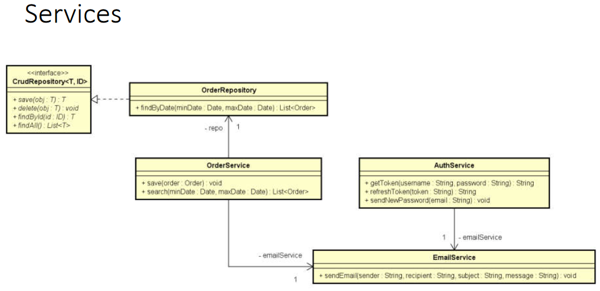

### 117. Composição

* É um tipo de associação que permite que um objeto contenha outro
* Relação "tem-um" ou "tem-vários"
* Vantagens:
  * Organização: divisão de responsabilidades
  * Coesão
  * Flexibilidade
  * Reuso
* **Nota** - Embora o símbolo UML para composição (todo-parte) seja o diamante preto, neste contexto estamos chamando de composição qualquer associação tipo "tem-um" e "tem-vários".

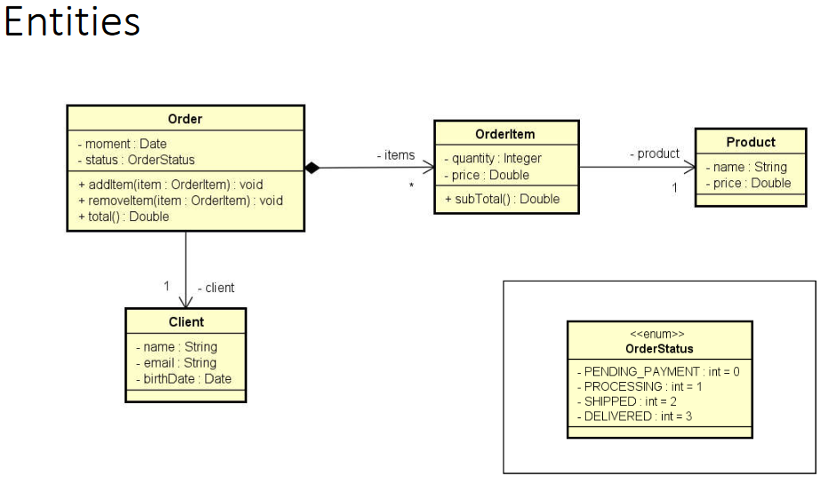

### 118. Exercício Resolvido - Parte 1

Ler os dados de um trabalhador com N contratos (N fornecido pelo usuário). Depois, solicitar do usuário um mês e mostrar qual foi o salário do funcionário nesse mês, conforme exemplo.

#### Diagrama de classes

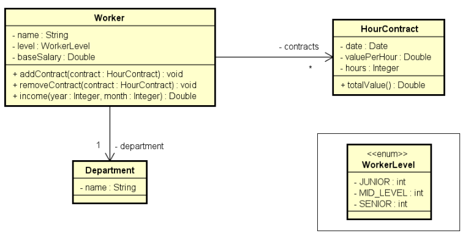

#### Exemplo

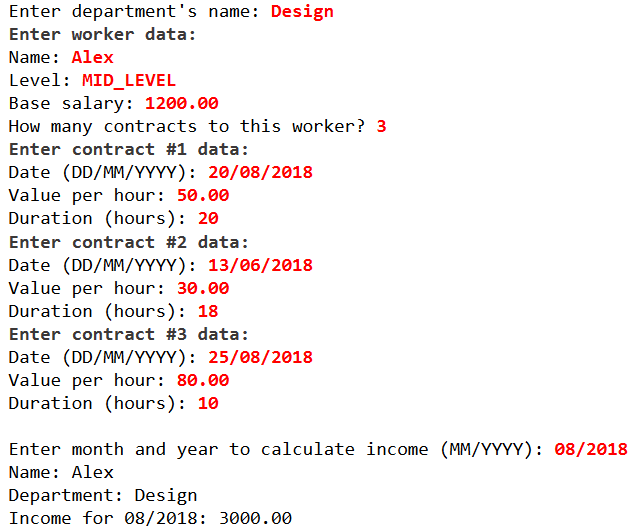

[Exercício](ws-eclipse/Aula118-Exemplo01)

### 119. Exercício resolvido 1 - Parte 2

[Exercício](ws-eclipse/Aula119-Exemplo01)

### 120. Exercício resolvido 2 (demo StringBuilder)

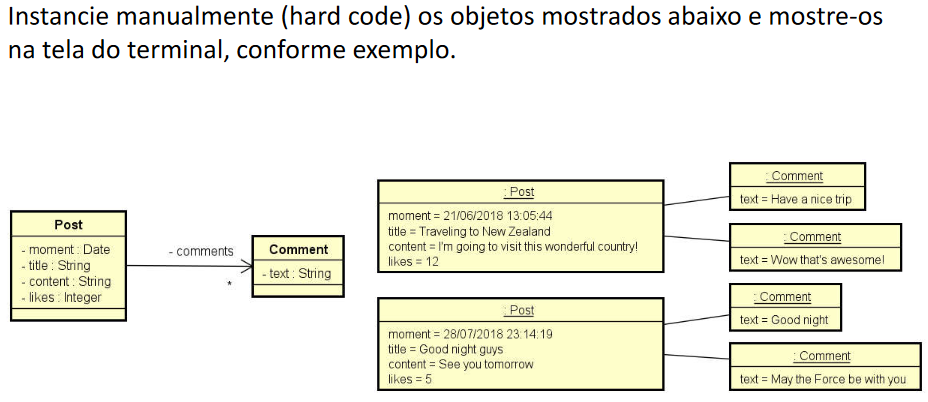


[Exercício](ws-eclipse/Aula120-Exemplo01)

### 121. Exercício de fixação

Ler os dados de um pedido com N itens (N fornecido pelo usuário). Depois, mostrar um sumário do pedido conforme exemplo abaixo. Nota: o instante do pedido deve ser o instante do sistema: *new Date()*

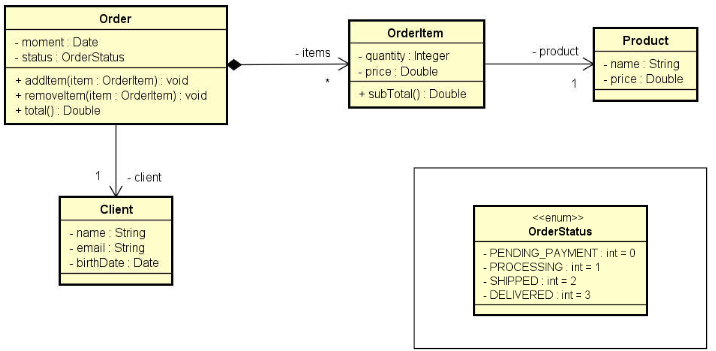

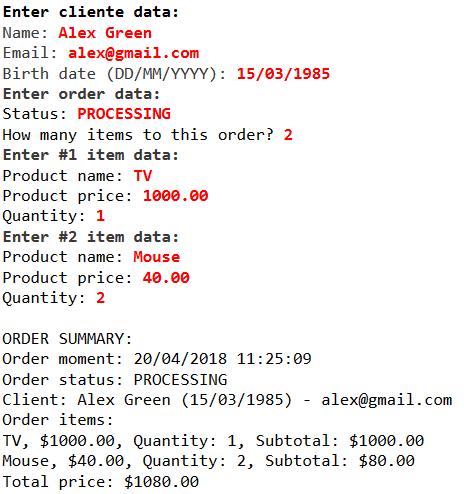

[Exercício](ws-eclipse/Aula121-Exercicio01)

### 122. Correção em vídeo do exercício de fixação

[Link Youtube](https://www.youtube.com/watch?v=gj80JEqk5ms)

[Exercício](ws-eclipse/Aula122-Exercicio01)

## Seção 14: Herança e polimorfismo

### 123. Visão geral do capítulo Herança e Polimorfismo

### 124. Material de apoio do capítulo

[Material de apoio](PDFs/Aula%20124%20-%20Herança%20e%20polimorfismo.pdf)

### 125. Herança

* **Herança** é um tipo de associação que permite que uma classe herde **todos** os dados e comportamentos de outra.
* Vantagens:
  * Reuso
  * Polimorfismo
* Sintaxe: *class A extends B*

#### Exemplo

Suponha um negócio de banco que possui uma conta comum e uma conta para empresas, sendo que a conta para empresa possui todos membros da conta comum, mais um limite de empréstimo e uma operação de realizar emprestimos.

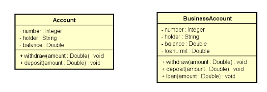

Utilizando herança nós podemos reutilizar os atributos e métodos que são comuns às duas classes:

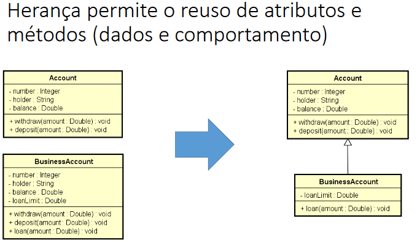

[Exemplo 01](ws-eclipse/Aula125-Exemplo01)

#### Modificador de acesso **protected**

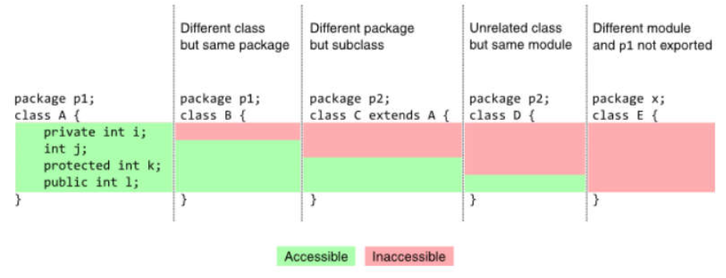

### 126. Upcasting e downcasting

#### Upcasting

* Casting da subclasse para superclasse
* Uso comum: polimorfismo

#### Downcasting

* Casting da superclasse para a subclasse
* Palavra *instanceof*
* Uso comum: métodos que recebem parâmetros genéridcos (ex: Equals)

#### Exemplo


[Exemplo 1](ws-eclipse/Aula126-Exemplo01)

### 127. Sobreposição, palavra *super*, anotação *@Overrride*

#### Sobreposição ou sobrescrita

* É a implementação de um método de uma superclasse na subclasse.
* É fortemente recomendável usar a anotação *@override* em um método sobrescrito
  * Facilita a leitura e compreensão do código
  * Avisamos ao compilador (boa prática)

#### Exemplo:

Suponha que a operação de saque possui uma taxa no valor de 5.0. Entretanto, se a conta for do tipo poupança, esta taxa não deve ser cobrada.

Como resolver isso?

Resposta: Sobrescrevendo o método *withdraw* na subclasse *SavingsAccount*.

#### Palavra **super**

* É possível chamar a implementação da superclasse usando a palavra **super**.
* *Exemplo*: suponha que, na classe *BusinessAccount*, a regra para saque seja realizar o saque normalmente da superclasse e depois descontar mais 2.0.

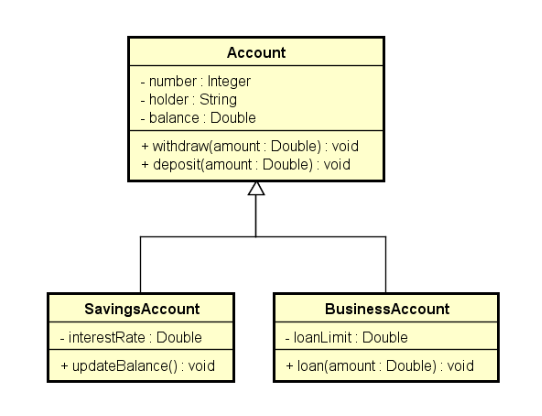

### 128. Classes e métodos final

* Palavra chave: **final**
* Quando aplicada a uma classe
  * evita que a classe seja herdada. Ex.: ```public final class SavingsAccount{}```
* Quando aplicada a uma método
  * evita que o método possa ser sobreposto por outra classe

#### Exemplo - Classe final

* Suponha que você queira evitar que sejam criadas subclasses de SavingsAccount.

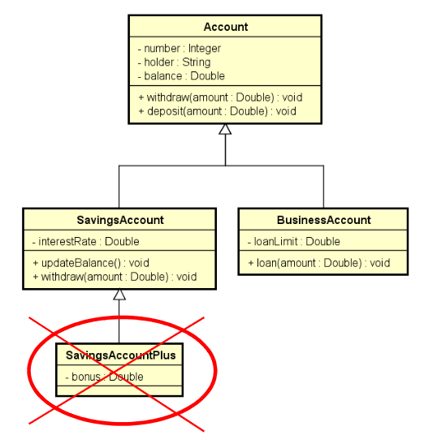

```java
public final class SavingsAccount {
  (...)
}
```

#### Exemplo - método final

* Suponha que você não queira que o método *withdraw* de *SavingsAccount* seja sobreposto.

```java
@Override
public final void Withdraw(double amount) {
  balance -= amount;
}
```

#### Benefícios

* **Segurança** - dependendo das regras de negócio, às vezes é desejável garantir que uma classe não seja herdada, ou que um método não seja sobreposto.
  * Geralmente convém acrescentar **final** em métodos sobrepostos, pois sobreposições múltiplas podem ser uma porta de entrada para inconsistências.
* **Performance** - atributos de tipo de uma classe final são analisados de forma mais rápida em tempo de execução.
  * Exemplo clássico: *String*

### 129. Introdução ao polimorfismo

#### Pilares da Programação Orientada a Objetos (OOP)

* Encapsulamento
* Herança
* Polimorfismo

#### Polimorfismo

* Em programação Orientada a Objetos, polimorfismo é um recurso que permite que variáveis de um mesmo tipo mais genérico possam apontar para objetos de tipos específicos diferentes, tendo assim comportamentos diferentes conforme cada tipo específico.

```java
Account x = new Account(1020, "Alex");
Account y = new SavingsAccount(1023, "Maria", 0.01);

x.withdraw(50.0);
y.withdraw(50.0);
```

[Exemplo 01](ws-eclipse/Aula129-Exemplo01)

#### Importante entender

* A associação do tipo específico com o tipo genérico é feita em tempo de execução (upcasting).
* O compilador não sabe para qual tipo específico a chamada do método *Withdraw* está sendo feita (ele só sabe que são duas variáveis tipo **Account**)

### 130. Exercício resolvido

Uma empresa possui funcionários próprios e terceirizados. Para cada funcionário, deseja-se registrar nome, horas trabalhadas e valor por hora. Funcionários terceirizado possuem ainda uma despesa adicional.

O pagamento dos funcionários corresponde ao valor da hora multiplicado pelas horas trabalhadas, sendo que os funcionários terceirizados ainda recebem um bônus correspondente a 110% de sua despesa adicional.

Fazer um programa para ler os dados de N funcionários (N fornecido pelo usuário) e armazená-los em uma lista. Depois de ler todos os dados, mostrar nome e pagamento de cada funcionário na mesma ordem em que foram digitados.

Construa o programa conforme projeto ao lado. Veja exemplo na próxima página.

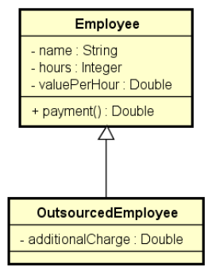

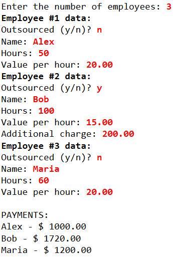

[Exercício resolvido](ws-eclipse/Aula130-Exercício01)

### 131. Exercício de fixação

Fazer um programa para ler os dados de N produtos (N fornecido pelo usuário). Ao final, mostrar a etiqueta de preço de cada produto na mesma ordem em que foram digitados.

Todo o produto possui nome e preço. Produtos importados possuem uma taxa de alfândega, e produtos usados possuem data de fabricação. Estes dados específicos devem ser acrescentados na etiqueta de preço conforme exemplo. Para Produtos importados, a taxa e alfândega deve ser acrescentada ao preço final do produto.

Favor implementar o programa conforme o projeto abaixo.

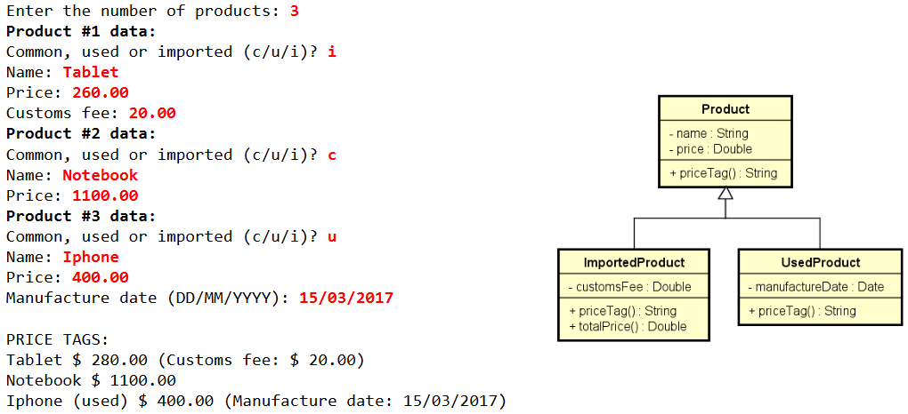

[Exercício](ws-eclipse/Aula131-Exercicio01)

### 132. Classes abstratas

* São classes que não podem ser instanciadas.
* É uma forma de garantir herança total: somente subclasses não abstratas podem ser instanciadas, mas nunca a superclasse abstrata.

#### Exemplo

Suponha que em um negócio relacionado a banco, apenas contas poupança e contas para empresas são permitidas. Não existe conta comum.

Para garantir que contas comuns não possam ser instanciadas, basta acrescentarmos a palavra "*abstract*" na declaração de classe.

```java
public abstract class Account {
  (...)
}
```

* **ATENÇÃO** - A notação para classes abstratas no UML é colocar o nome da classe em *itálico*.


[Exemplo](ws-eclipse/Aula132-Exercicio01)

#### Questionamento

* Se a classe *Account* não pode ser instan ciada, por que simplesmente não criar somente *SavingsAccount* e *BusinessAccount*?
* Resposta:
  * **Reuso**
  * **Polimorfismo**: a superclasse classe generica nos permite tratar de forma fácil e uniforme todos os tipos de conta, inclusive com polimorfismo se for o caso (como fizemos nos últimos exercícios). Por exemplo, você pode colocar todos tipos de contas em uma mesma coleção.

* Exemplo de casos de uso:
  * Totalizar o saldo de todas as contas.
  * Depositar 10.00 em todas as contas.

### 133. Métodos abstratos

* São métodos que não possuem implementação.
* Métodos precisam ser abstratos quando a classe é genérica demais para conter sua implementação.
* Se uma classe possuir pelo menos um método abstrato, então esta classes também é abstrata.
* A notação UML de um método abstrato é o *itálico*.

#### Exemplo de uso

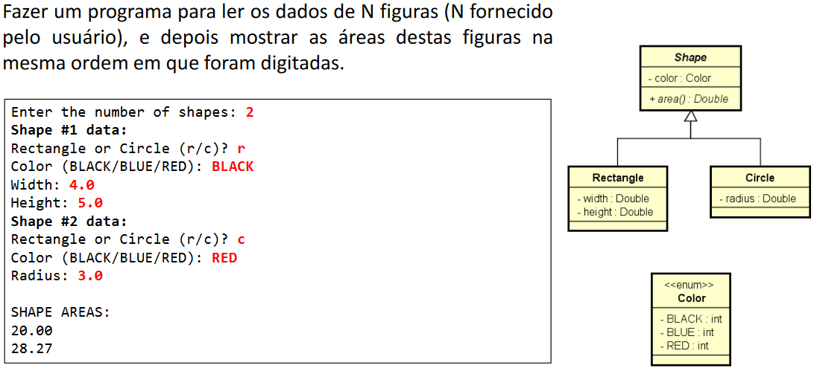

[Exemplo](ws-eclipse/Aula133-Exercicio01)

### 134. Exercício de fixação


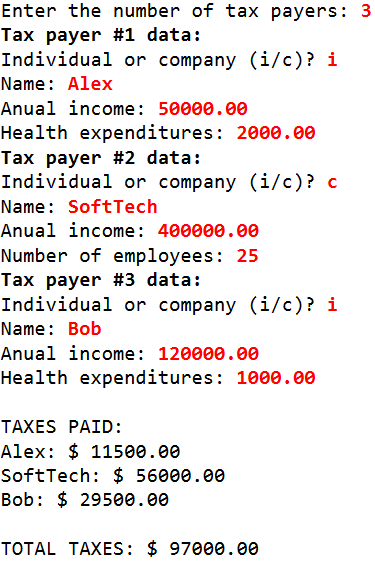

[Exercício](ws-eclipse/Aula134-Exercicio01)

### 135. Correção em vídeo do exercício de fixação

[Link](https://www.youtube.com/watch?v=eDsS3JM5iXw)

[Correção do exercício](ws-eclipse/Aula134-Exercicio01)

## Seção 15: Tratamento de exceções

### 136. Visão geral do capítulo Tratamento de exceções

### 137. Material de apoio do capítulo

[Material de apoio](PDFs/Aula%20137%20-%20Tratamento%20de%20exceções.pdf)

### 138. Discussão inicial sobre exceções

* Uma **exceção** é qualquer condição de erro ou comportamento inesperado encontrado por um programa **em execução**
* Em **Java**, uma exceção é um objeto herdado da classe:
  * **java.lang.Exception** - o compilador obriga a tratar ou propagar
  * **java.lang.RuntimeException** - o compilador não obriga a tratar ou propagar
* Quando lançada, uma exceção é propagada na pilha de chamadas de métodos em execução, até que seja capturada (tratada) ou o programa seja encerrado.

#### Hierarquia de exceções do Java

[link](https://docs.oracle.com/javase/10/docs/api/java/lang/package-tree.html)

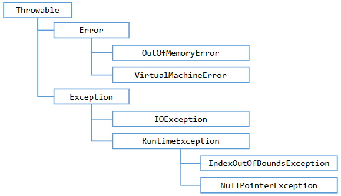

#### Por que exceções?

* O modelo de tratamento de exceções permite que erros sejam tratados de forma consistente e flexível, usando boas práticas
* **Vantagens**:
  * Delega a lógica do erro para a classe responsável por conhecer as regras que podem ocasionar o erro.
  * Trata de forma organizada (inclusive hierárquica) exceções de tipos diferentes.
  * A exceção pode carregar dados quaisquer.

### 139. Estrutura try-catch

A estrutura *try-catch* possuí dois blocos:

* Bloco try:
  * Contém o código que representa a execução normal do tracho de código que **pode** acarretar em uma exceção.

* Bloco catch:
  * Contém o código a ser executado caso uma exceção ocorra.
  * Deve ser especificado o tipo de exceção a ser tratada (*upcasting* é permitido).

#### Sintaxe

```java
try {
  (...)
} catch (ExceptionType e) {
  (...)
} catch (ExceptionType e) {
  (...)
} catch (ExceptionType e) {
  (...)
}
```

#### Exemplo

[Exemplo 01](ws-eclipse/Aula139-Exemplo01)

### 140. Pilha de chamadas de métodos (stack trace)

[Exemplo 01](ws-eclipse/Aula140-Exemplo01)

### 141. Bloco finally

* É um bloco que contém o código a ser executado independentemente de ter ocorrido ou não uma exceção.
* Exemplo clássico: fechar um arquivo, conexão de banco de dados, ou outro recurso específico ao final do processamento.

#### Sintaxe:

```java
try {
  (...)
} catch (ExceptionType e) {
  (...)
} finally {
  (...)
}
```

#### Exemplo

[Exemplo 01](ws-eclipse/Aula141-Exemplo01)

### 142. Criando exceções personalizadas

#### Sugestão de pacotes "*model*"

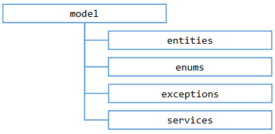

#### Problema exemplo

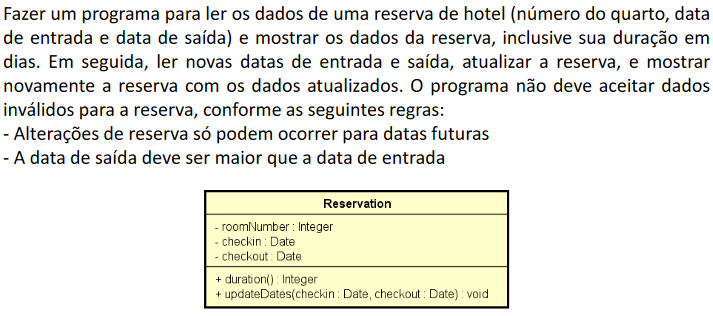

[Problema exemplo 01](ws-eclipse/Aula142-Exemplo01)

### 143. Primeira solução - muito ruim

[Exemplo 01](ws-eclipse/Aula143-Exemplo01)

### 144. Segunda solução - ruim

[Exemplo 01](ws-eclipse/Aula144-Exemplo01)

### 145. Terceira solução - boa

[Exemplo 01](ws-eclipse/Aula145-Exemplo01)