# Curso Java Completo

- [Curso Java Completo](#curso-java-completo)
  - [Links úteis](#links-úteis)
  - [Seção 1: Introdução](#seção-1-introdução)
    - [1. Introdução: Visão geral do curso](#1-introdução-visão-geral-do-curso)
      - [Profissional Java](#profissional-java)
      - [Assuntos abordados](#assuntos-abordados)
  - [Seção 2: Conceitos de programação](#seção-2-conceitos-de-programação)
    - [2. Visão geral do capítulo](#2-visão-geral-do-capítulo)
    - [3. Material de apoio do capítulo](#3-material-de-apoio-do-capítulo)
    - [4. Algoritmo, Automação, Programa de computador](#4-algoritmo-automação-programa-de-computador)
      - [Algoritmo](#algoritmo)
      - [Automação](#automação)
      - [Computador](#computador)
      - [Programa x Algoritmo](#programa-x-algoritmo)
    - [5. O que é preciso para se fazer um programa de computador](#5-o-que-é-preciso-para-se-fazer-um-programa-de-computador)
      - [Para criar um programa de computador, vamos precisar de](#para-criar-um-programa-de-computador-vamos-precisar-de)
    - [6. Linguagem de programação, léxica e sintática](#6-linguagem-de-programação-léxica-e-sintática)
      - [Linguagem de programação](#linguagem-de-programação)
      - [Léxica](#léxica)
      - [Sintática](#sintática)
      - [Exemplos de linguagens de programação](#exemplos-de-linguagens-de-programação)
    - [7. IDE - Ambiente Integrado de Desenvolvimento](#7-ide---ambiente-integrado-de-desenvolvimento)
      - [Funcionalidades de uma IDE](#funcionalidades-de-uma-ide)
    - [8. Compilação, interpretação, código fonte, código objeto, máquina virtual](#8-compilação-interpretação-código-fonte-código-objeto-máquina-virtual)
      - [Código fonte](#código-fonte)
      - [Tipos de linguagens](#tipos-de-linguagens)
      - [Vantagens](#vantagens)
  - [Seção 3: Introdução à linguagem Java](#seção-3-introdução-à-linguagem-java)
    - [9. Visão geral do capítulo](#9-visão-geral-do-capítulo)
    - [10. Material de apoio do capítulo](#10-material-de-apoio-do-capítulo)
    - [11. Entendendo as versões do Java](#11-entendendo-as-versões-do-java)
    - [12. Histórico e edições do Java](#12-histórico-e-edições-do-java)
      - [O que é Java?](#o-que-é-java)
      - [Histórico](#histórico)
      - [Aspectos notáveis](#aspectos-notáveis)
      - [As edições do Java](#as-edições-do-java)
    - [13. JDK / JVM - Máquina virtual do Java](#13-jdk--jvm---máquina-virtual-do-java)
      - [JVM - Java Virtual Machine](#jvm---java-virtual-machine)
    - [14. Estrutura de uma aplicação Java](#14-estrutura-de-uma-aplicação-java)
    - [15. Instalando o Java JDK](#15-instalando-o-java-jdk)
    - [16. Instalando o Eclipse](#16-instalando-o-eclipse)
    - [17. Primeiro programa em Java no Eclipse](#17-primeiro-programa-em-java-no-eclipse)
      - [Primeiros passos](#primeiros-passos)
  - [Seção 4: Estrutura sequencial](#seção-4-estrutura-sequencial)
    - [18. Visão geral do capítulo](#18-visão-geral-do-capítulo)
    - [19. Material de apoio do capítulo](#19-material-de-apoio-do-capítulo)
    - [20. Expressões aritméticas](#20-expressões-aritméticas)
      - [Operadores Aritméticos](#operadores-aritméticos)
      - [Ordem de prescedência](#ordem-de-prescedência)
      - [Exemplos](#exemplos)
    - [21. Variáveis e tipos básicos em Java](#21-variáveis-e-tipos-básicos-em-java)
      - [Tipos primitivos em Java](#tipos-primitivos-em-java)
      - [Nome de variáveis](#nome-de-variáveis)
    - [22. As três operações básicas de programação](#22-as-três-operações-básicas-de-programação)
      - [Entrada de dados](#entrada-de-dados)
      - [Processamento de dados](#processamento-de-dados)
      - [Saída de dados](#saída-de-dados)
    - [23. Saída de dados em Java](#23-saída-de-dados-em-java)
      - [Para escrevermos um texto qualquer](#para-escrevermos-um-texto-qualquer)
      - [Para escrever o conteúdo de uma variável com ponto flutuante](#para-escrever-o-conteúdo-de-uma-variável-com-ponto-flutuante)
      - [Para concatenar vários elementos em um mesmo comando de escrita Sem formatação](#para-concatenar-vários-elementos-em-um-mesmo-comando-de-escrita-sem-formatação)
      - [Para concatenar vários elementos em um mesmo comando de escrita Com formatação](#para-concatenar-vários-elementos-em-um-mesmo-comando-de-escrita-com-formatação)
      - [Para concatenar vários elementos em um mesmo comando de escrita com diferentes tipos de variáveis](#para-concatenar-vários-elementos-em-um-mesmo-comando-de-escrita-com-diferentes-tipos-de-variáveis)
    - [24. Processamento de dados em Java, Casting](#24-processamento-de-dados-em-java-casting)
      - [Regra de execução](#regra-de-execução)
    - [25. Entrada de dados em Java - Parte 1](#25-entrada-de-dados-em-java---parte-1)
      - [Scanner](#scanner)
      - [Para ler uma palavra](#para-ler-uma-palavra)
      - [Para ler um número inteiro](#para-ler-um-número-inteiro)
      - [Para ler um número com ponto flutuante](#para-ler-um-número-com-ponto-flutuante)
      - [Para ler um caractere](#para-ler-um-caractere)
    - [Para ler vários dados na mesma linha](#para-ler-vários-dados-na-mesma-linha)
    - [26. Entrada de dados em Java - Parte 2](#26-entrada-de-dados-em-java---parte-2)
      - [Para ler um texto até a quebra de linha](#para-ler-um-texto-até-a-quebra-de-linha)
    - [Quebra de linha pendente](#quebra-de-linha-pendente)
    - [27. Funções matemáticas em Java](#27-funções-matemáticas-em-java)
      - [Algumas funções matemáticas em Java](#algumas-funções-matemáticas-em-java)
    - [28. Aviso: exercícios para iniciantes PARTE 1](#28-aviso-exercícios-para-iniciantes-parte-1)
    - [29. Exercícios para iniciantes - PARTE 1](#29-exercícios-para-iniciantes---parte-1)
      - [Exercício resolvido 1](#exercício-resolvido-1)
      - [Exercício 01](#exercício-01)
      - [Exercício 02](#exercício-02)
      - [Exercício 03](#exercício-03)
      - [Exercício 04](#exercício-04)
      - [Exercício 05](#exercício-05)
      - [Exercício 06](#exercício-06)
  - [Seção 5: Estrutura condicional](#seção-5-estrutura-condicional)
    - [30. Visão geral do capítulo](#30-visão-geral-do-capítulo)
    - [31. Material de apoio do capítulo](#31-material-de-apoio-do-capítulo)
    - [32. Expressões comparativas](#32-expressões-comparativas)
      - [Operadores comparativos](#operadores-comparativos)
      - [Exemplos de expressões comparativas](#exemplos-de-expressões-comparativas)
    - [33. Expressões lógicas](#33-expressões-lógicas)
      - [Operadores lógicos](#operadores-lógicos)
      - [Operador E](#operador-e)
      - [Operador OU](#operador-ou)
      - [Operador NÃO](#operador-não)
    - [34. strutura condicional (if - else)](#34-strutura-condicional-if---else)
      - [Sintaxe simples](#sintaxe-simples)
      - [Sintaxe composta](#sintaxe-composta)
      - [Sintaxe para múltiplas possibilidades](#sintaxe-para-múltiplas-possibilidades)
    - [35. AVISO: exercícios para iniciantes PARTE 2](#35-aviso-exercícios-para-iniciantes-parte-2)
    - [36. Exercícios para Iniciantes](#36-exercícios-para-iniciantes)
      - [Exercício resolvido 1](#exercício-resolvido-1-1)
      - [Exercício resolvido 2](#exercício-resolvido-2)
      - [Exercício resolvido 3](#exercício-resolvido-3)
      - [Exercício 1](#exercício-1)
      - [Exercício 2](#exercício-2)
      - [Exercício 3](#exercício-3)
      - [Exercício 4](#exercício-4)
      - [Exercício 5](#exercício-5)
      - [Exercício 6](#exercício-6)
      - [Exercício 7](#exercício-7)
      - [Exercício 8](#exercício-8)
    - [37. Sintaxe opcional - Operadores de atribuição cumulativa](#37-sintaxe-opcional---operadores-de-atribuição-cumulativa)
      - [Operadores de atribuição cumulativos](#operadores-de-atribuição-cumulativos)
    - [38. Sintaxe opcional - switch-case](#38-sintaxe-opcional---switch-case)
      - [Sintaxe:](#sintaxe)
    - [39. Expressões condicionais ternárias](#39-expressões-condicionais-ternárias)
      - [Sintaxe](#sintaxe-1)
      - [Exemplos](#exemplos-1)
    - [40. Escopo e inicialização](#40-escopo-e-inicialização)
  - [Seção 6: Estruturas repetitivas](#seção-6-estruturas-repetitivas)
    - [41. Visão geral do capítulo](#41-visão-geral-do-capítulo)
    - [42. Material de apoio do capítulo](#42-material-de-apoio-do-capítulo)
    - [43. Como utilizar o DEBUG no Eclipse (execução passo a passo)](#43-como-utilizar-o-debug-no-eclipse-execução-passo-a-passo)
    - [44. Estrutura repetitiva enquanto (while)](#44-estrutura-repetitiva-enquanto-while)
      - [Sintaxe](#sintaxe-2)
      - [Exemplo de uso](#exemplo-de-uso)
    - [45. Teste de mesa com estrutura repetitiva enquanto](#45-teste-de-mesa-com-estrutura-repetitiva-enquanto)
    - [46. Exercícios de teste de mesa com while](#46-exercícios-de-teste-de-mesa-com-while)
    - [47. AVISO: exercícios para iniciantes PARTE 3](#47-aviso-exercícios-para-iniciantes-parte-3)
    - [48. Exercícios para Inicantes - PARTE 3](#48-exercícios-para-inicantes---parte-3)
      - [Exercício resolvido 1](#exercício-resolvido-1-2)
        - [Entrada](#entrada)
        - [Saída](#saída)
      - [Exercício resolvido 2](#exercício-resolvido-2-1)
      - [Exercício 1](#exercício-1-1)
      - [Exercício 2](#exercício-2-1)
      - [Exercício 3](#exercício-3-1)
    - [49. Estrutura repetitiva "para" (for)](#49-estrutura-repetitiva-para-for)
      - [Sintaxe](#sintaxe-3)
      - [Exemplo](#exemplo)
    - [50. Teste de mesa com estrutura repetitiva para](#50-teste-de-mesa-com-estrutura-repetitiva-para)
    - [51. Exercícios de testes de mesa com for](#51-exercícios-de-testes-de-mesa-com-for)
    - [52. AVISO: exercícios para iniciiantes PARTE 4](#52-aviso-exercícios-para-iniciiantes-parte-4)
    - [53. Exercícios para iniciantes PARTE 4](#53-exercícios-para-iniciantes-parte-4)
      - [Exercício resolvido 01](#exercício-resolvido-01)
        - [Entrada](#entrada-1)
        - [Saída](#saída-1)
      - [Exercícios resolvido 02](#exercícios-resolvido-02)
        - [Entrada](#entrada-2)
        - [Saída](#saída-2)
      - [Exercício 1](#exercício-1-2)
      - [Exercício 2](#exercício-2-2)
      - [Exercício 3](#exercício-3-2)
      - [Exercício 4](#exercício-4-1)
      - [Exercício 5](#exercício-5-1)
      - [Exercício 6](#exercício-6-1)
      - [Exercício 7](#exercício-7-1)
    - [54. Estrutura repetitiva faça-enquanto (do-while)](#54-estrutura-repetitiva-faça-enquanto-do-while)
      - [Sintaxe](#sintaxe-4)
      - [Exemplo de uso](#exemplo-de-uso-1)
  - [Seção 7: Outros tópicos básicos sobre Java](#seção-7-outros-tópicos-básicos-sobre-java)
    - [55. Material de apoio do capítulo](#55-material-de-apoio-do-capítulo)
    - [56. Restrições e convenções para nomes](#56-restrições-e-convenções-para-nomes)
      - [Restrições para nomes de variáveis](#restrições-para-nomes-de-variáveis)
      - [Convenções](#convenções)
    - [57. Operadores bitwise](#57-operadores-bitwise)
      - [Tabela verdade](#tabela-verdade)
      - [Exemplos](#exemplos-2)
    - [58. Funções interessantes para String](#58-funções-interessantes-para-string)
      - [Checklist](#checklist)
      - [Exemplos](#exemplos-3)
    - [59. Comentários em Java (básico)](#59-comentários-em-java-básico)
      - [Comentário de linha](#comentário-de-linha)
      - [Comentário de bloco](#comentário-de-bloco)
    - [60. Funções (sintaxe)](#60-funções-sintaxe)
      - [Exemplo](#exemplo-1)
  - [Seção 8: Introdução à Programação Orientada a Objetos](#seção-8-introdução-à-programação-orientada-a-objetos)
    - [61. Visão geral do capítulo](#61-visão-geral-do-capítulo)
    - [62. Material de apoio do capítulo](#62-material-de-apoio-do-capítulo)
    - [63. Resolvendo um problema sem orientação a objetos](#63-resolvendo-um-problema-sem-orientação-a-objetos)
    - [64. Criando uma classe com três atributos para representar melhor o triângulo](#64-criando-uma-classe-com-três-atributos-para-representar-melhor-o-triângulo)
      - [Discussão](#discussão)
      - [classe](#classe)
      - [Instanciação](#instanciação)
    - [65. Criando um método para obtermos os benefícios de reaproveitamento e delegação.](#65-criando-um-método-para-obtermos-os-benefícios-de-reaproveitamento-e-delegação)
      - [Discussão](#discussão-1)
      - [Projeto da classe (UML)](#projeto-da-classe-uml)
      - [Benefícios](#benefícios)
    - [66. Começando a resolver um segundo problema exemplo](#66-começando-a-resolver-um-segundo-problema-exemplo)
    - [67. Object e toString](#67-object-e-tostring)
      - [Discussão](#discussão-2)
    - [68. Finalizando o programa](#68-finalizando-o-programa)
    - [69. Exercícios de fixação](#69-exercícios-de-fixação)
      - [Exercício 1](#exercício-1-3)
      - [Exercício 2](#exercício-2-3)
      - [Exercício 3](#exercício-3-3)
    - [70. Membros estáticos - Parte 1](#70-membros-estáticos---parte-1)
      - [Exemplo de uso](#exemplo-de-uso-2)
      - [Faremos a solução em 3 versões:](#faremos-a-solução-em-3-versões)
      - [Versão 1 - Métodos na própria classe do programa](#versão-1---métodos-na-própria-classe-do-programa)
      - [Versão 2 - Classe Calculator com membros de instância](#versão-2---classe-calculator-com-membros-de-instância)
    - [71. Membros estáticos - Parte 2](#71-membros-estáticos---parte-2)
      - [Discussão](#discussão-3)
      - [Versão 3 - Classe Calculator com método estático](#versão-3---classe-calculator-com-método-estático)
    - [72. Exercício de fixação](#72-exercício-de-fixação)
  - [Seção 9: Construtores, palavra this, sobrecarga, encapsulamento](#seção-9-construtores-palavra-this-sobrecarga-encapsulamento)
    - [73. Visão geral do capítulo](#73-visão-geral-do-capítulo)
    - [74. Material de apoio do capítulo](#74-material-de-apoio-do-capítulo)
    - [75. Construtores](#75-construtores)
      - [Usos comuns:](#usos-comuns)
      - [Problema exemplo](#problema-exemplo)
      - [Proposta de melhoria](#proposta-de-melhoria)
    - [76. Palavra this](#76-palavra-this)
      - [Usos comuns:](#usos-comuns-1)
    - [77. Sobrecarga](#77-sobrecarga)
      - [Proposta de melhoria](#proposta-de-melhoria-1)
    - [78. Encapsulamento](#78-encapsulamento)
      - [Regra geral básica](#regra-geral-básica)
      - [Exemplo de uso](#exemplo-de-uso-3)
    - [79. Gerando automaticamente construtores, getters e setters com Eclipse](#79-gerando-automaticamente-construtores-getters-e-setters-com-eclipse)
      - [Gerando construtor](#gerando-construtor)
      - [Gerando getters e setters](#gerando-getters-e-setters)
    - [80. Modificadores de acesso](#80-modificadores-de-acesso)
    - [81. Exercício de fixação](#81-exercício-de-fixação)
    - [82. Correção do exercício de fixação - Parte 1](#82-correção-do-exercício-de-fixação---parte-1)
    - [83. Correção do exercício de fixação - Parte 2](#83-correção-do-exercício-de-fixação---parte-2)
  - [Seção 10: Comportamento de memória, arrays e listas](#seção-10-comportamento-de-memória-arrays-e-listas)
    - [84. Visão geral do capítulo](#84-visão-geral-do-capítulo)
    - [85. Material de apoio do capítulo](#85-material-de-apoio-do-capítulo)
    - [86. Tipos referência vs. tipos valor](#86-tipos-referência-vs-tipos-valor)
      - [Classes são tipos referência](#classes-são-tipos-referência)
      - [Valor "null"](#valor-null)
      - [Tipos primitivos são tipos valor](#tipos-primitivos-são-tipos-valor)
      - [Valores padrão](#valores-padrão)
      - [Tabela comparativa (Resumo)](#tabela-comparativa-resumo)
    - [87. Desalocação de memória - garbage collector e escopo local](#87-desalocação-de-memória---garbage-collector-e-escopo-local)
      - [Garbage Collector](#garbage-collector)
      - [Desalocação por escopo](#desalocação-por-escopo)
      - [Resumo](#resumo)
    - [88. Vetores - Parte 1](#88-vetores---parte-1)
      - [Checklist](#checklist-1)
      - [Vetores](#vetores)
      - [Exemplo de uma declaração de vetor](#exemplo-de-uma-declaração-de-vetor)
      - [Problema exemplo 1](#problema-exemplo-1)
    - [89. Vetores - Parte 2](#89-vetores---parte-2)
      - [Problema exemplo 2](#problema-exemplo-2)
      - [Atributo lenght](#atributo-lenght)
    - [90. Exercícios de fixação sobre vetores](#90-exercícios-de-fixação-sobre-vetores)
      - [Exercício 1 - Problema "negativos"](#exercício-1---problema-negativos)
      - [Exercício 2 - Problema "soma_vetor"](#exercício-2---problema-soma_vetor)
      - [Exercício 3 - Problema "alturas"](#exercício-3---problema-alturas)
      - [Exercício 4 - Problema "numeros_pares"](#exercício-4---problema-numeros_pares)
      - [Exercício 5 - Problema "maior_posicao"](#exercício-5---problema-maior_posicao)
      - [Exercício 6 - Problema "soma_vetores"](#exercício-6---problema-soma_vetores)
      - [Exercício 7 - Problema "abaixo_da_media"](#exercício-7---problema-abaixo_da_media)
      - [Exercício 8 - Problema "media_pares"](#exercício-8---problema-media_pares)
      - [Exercício 9 - Problema "mais_velho"](#exercício-9---problema-mais_velho)
      - [Exercício 10 - Problema "aprovados"](#exercício-10---problema-aprovados)
      - [Exercício 11 - Problema "dados_pessoas"](#exercício-11---problema-dados_pessoas)
    - [91. Correção do exercício negativos](#91-correção-do-exercício-negativos)
    - [92. Correção do exercício alturas](#92-correção-do-exercício-alturas)
    - [93. Desafio sobre vetores (pensionato)](#93-desafio-sobre-vetores-pensionato)
    - [94. Correção do desafio sobre vetores (pensionato)](#94-correção-do-desafio-sobre-vetores-pensionato)
    - [95. Boxing, umboxing e wrapper classes](#95-boxing-umboxing-e-wrapper-classes)
      - [Boxing](#boxing)
      - [Unboxing](#unboxing)
      - [Exemplo de boxing e umboxing](#exemplo-de-boxing-e-umboxing)
      - [Wrapper classes](#wrapper-classes)
    - [96. Laço for each](#96-laço-for-each)
      - [Sintaxe](#sintaxe-5)
      - [Exemplo](#exemplo-2)
    - [97. Listas - Parte 1](#97-listas---parte-1)
      - [Conceito](#conceito)
    - [98. Listas - Parte 2](#98-listas---parte-2)
      - [Demonstração de operações com listas](#demonstração-de-operações-com-listas)
    - [99. Exercício proposto](#99-exercício-proposto)
    - [100. Correção em vídeo do exercício proposto](#100-correção-em-vídeo-do-exercício-proposto)
    - [101. Matrizes](#101-matrizes)
    - [102. Exercício resolvido](#102-exercício-resolvido)
    - [103. Exercício proposto](#103-exercício-proposto)
  - [Seção 11: Tópicos especiais em Java: data-hora](#seção-11-tópicos-especiais-em-java-data-hora)
    - [104. Boas-vindas e avisos](#104-boas-vindas-e-avisos)
    - [105. Material de apoio do capítulo](#105-material-de-apoio-do-capítulo)
    - [106. Introdução a data-hora e duração](#106-introdução-a-data-hora-e-duração)
      - [Conceitos importantes](#conceitos-importantes)
      - [Quando usar?](#quando-usar)
    - [107. Entendendo timezone (fuso horário)](#107-entendendo-timezone-fuso-horário)
      - [GMT - Treenwich Mean Time](#gmt---treenwich-mean-time)
      - [Outros fusos horários são relativos ao GMT/UTC:](#outros-fusos-horários-são-relativos-ao-gmtutc)
      - [Muitas linguagens/tecnologias usam nomes para as timezones:](#muitas-linguagenstecnologias-usam-nomes-para-as-timezones)
    - [108. Padrão ISO 8601](#108-padrão-iso-8601)
      - [Data-[hora] local:](#data-hora-local)
      - [Data-hora global:](#data-hora-global)
    - [109. Operações importantes com data-hora](#109-operações-importantes-com-data-hora)
      - [Instanciação](#instanciação-1)
      - [Formatação](#formatação)
    - [110. Instanciando data-hora em Java](#110-instanciando-data-hora-em-java)
      - [Principais tipos Java (versão 8+)](#principais-tipos-java-versão-8)
      - [Instanciação](#instanciação-2)
    - [111. Convertendo data-hora para texto](#111-convertendo-data-hora-para-texto)
      - [Formatação](#formatação-1)
    - [112. Convertendo data-hora global para local](#112-convertendo-data-hora-global-para-local)
      - [Obtendo uma lista de todos os ZoneIds disponíveis](#obtendo-uma-lista-de-todos-os-zoneids-disponíveis)
      - [Convertendo data-hora para local](#convertendo-data-hora-para-local)
    - [113. Cálculos com data-hora](#113-cálculos-com-data-hora)
    - [114. Aviso: próximas duas aulas são sobre Date e Calendar](#114-aviso-próximas-duas-aulas-são-sobre-date-e-calendar)
    - [115. Trabalhando com datas - Date](#115-trabalhando-com-datas---date)
      - [SimpleDateFormat](#simpledateformat)
      - [Padrão ISO 8601 e classe Instant](#padrão-iso-8601-e-classe-instant)
    - [116. Manipulando um Date com Calendar](#116-manipulando-um-date-com-calendar)
      - [Somando uma unidade de tempo](#somando-uma-unidade-de-tempo)
      - [Obtendo uma unidade de tempo](#obtendo-uma-unidade-de-tempo)
  - [Seção 12: Bônus - nivelamento sobre Git e Github](#seção-12-bônus---nivelamento-sobre-git-e-github)
    - [117. Apresentação do bônus Git e Github](#117-apresentação-do-bônus-git-e-github)
    - [118. Material de apoio do capítulo](#118-material-de-apoio-do-capítulo)
    - [119. Introdução ao Git e Github](#119-introdução-ao-git-e-github)
      - [Git](#git)
      - [Github](#github)
    - [120. Repositório local e repositório remoto](#120-repositório-local-e-repositório-remoto)
    - [121. Instalação do Git no Windows](#121-instalação-do-git-no-windows)
    - [122. Configurando sua identificação](#122-configurando-sua-identificação)
      - [Alterar o branch padrão de master para main:](#alterar-o-branch-padrão-de-master-para-main)
    - [123. Mostrar arquivos ocultos e extensões](#123-mostrar-arquivos-ocultos-e-extensões)
    - [124. Configurar chave SSH no Github](#124-configurar-chave-ssh-no-github)
      - [Gerar uma chave SSH no seu computador](#gerar-uma-chave-ssh-no-seu-computador)
    - [125. Salvando primeira versão de um projeto no Github](#125-salvando-primeira-versão-de-um-projeto-no-github)
      - [Passo a passo: Salvar primeira versão de um projeto no Github](#passo-a-passo-salvar-primeira-versão-de-um-projeto-no-github)
    - [126. Salvando um novo commit](#126-salvando-um-novo-commit)
    - [127. Demo - clonar e modificar um projeto](#127-demo---clonar-e-modificar-um-projeto)
    - [128. Git log para verificar histórico de versões](#128-git-log-para-verificar-histórico-de-versões)
      - [Verificando o histórico de versões](#verificando-o-histórico-de-versões)
    - [129. Entendendo git status e stage](#129-entendendo-git-status-e-stage)
      - [git status](#git-status)
      - [retirar arquivos do stage](#retirar-arquivos-do-stage)
    - [130. Git diff e recurso source control do VS Code](#130-git-diff-e-recurso-source-control-do-vs-code)
    - [131. Git checkout](#131-git-checkout)
      - [Código do commit, HEAD](#código-do-commit-head)
      - [Importante](#importante)
    - [132. Arquivo .gitignore](#132-arquivo-gitignore)
      - [Casos comuns de arquivos que não devem ser salvos pelo Git:](#casos-comuns-de-arquivos-que-não-devem-ser-salvos-pelo-git)
    - [133. Visão geral da segunda parte](#133-visão-geral-da-segunda-parte)
    - [134. Removendo arquivos da área de stage](#134-removendo-arquivos-da-área-de-stage)
    - [135. Desfazendo modificações não salvas](#135-desfazendo-modificações-não-salvas)
    - [136. O que fazer quando abre o editor VIM](#136-o-que-fazer-quando-abre-o-editor-vim)
    - [137. Deletando o último commit sem deletar modificações nos arquivos](#137-deletando-o-último-commit-sem-deletar-modificações-nos-arquivos)
    - [138. Deletando commits e também modificações nos arquivos](#138-deletando-commits-e-também-modificações-nos-arquivos)
    - [139. Como atualizar o repositório local em relação ao remoto](#139-como-atualizar-o-repositório-local-em-relação-ao-remoto)
    - [140. Como resolver push rejeitado por históricos diferentes](#140-como-resolver-push-rejeitado-por-históricos-diferentes)
    - [141. Resolvendo pull com conflito](#141-resolvendo-pull-com-conflito)
    - [142. Como sobrescrever um histórico no Github](#142-como-sobrescrever-um-histórico-no-github)
    - [143. Como apontar o projeto para outro repositório remoto](#143-como-apontar-o-projeto-para-outro-repositório-remoto)
  - [Seção 13: Enumerações, composição](#seção-13-enumerações-composição)
    - [144. Visão geral do capítulo Enumerações e Composição](#144-visão-geral-do-capítulo-enumerações-e-composição)
    - [145. Material de apoio do capítulo](#145-material-de-apoio-do-capítulo)
    - [146. Enumerações](#146-enumerações)
      - [Checklist](#checklist-2)
      - [Definição](#definição)
      - [Exemplo](#exemplo-3)
      - [Conversão de String para enum](#conversão-de-string-para-enum)
      - [Representação UML](#representação-uml)
    - [147. Vamos falar um pouco sobre design](#147-vamos-falar-um-pouco-sobre-design)
      - [Categorias de classes](#categorias-de-classes)
    - [148. Composição](#148-composição)
      - [Vantagens](#vantagens-1)
    - [149. Exercício resolvido 1 - Parte 1](#149-exercício-resolvido-1---parte-1)
    - [150. Exercício resolvido 1 - Parte 2](#150-exercício-resolvido-1---parte-2)
    - [151. Exercício resolvido 2 (demo StringBuilder)](#151-exercício-resolvido-2-demo-stringbuilder)
      - [StringBuilder](#stringbuilder)
    - [152. Exercício de fixação](#152-exercício-de-fixação)
      - [Diagrama de classes](#diagrama-de-classes)
      - [Diagrama de objetos](#diagrama-de-objetos)
      - [Exemplo](#exemplo-4)
    - [153. Correção em vídeo do exercício de fixação](#153-correção-em-vídeo-do-exercício-de-fixação)
  - [Seção 14: Herança e polimorfismo](#seção-14-herança-e-polimorfismo)
    - [154. Visão geral do capítulo Herança Se polimorfismo](#154-visão-geral-do-capítulo-herança-se-polimorfismo)
    - [155. Material de apoio do capítulo](#155-material-de-apoio-do-capítulo)
    - [156. Herança](#156-herança)
      - [Exemplo de uso](#exemplo-de-uso-4)
      - [Modificador de acesso protected](#modificador-de-acesso-protected)
      - [Exemplo de uso](#exemplo-de-uso-5)
      - [Definições importantes](#definições-importantes)
    - [157. Upcasting e downcasting](#157-upcasting-e-downcasting)
      - [Exemplo de uso](#exemplo-de-uso-6)
    - [158. Sobreposição, palavra super e anotação @Override](#158-sobreposição-palavra-super-e-anotação-override)
      - [Sobreposição ou sobrescrita](#sobreposição-ou-sobrescrita)
      - [Exemplo de uso](#exemplo-de-uso-7)
      - [Palavra super](#palavra-super)
    - [159. Classes e métodos final](#159-classes-e-métodos-final)
      - [Exemplo de uso - Classe final](#exemplo-de-uso---classe-final)
      - [Exemplo de uso - Método final](#exemplo-de-uso---método-final)
      - [Motivos para utilização](#motivos-para-utilização)
    - [160. Introdução ao polimorfismo](#160-introdução-ao-polimorfismo)
      - [Pilares da Programação Orientada a Objetos (OOP)](#pilares-da-programação-orientada-a-objetos-oop)
      - [Polimorfismo](#polimorfismo)
      - [Importante entender](#importante-entender)
    - [161. Exercício resolvido](#161-exercício-resolvido)
      - [Projeto UML](#projeto-uml)
      - [Exemplo do programa](#exemplo-do-programa)
      - [Exemplo dos objetos em memória](#exemplo-dos-objetos-em-memória)
      - [Exercício resolvido](#exercício-resolvido)
    - [162. Exercício de fixação](#162-exercício-de-fixação)
      - [Projeto UML](#projeto-uml-1)
      - [Exemplo do programa](#exemplo-do-programa-1)
      - [Resposta do exercício](#resposta-do-exercício)
    - [163. Classes abstratas](#163-classes-abstratas)
      - [Exemplo de uso](#exemplo-de-uso-8)
      - [Questionamento](#questionamento)
    - [164. Métodos abstrados](#164-métodos-abstrados)
      - [Exemplo de uso](#exemplo-de-uso-9)
      - [Exercício resolvido](#exercício-resolvido-1)
    - [165. Exercício de fixação](#165-exercício-de-fixação)
      - [Diagrama UML](#diagrama-uml)
      - [Exemplo do programa](#exemplo-do-programa-2)
      - [Implementação](#implementação)
    - [166. Correção em vídeo do exercício de fixação](#166-correção-em-vídeo-do-exercício-de-fixação)
  - [Seção 15: Tratamento de exceções](#seção-15-tratamento-de-exceções)
    - [167. Visão geral do capítulo Tratamento de Exceções](#167-visão-geral-do-capítulo-tratamento-de-exceções)
    - [168. Material de apoio do capítulo](#168-material-de-apoio-do-capítulo)
    - [169. Discussão inicial sobre exceções](#169-discussão-inicial-sobre-exceções)
      - [Hierarquia de exceções do Java](#hierarquia-de-exceções-do-java)
      - [Por que exceções?](#por-que-exceções)
    - [170. Estrutura try-catch](#170-estrutura-try-catch)
      - [Sintaxe](#sintaxe-6)
      - [Exemplo de uso](#exemplo-de-uso-10)
    - [171. Pilha de chamadas de métodos (stack trace)](#171-pilha-de-chamadas-de-métodos-stack-trace)
    - [172. Bloco finally](#172-bloco-finally)
      - [Sintaxe](#sintaxe-7)
      - [Exemplo de uso](#exemplo-de-uso-11)
    - [173. Criando exceções personalizadas](#173-criando-exceções-personalizadas)
      - [Sugestão para organização dos pacotes para o model](#sugestão-para-organização-dos-pacotes-para-o-model)
      - [Problema exemplo](#problema-exemplo-1)
    - [174. Primeira solução - muito ruim](#174-primeira-solução---muito-ruim)
    - [175. Segunda solução - ruim](#175-segunda-solução---ruim)
    - [176. Terceira solução - boa](#176-terceira-solução---boa)
      - [Resumo](#resumo-1)
    - [177. Exercício de fixação](#177-exercício-de-fixação)
      - [Exemplos de execução:](#exemplos-de-execução)
      - [Resolução](#resolução)
    - [178. Correção do exercício de fixação](#178-correção-do-exercício-de-fixação)
  - [Seção 16: Projeto: Sistema jogo de xadrez](#seção-16-projeto-sistema-jogo-de-xadrez)
    - [179. Visão geral do capítulo Sistema Jogo de Xadrez](#179-visão-geral-do-capítulo-sistema-jogo-de-xadrez)
      - [Objetivo geral](#objetivo-geral)
      - [Design do sistema (UML)](#design-do-sistema-uml)
      - [Link do projeto](#link-do-projeto)
    - [180. Material de apoio do capítulo](#180-material-de-apoio-do-capítulo)
    - [181. Criando projeto e repositório Git](#181-criando-projeto-e-repositório-git)
      - [Checklist:](#checklist-3)
    - [182. Primeira classe - Position](#182-primeira-classe---position)
      - [Checklist](#checklist-4)
    - [183. Começando a implementar Board e Piece](#183-começando-a-implementar-board-e-piece)
      - [Checklist](#checklist-5)
    - [184. Camada Chess e imprimindo o tabuleiro](#184-camada-chess-e-imprimindo-o-tabuleiro)
      - [Checklist](#checklist-6)
    - [185. Colocando peças no tabuleiro](#185-colocando-peças-no-tabuleiro)
      - [Checklist](#checklist-7)
    - [186. BoardException e programação defensiva](#186-boardexception-e-programação-defensiva)
      - [Checklist](#checklist-8)
    - [187. ChessException e ChessPosition](#187-chessexception-e-chessposition)
      - [Checklist](#checklist-9)
    - [188. Pequena melhoria na impressão do tabuleiro](#188-pequena-melhoria-na-impressão-do-tabuleiro)
      - [Color in terminal](#color-in-terminal)
      - [Executando programa no terminal](#executando-programa-no-terminal)
      - [Checklist](#checklist-10)
    - [189. Movendo peças](#189-movendo-peças)
      - [Checklist](#checklist-11)
    - [190. Tratando exceções e limpando a tela](#190-tratando-exceções-e-limpando-a-tela)
      - [Clear screen using Java](#clear-screen-using-java)
      - [Checklist](#checklist-12)
    - [191. Movimentos possíveis de uma peça](#191-movimentos-possíveis-de-uma-peça)
      - [Checklist](#checklist-13)
    - [192. Implementando movimentos possíveis da Torre](#192-implementando-movimentos-possíveis-da-torre)
      - [Checklist](#checklist-14)
    - [193. Imprimindo os movimentos possíveis](#193-imprimindo-os-movimentos-possíveis)
      - [Checklist](#checklist-15)
    - [194. Implementando os movimentos possíveis do Rei](#194-implementando-os-movimentos-possíveis-do-rei)
      - [Checklist](#checklist-16)
    - [195. Trocando de jogador a cada turno](#195-trocando-de-jogador-a-cada-turno)
      - [Checklist](#checklist-17)
    - [196. Manipulando peças capturadas](#196-manipulando-peças-capturadas)
    - [197. Lógica de xeque - PARTE 1](#197-lógica-de-xeque---parte-1)
      - [Rules](#rules)
      - [Checklist](#checklist-18)
    - [198. Lógica de xeque - PARTE 2](#198-lógica-de-xeque---parte-2)
    - [199. Lógica do xequemate](#199-lógica-do-xequemate)
      - [Checklist](#checklist-19)
    - [200. Contagem de movimentos das peças](#200-contagem-de-movimentos-das-peças)
      - [Checklist](#checklist-20)
    - [201. Peão](#201-peão)
      - [Checklist](#checklist-21)
    - [202. Bispo](#202-bispo)
      - [Checklist](#checklist-22)
    - [203. Cavalo](#203-cavalo)
      - [Checklist](#checklist-23)
    - [204. Rainha](#204-rainha)
      - [Checklist](#checklist-24)
    - [205. Jogada especial Roque - PARTE 1](#205-jogada-especial-roque---parte-1)
      - [Checklist](#checklist-25)
    - [206. Jogada especial Roque - PARTE 2](#206-jogada-especial-roque---parte-2)
    - [207. Jogada especial en passant - PARTE 1](#207-jogada-especial-en-passant---parte-1)
      - [Checklist](#checklist-26)
    - [208. Jogada especial en passant - PARTE 2](#208-jogada-especial-en-passant---parte-2)
    - [209. Jotada especial promoção](#209-jotada-especial-promoção)
      - [Checklist](#checklist-27)
    - [210. Atualização de compliance](#210-atualização-de-compliance)
    - [211. Dando um tratamento melhor para a promoção](#211-dando-um-tratamento-melhor-para-a-promoção)
  - [Seção 17: Trabalhando com arquivos](#seção-17-trabalhando-com-arquivos)
    - [212. Visão geral do capítulo trabalhando com arquivos](#212-visão-geral-do-capítulo-trabalhando-com-arquivos)
    - [213. Material de apoio do capítulo](#213-material-de-apoio-do-capítulo)
    - [214. Lendo arquivo texto com clesses File e Scanner](#214-lendo-arquivo-texto-com-clesses-file-e-scanner)
      - [Classes](#classes)
    - [215. FileReader e BufferedReader](#215-filereader-e-bufferedreader)
      - [Classes](#classes-1)
    - [216. Bloco try-with-resources](#216-bloco-try-with-resources)
    - [217. FileWriter e BufferedWriter](#217-filewriter-e-bufferedwriter)
      - [Classes](#classes-2)
    - [218. Manipulando pastas com File](#218-manipulando-pastas-com-file)
    - [219. Informações do caminho do arquivo](#219-informações-do-caminho-do-arquivo)

## Links úteis

[Atalhos do Eclipse](Eclipse-atalhos.md)

[URI Online Judge](www.urionlinejudge.com.br)

## Seção 1: Introdução

### 1. Introdução: Visão geral do curso

[Material de apoio](Recursos/pdf/01-introducao.pdf)

#### Profissional Java

- Fundamentos
  - Lógica de programação
  - Estrutura de dados
  - Programação Orientada a Objetos
  - Banco de dados
  - Análise e Design de Sistemas
- Comercial
  - Backend
  - Web
  - Mobile
  - Desktop

#### Assuntos abordados

- *Lógica de Programação - Algoritmos Usando Java (iniciante)*
  - Conceitos de programação
  - Introdução à linguagem Java
  - Estrutura sequencial
  - Estrutura condicional
  - Estruturas repetitivas
- *Java e Programação Orientada a Objetos (parte 1)*
  - Introdução à programação Orientada a Objetos
  - Construtores, palavra this, sobrecarga, encapsulamento
  - Comportamento de memória, arrays, listas
  - Tópicos especiais em Java
  - BÔNUS - Nivelamento sobre Git e Github
  - Enumerações, composição
  - Herança e polimorfismo
  - Tratamento de exceções
- *PROJETO - Sistema jogo de xadrez*
  - Composição de objetos, herança, coleções, etc.
  - Desenvolvimento em camadas
  - Padrão de projetos
- *Java e Programação Orientada a objetos (parte 2) + Programação Funcional*
  - Trabalhando com arquivos
  - Interfaces
  - Generics, Set, Map
  - Programação funcional e expressões lambda
  - BÔNUS - Nivelamento álgebra relacional, SQL, MySQL
  - Acesso a banco de dados com JDBC
  - Interface Gráfica com JavaFX
- *PROJETO - Aplicação desktop com JavaFX e banco de dados MySQL com JDBC*
  - Padrão MVC - Model View Controller
  - Padrão Camadas
  - FXML, SceneBuilder
  - Tratamento de eventos de UI
  - CRUD completo
  - padrão0 de projetos
- *PROJETO - Web Services com Spring Boot e JPA / Hibernate*
  - BÔNUS - Nivelamento ORM com JPA / Hibernate
  - Padrão camadas
  - Web e HTTP
  - REST / Web Services
  - Modelo de domínio complexo
  - Maven
  - Banco de dados H2
  - Spring Data JPA
  - CRUD completo
  - Tratamento de exceções
- *PROJETO - Web services com Spring boot e NoSQL (MongoDB)*
  - Bônus - Nivelamento NoSQL e MongoDB
  - Modelo de domínio: agregados e desnormalização
  - Padrão DTO
  - Spring Data MongoDB
  - CRUD completo
  - Tratamento de exceções

## Seção 2: Conceitos de programação

### 2. Visão geral do capítulo

### 3. Material de apoio do capítulo

[Material de apoio](Recursos/pdf/02-conceitos-de-programacao.pdf)

### 4. Algoritmo, Automação, Programa de computador

#### Algoritmo

- Sequência finita de instruções para se resolver um problema. Aplicamos este conceito a diversas área de conhecimento.
- Exemplo:
  - **problema**: *lavar a roupa suja*
  - **Algoritmo*- (*um dos algoritmos possíveis*):
    - 1. Colocar a roupa em um recipiente
    - 2. Colocar um pouco de sabão e amaciente
    - 3. Encher de água
    - 4. Mexer tudo até dissolver todo o sabão
    - 5. Deixar de molho por vinte minutos
    - 6. Esfregar a roupa
    - 7. Enxaguar
    - 8. Torcer

#### Automação

- Consiste em utilizar máquina(s) para executar o procedimento desejado de forma automática ou semiautomática.

#### Computador

- **Hardware** - Parte física (a máquina em si)
- **Software** - Parte lógicas (programas)
  - Sistema operacional (Windows, Linux, iOS)
  - Aplicativos (apps de escritório, app de câmera, navegador web)
  - Jogos
  - Utilitários (Antivírus, compactador de arquivos)
  - Outros

#### Programa x Algoritmo

- Existe uma similaridade entre os conceitos de programa de commputador e algoritmos.
- Em linhas gerais, **programas de computador** são **algoritmos** executados pelo computador.
- Desta forma, podemos concluir que o computador é uma máquina que **automatiza** a execução de **algoritmos**.

- Os **algoritmos** automatizados pelo computador são os chamados *algoritmos computacionais*:
  - processamento de dados
  - cálculos
  - etc

### 5. O que é preciso para se fazer um programa de computador

#### Para criar um programa de computador, vamos precisar de

- Uma **linguagem de programação**: regras **léxicas** e **sintáticas** para se escrever o programa.
- uma **IDE**: software para editar e testar o programa.
- um **compilador**: software para transfermar o **código fonte** em **código objeto**.
- um **gerador de código** ou **máquina virtual**: software que permite que o programa seja executado.

### 6. Linguagem de programação, léxica e sintática

#### Linguagem de programação

- É um conjunto de regras **léxicas** (*ortografia*) e **sintáticas** (gramática) para se escrever programas.

#### Léxica

- Diz respeito à correção das **palavras isoladas** (ortografia).

#### Sintática

- Diz respeito à correção das sentenças (gramática).

#### Exemplos de linguagens de programação

- Existem diversas linguagens de programação: **C**, **Pascal**, **C++**, **Java**, **C#**, **Python**, **Ruby**, **PHP**, **JavaScript**, etc.

### 7. IDE - Ambiente Integrado de Desenvolvimento

- IDE é a sigla para *Integrated Development Environment* ou *Ambiente Integrado de Desenvolvimento*. Trata-se de um conjunto de softwares utilizados para a construção de programas. Exemplos:
  - C/C++: **Code Blocks**
  - Java: **Eclipse, NetBeans**
  - C#: **Microsoft Visual Studio**

#### Funcionalidades de uma IDE

- Edição de código fonte (endentação, autocompletar, destaque de palavras, etc)
- Depuração e testes
- Construção do produto final (build)
- Sugestão de modelos (templates)
- Auxiliar em várias tarefas do seu projeto
- etc

### 8. Compilação, interpretação, código fonte, código objeto, máquina virtual

#### Código fonte

- É aquele escrito pelo programador em linguagem de programação

#### Tipos de linguagens

- **Compiladas**
  - O código fonte é transformado (compilado) pelo compilador em código objeto. O compilador realiza uma análise léxica e sintática do código fonte.
  - Uma vez que o código fonte foi compilado e transformado em código objeto. Este passará por um gerador de código, processo conhecido como *build*.
  - Após o *build* teremos um código executável que poderá ser executado pelo sistema operacional.
  - Exemplos de linguagens que tipicamente usam esta abordagem: **C** e **C++**.

- **Interpretadas**
  - Nas linguagens interpretadas, o código fonte passa por um interpretador. Este realizará as análise léxicas, sintáticas e fará a geração do código sob demanda no momento em que o programa é executado.
  - Exemplos de linguagens que tipicamente usam esta abordagem: **PHP**, **JavaScript**, **Python** e **Ruby**

- **Abordagem híbrida**
  - Nesta abordagem o código fonte passa por uma précompilação, com a análise léxica e sintática, resultando em um **bytecode**.
  - Este **bytecode** é executado por uma máquina virtual, que faz a interpretação deste código sob demanda.
  - Exemplos de linguagens que tipicamente usam esta abordagem: **Java** e **C#**

#### Vantagens

- **Linguagens compiladas**
  - Velocidade do programa
  - Auxílio do compilador antes da execução

- **Linguagens interpretadas**
  - Flexibilidade de manutenção do aplicativo em produção
  - Expressividade da linguagem
  - Código fonte não precisa ser compilado para rodar em plataformas diferentes

- **Abordagem híbrida**
  - Se beneficia das principais vantagens das duas abordagem:
  - Principais vantagens:
    - Auxílio do compilador antes da execução
    - Código fonte não precisa ser compilado para rodar em plataformas diferentes
  - Vantagens secundárias (parcialmente aproveitadas):
    - Velocidade do programa
    - Flexibilidade de manutenção do aplicativo em produção

## Seção 3: Introdução à linguagem Java

### 9. Visão geral do capítulo

### 10. Material de apoio do capítulo

[Material de apoio](Recursos/pdf/03-introducao-linguagem-java.pdf)

### 11. Entendendo as versões do Java

[Link atual das versões do Java](https://www.oracle.com/java/technologies/downloads/)

- LTS - Long Term Support

### 12. Histórico e edições do Java

#### O que é Java?

- Java é além de uma linguagem de programação, ou seja, um conjunto de regras sintáticas, uma plataforma de desenvolvimento e execução. Esta incluí bibliotecas (APIs) e ambiente de execução.

#### Histórico

- Os problemas resolvidos e o motivo de seu sucesso:
  - Ponteiros / gerenciamento de memória
  - Portabilidade falha: reescrever parte do código ao mudar de S.O.
  - Utilização em diversos dispositivos
  - Custo

- Criada pela Sum Microsystems no meio da década de 1990

- Adquirida pela Oracle Corporation em 2010

#### Aspectos notáveis

- O código java é compilado para *bytecode* e executado em uma máquina virtual - *JVM*.
- É portável, segura e robusta.
- Roda em vários tipos de dispositivos.
- Domina o mercado corporativo desde o fim do século 20.
- Padrão para o desenvolvimento Android por muitos anos.

#### As edições do Java

- [Java ME - Java Micro Edition](https://www.oracle.com/java/technologies/javameoverview.html) - Para dispositivos embarcados e móveis - IoT

- [Java SE - Java Standard Edition](https://www.oracle.com/java/technologies/java-se-glance.html) - Core - Para Desktops e servidores

- [Java EE](https://www.oracle.com/java/technologies/java-ee-glance.html) - Java Enterprise Edition - Para plicações corporativas

### 13. JDK / JVM - Máquina virtual do Java

#### JVM - Java Virtual Machine

- A **JVM** - máquina virtual do Java - é necessária para executar sistema em Java. Também é necessária no desenvolvimento de aplicações em Java.

### 14. Estrutura de uma aplicação Java

- **Java** é uma linguagem de programação orientada a objetos e a unidade básica dela é a **classe**, ou seja, todo o código estará dentro de uma classe.
- temos também o conceito de **pacote** ou**package**, que é o agrupamento lógico de classes relacionadas.
- A partir do Java 9, foi adicionado o conceito de **módulo**, que é o agrupamento de pacotes relacionados.
- A **aplicação** é um agrupamento de módulos relacionados.

### 15. Instalando o Java JDK

- Windows: [https://www.youtube.com/watch?v=QekeJBShCy4](https://www.youtube.com/watch?v=QekeJBShCy4)

- Linux: [https://www.youtube.com/watch?v=Sv0EwYPLw8w&list=PLNuUvBZGBA8mcAF-YX7RJhA26TBLdG5yk&index=3](https://www.youtube.com/watch?v=Sv0EwYPLw8w&list=PLNuUvBZGBA8mcAF-YX7RJhA26TBLdG5yk&index=3)

Mac: [https://github.com/devsuperior/sds2/tree/master/instalacao/mac#java-11-on-macos](https://github.com/devsuperior/sds2/tree/master/instalacao/mac#java-11-on-macos)

[Link da distribuição Zulu](https://www.azul.com/downloads/?package=jdk)

- Configuração das variáveis de ambiente do sistema
  - Painel de Controle -> Variáveis de ambiente
    - JAVA_HOME: C:\Program Files\Java\jdk... (pasta da versão instalada)
    - Path: incluir o caminho - C:\Program Files\Java\jdk... (pasta da versão instalada)/bin
- Para verificar se a configuração ocorreu com sucesso, basta testar no terminal o comando: ```java version```

### 16. Instalando o Eclipse

Link do download: [https://www.eclipse.org/downloads/packages/](https://www.eclipse.org/downloads/packages/)

### 17. Primeiro programa em Java no Eclipse

#### Primeiros passos

- Workspace: Seleciona a pasta onde o projeto será salvo
- Mudar o Layout: Windows -> Perspective -> Open Perspective -> Java
- Zerar o Layout: Windows -> Perspective -> Reset Perspective
- Mostrar a aba do console: Windows -> Show View -> Console
- Criar Projetos: File -> New -> Java Project
- Para criar uma classe:
  - Botão direito na pasta *src* -> new -> class
  - Package: em branco
  - nome da classe: Main (com M maiúsculo)
  - marque a opção: *public static void main (string[] args)*
- Alterar o tamanho da fonte:
  - Ctrl +
  - Ctrl -

[Exemplo 1](Workspace/aula018_Exemplo_001)

## Seção 4: Estrutura sequencial

### 18. Visão geral do capítulo

### 19. Material de apoio do capítulo

[Material de apoio](Recursos/pdf/04-estrutura-sequencial.pdf)

### 20. Expressões aritméticas

- **Expressões aritméticas** são aquelas que quando calculadas retornam um valor numérico. Exemplo: *4 + 5 = 9*

#### Operadores Aritméticos

| Operador | Significado               |
| -------- | ------------------------- |
| +        | Adição                    |
| -        | Subtração                 |
| *        | Multiplicação             |
| /        | divisão                   |
| %        | Módulo (Resto da divisão) |

#### Ordem de prescedência

| Importância | operadores                                  |
| ----------- | ------------------------------------------- |
| 1º Lugar    | * (multiplicação), / (divisão) e % (módulo) |
| 2º Lugar    | + (adição) e - (subtração)                  |

#### Exemplos

| Expressão          | Resultado |
| ------------------ | --------- |
| 2 * 6 / 3          | 4         |
| 3 + 2 * 4          | 11        |
| (3 + 2) * 4        | 20        |
| 60 / (3 + 2) * 4   | 48        |
| 60 / ((3 + 2) * 4) | 3         |

### 21. Variáveis e tipos básicos em Java

- Um programa de computador em execução lida com dados. Estes dados são armazenados em variáveis.
- **Variáveis** em programação é uma porção de memória (RAM) utilizada para armazenar dados durante a execução dos programas.
- Para uma programa em Java utilizar variávies, estas devem ser declaradas com a seguinte sintaxe: ```<tipo> <nome> = <valor inicial>;```. Exemplo:

```java
int idade = 25;
double altura = 1.68;
char sexo = 'F';
```

- Desta forma concluímos que uma variável possui:
  - Nome (ou identificador)
  - Tipo
  - Valor
  - Endereço (local da memória onde o dado está armazenado)

#### Tipos primitivos em Java

| Descrição                | Tipo        | Tamanho | Valores                                    | Valor padrão |
| ------------------------ | ----------- | ------- | ------------------------------------------ | ------------ |
| tipos numéricos inteiros | **byte**    | 8 bits  | -128 a 127                                 | 0            |
| tipos numéricos inteiros | **short**   | 16 bits | -32768 a 32767                             | 0            |
| tipos numéricos inteiros | **int**     | 32 bits | -2147483648 a 2147483647                   | 0            |
| tipos numéricos inteiros | **long**    | 64 bits | -9223372036854770000 a 9223372036854770000 | 0L           |
| tipos numéricos com      | **float**   | 32 bits | -1,4024E-37 a 3,4028E+38                   | 0.0f         |
| ponto flutuante          | **double**  | 64 bits | -4,94E-307 a 1,79E+308                     | 0.0          |
| um caractere Unicode     | **char**    | 16 bits | '\u0000' a '\uFFFF'                        | '\u0000'     |
| valor verdade            | **boolean** | 1 bit   | {false, true}                              | false        |

- **String** é uma cadeia de caracteres e apesar de não ser um tipo primitivo será amplamente utilizado.
- Para descobrir um código unicode referente a um caracter, podemos utilizar o link [unicode-table.com](https://unicode-table.com/pt/). Ex.: 'a' = '\u0061'

- A quantidade de bits determina a quantidade de valores diferentes que determinada tipo pode armazenar. Para sabermos este limite basta utilizarmos o número de bits como expoente de 2. Ex.:
  - 8 bits = 2 x 2 x 2 x 2 x 2 x 2 x 2 x 2 = 2⁸ = 256

#### Nome de variáveis

- Não pode começar com dígito: use uma letra ou _ (underscore)
- Não pode ter espaço em branco
- Não usar acentos ou til
- Sugestão: use o padrão "*camel case*"

| Errado                     | Correto                  |
| -------------------------- | ------------------------ |
| int 5minutos;              | int _5minutos;           |
| int salário;               | int salario;             |
| int salário do funcionário | int salarioDoFuncionario |

### 22. As três operações básicas de programação

- Um programa de computador é capaz de realizar essencialmente três operações:
  - Entrada de dados
  - Processamento de dados
  - Saída de dados

#### Entrada de dados

- É quando um usuário informa dados para um programa. Os dados informados serão armazenados dentro de variáveis.
- Os dados são inseridos pelo usuário através de **dispositivos de entrada**.
- Um exemplo de dispositivo de entrada é o teclado.
- A operação de **entrada de dados** também é conhecida como **leitura**.

#### Processamento de dados

- É quando o computador realiza cálculos de acordo com as instruções contidas nos programas de computadores.
- O **processamento de dados** se dá por um comando chamado de **atribuição** (**=**).

#### Saída de dados

- É quando um programa informa dados para o usuário.
- O programa utiliza **dispositivos de saída** para informar estes dados.
- Um exemplo de **dispositivo de saída** é o monitor do computador.
- A operação de **saída de dados** também é conhecida como **escrita**.

### 23. Saída de dados em Java

#### Para escrevermos um texto qualquer

```java
// Sem quebra de linha ao final
System.out.print("Bom dia!");

// Com quabra de linha ao final
System.out.println("Bom dia!");
```

- Para escrever na tela o conteúdo de uma variável de algum tipo básico:

```java
// considerando uma variável do tipo int declarada e iniciada
int y = 32;

System.out.println(y);
```

#### Para escrever o conteúdo de uma variável com ponto flutuante

```java
// Considerando uma variável do tipo double declarada e iniciada
double x = 10.35784;

System.out.println(x);
System.out.printf("%.2f%n", x);
System.out.printf("%.4f%n", x);
```

- **Atenção**: para considerar o separador de decimais como ponto, **antes** da declaração do Scanner, faça: ```Locale.setDefault(Locale.US);```
- **Atenção 2**: O simbolo **%n** representa uma quebra de linha e pode ser utilizada independente de plataforma.

#### Para concatenar vários elementos em um mesmo comando de escrita Sem formatação

- Como regra geral para concatenar usando os comandos **print** ou **println** utilizamos: ```elemento1 + elemento2 + ... + elementoN```. Exemplo:

```java
System.out.println("Resultado = " + x + " metros");
```

#### Para concatenar vários elementos em um mesmo comando de escrita Com formatação

- Como regra geral para concatenar usando o comando **printf**: ```"elemento1 %f elemento2 %f elemento3", variavel1, variavel2```
- O simbolo **%f** representa um número de ponto flutuante.
- O simbolo **%n** representa uma quebra de linha.

```java
System.out.printf("Resultado = %.2f metros%n", x);
```

#### Para concatenar vários elementos em um mesmo comando de escrita com diferentes tipos de variáveis

- Para concatenar com diferentes tipos de variáveis utilizaremos:
  - *%f* para ponto flutuante
  - *%d* para inteiro
  - *%s* para texto
  - *%n* para quebra de linha
- Mais informações sobre formato de números em [https://docs.oracle.com/javase/tutorial/java/data/numberformat.html](https://docs.oracle.com/javase/tutorial/java/data/numberformat.html)

```java
String nome = "Maria";
int idade = 31;
double renda = 4000.0;

System.out.printf("%s tem %d anos e ganha R$ %.2f reais%n", nome, idade, renda);
```

[Exemplo 1](Workspace/aula024_Exemplo_001)

[Exercício 1](workspace/aula024_Exercicio_001/)

### 24. Processamento de dados em Java, Casting

- O processamento de dados em Java é feito por meio do comando de atribuição.
- Sintaxe: ```<variavel> = <expressão>;```.
- Lê-se que a *variável* recebe o resultado da *expressão*.

#### Regra de execução

1. A expressão é calculada.
2. O resultado da expressão é armazenado na variável.

```Java
// Exemplo 1

int x, y;

x = 5;

y = 2 * x;

System.out.println(x); // 5
System.out.println(y); // 10
```

[Exemplo 1](Workspace/aula025_Exemplo_001)

```java
// Exemplo 2

int x;
double y;

x = 5;

y = 2 * x;

System.out.println(x); // 5
System.out.println(y); // 10.0
```

[Exemplo 2](Workspace/aula025_Exemplo_002)

```java
// Exemplo 3

double b, B, h, area;

b = 6.0;
B = 8.0;
h = 5.0;

area = (b + B) / 2.0 * h;

System.out.println(area); // 35.0
```

[Exemplo 3](Workspace/aula025_Exemplo_003)

- **Atenção** - Sempre indique o tipo do número, se a expressão fo de ponto flutuante (não inteira).
  - Para **double** use: **.0**
  - Para float use: **f**

```java
// Exemplo 4
int a, b;
double resultado;

a = 5;
b = 2;

resultado = (double) a / b;

System.out.println(resultado); // 2.5
```

[Exemplo 4](Workspace/aula025_Exemplo_004)

```java
// Exemplo 5

double a;
int b;

a = 5.0;
b = (int) a;

System.out.println(b); // 5

```

[Exemplo 5](Workspace/aula025_Exemplo_005)

### 25. Entrada de dados em Java - Parte 1

- A entrada de dados é quando um usuário informa dados para um programa por meio de um dispositivo de entrada. Os dados são inseridos dentro de variáveis.

#### Scanner

- Para realizarmos a entrada de dados em Java, precisaremos criar um objeto do tipo *Scanner*. Para isso, utilizaremos o seguinte comando: ```Scanner sc = new Scanner(System.in);```
- Para conseguirmos criar um objeto do tipo *Scanner*, precisamos utilizar o ```import java.util.Scanner;```
- Após utilizarmos o objeto precisamos desalocar o objeto através do comando: ```sc.close()```

#### Para ler uma palavra

```java
// Exemplo 1

Scanner sc = new Scanner(System.in);
String x;

x = sc.next();

System.out.println("Você digitou: " + x);

sc.close();
```

[Exemplo 1](Workspace/aula026_Exemplo_001)

#### Para ler um número inteiro

```java
// Exemplo 2

Scanner sc = new Scanner(System.in);
int x;

x = sc.nextInt();

System.out.println("Você digitou: " + x);

sc.close();
```

[Exemplo 2](Workspace/aula026_Exemplo_002)

#### Para ler um número com ponto flutuante

```java
// Exemplo 3

Locale.setDefault(Locale.US);
Scanner sc = new Scanner(System.in);
double x;

x = sc.nextDouble();

System.out.printf("Você digitou: %.2f%n", x);

sc.close();

```

- **Atenção**: para considerar o separador de decimais como ponto, **antes** da declaração do Scanner, faça: ```Locale.setDefault(Locale.US);```

[Exemplo 3](Workspace/aula026_Exemplo_003)

#### Para ler um caractere

```java
// Exemplo 4

Scanner sc = new Scanner(System.in);
char x;

x = sc.next().charAt(0);

System.out.println("Você digitou: " + x);

sc.close();
```

[Exemplo 4](Workspace\aula026_Exemplo_004)

### Para ler vários dados na mesma linha

```java
// Exemplo 5

Locale.setDefault(Locale.US);
Scanner sc = new Scanner(System.in);

String x;
int y;
double z;

x = sc.next();
y = sc.nextInt();
z = sc.nextDouble();

System.out.println("Dados digitados:");
System.out.println(x);
System.out.println(y);
System.out.println(z);

sc.close();
```

[Exemplo 5](Workspace/aula026_Exemplo_005)

### 26. Entrada de dados em Java - Parte 2

#### Para ler um texto até a quebra de linha

```java
// Exemplo 1

Scanner sc = new Scanner(System.in);

String s1, s2, s3;

s1 = sc.nextLine();
s2 = sc.nextLine();
s3 = sc.nextLine();

System.out.println("Dados digitados:");
System.out.println(s1);
System.out.println(s2);
System.out.println(s3);

sc.close();
```

[Exemplo 1](Workspace/aula027_Exemplo_001)

### Quebra de linha pendente

Quando você usa um comando de leitura diferente do *nextLine()* e dá alguma quebra de linha, essa quebra de linha fica "*pendente*" na entrada padrão.

Se você então fizer um *nextLine()*, aquela quebra de linha pendente será absorvida.

**Solução** - Faça um *nextLine()* extra antes de fazer o nextLine() de seu interesse.

```java
// Exemplo 2

Scanner sc = new Scanner(System.in);

int x;
String s1, s2, s3;

x = sc.nextInt();
sc.nextLine(); // nextLine() extra para consumir a quebra de linha
s1 = sc.nextLine();
s2 = sc.nextLine();
s3 = sc.nextLine();

System.out.println("Dados digitados:");
System.out.println(x);
System.out.println(s1);
System.out.println(s2);
System.out.println(s3);

sc.close();

```

[Exempl 2](Workspace/aula027_Exemplo_002)

### 27. Funções matemáticas em Java

#### Algumas funções matemáticas em Java

| Exemplo                   | Significado                                    |
| ------------------------- | ---------------------------------------------- |
| ```A = Math.sqrt(x);```   | Variável A recebe a reaiz quadrada de x        |
| ```A = Math.pow(x, y);``` | Variável A recebe o resultado de x elevado a y |
| ```A = Math.abs(x);```    | Variável A recebe o valor ab soluto de x       |

- Mais Métodos podem ser verificados em [java.lang.Math](https://docs.oracle.com/javase/8/docs/api/java/lang/Math.html)

```java
// Exemplo 1

double x = 3.0;
double y = 4.0;
double z = -5.0;
double A, B, C;

A = Math.sqrt(x);
B = Math.sqrt(y);
C = Math.sqrt(25.0);
System.out.println("Raiz quadrada de " + x + " = " + A); // Raiz quadrada de 3.0 = 1.7320508075688772
System.out.println("Raiz quadrada de " + y + " = " + B); // Raiz quadrada de 4.0 = 2.0
System.out.println("Raiz quadrada de 25 = " + C); // Raiz quadrada de 25 = 5.0

A = Math.pow(x, y);
B = Math.pow(x,  2.0);
C = Math.pow(5.0, 2.0);
System.out.println(x + " elevado a " + y + " = " + A); // 3.0 elevado a 4.0 = 81.0
System.out.println(x + " elevado ao quadrado = " + B); // 3.0 elevado ao quadrado = 9.0
System.out.println("5 elevado ao quadrado = " + C); // 5 elevado ao quadrado = 25.0

A = Math.abs(y);
B = Math.abs(z);
System.out.println("O valor absoluto de " + y + " = " + A); // O valor absoluto de 4.0 = 4.0
System.out.println("O valor absoludo de " + z + " = " + B); // O valor absoludo de -5.0 = 5.0
```

[Exemplo 1](Workspace/aula028_Exemplo_001)

### 28. Aviso: exercícios para iniciantes PARTE 1

Até o momento nós aprendemos no curso a estrutura sequencial, ou seja:

- Entrada de dados
- Processamenteo (atribuição)
- Saída

Agora serão apresentados exercícios para praticar os tópicos apresentados.

### 29. Exercícios para iniciantes - PARTE 1

[Exercícios 1](Recursos/pdf/Exercicios1-estrutura-sequencial.pdf)

#### Exercício resolvido 1

[Link Exercício resolvido no Youtube](https://www.youtube.com/watch?v=Ah1Y6d6deq0)

Fazer um programa para ler as medidas da largura e comprimento de um terreno retangular com uma casa decimal, bem como o valor do metro quadrado do terreno com duas casas decimais. Em seguinda, o programa deve mostrar o valor da área do terreno, bem como o valor do preço do terreno, ambos com duas casas decimais, conforme exemplo:

| Entrada | Saída            |
| ------- | ---------------- |
| 10.0    | AREA = 300.00    |
| 30.0    | PRECO = 60000.00 |
| 200.00  |                  |

Desta forma:

*area* = *largura* x *comprimento*
*preco* = *area* x *preco do metro quadrado*

[Exercício Resolvido](Workspace/aula030_Exercicio_resolvido_001)

#### Exercício 01

Faça um programa para ler dois valores inteiros, e depois mostrar na tela a soma desses números com uma mensagem explicativa, conforme exemplos:

| Entrada | Saída     |
| ------- | --------- |
| 10      | SOMA = 40 |
| 30      |           |

| Entrada | Saída      |
| ------- | ---------- |
| -30     | SOMA = -20 |
| 10      |            |

| Entrada | Saída    |
| ------- | -------- |
| 0       | SOMA = 0 |
| 0       |          |

[Exercício 1](Workspace/aula030_Exercicio_001)

#### Exercício 02

Faça um programa para ler o valor do raio de um círculo, e depois mostrar o valor da área deste círculo com quatro casas decimais conforme exemplos.

Fórmula da área: *area* = *Π* . *raio²*
Considere o valor de *Π* = 3.14159

Exemplos:

| Entrada | Saída       |
| ------- | ----------- |
| 2.00    | A = 12.5664 |

| Entrada | Saída          |
| ------- | -------------- |
| 100.64  | A = 31819.3103 |

| Entrada | Saída          |
| ------- | -------------- |
| 150.00  | A = 70685.7750 |

[Exercício 2](Workspace/aula030_Exercicio_002)

#### Exercício 03

Fazer um programa para ler quatro valores inteiros A, B, C e D. A seguir, calcule e mostre a diferença do produto de A e B pelo produto de C e D segundo a formula: *DIFERENCA* = (A x B - C x D).

Exemplos:

| Entrada | Saída           |
| ------- | --------------- |
| 5       | DIFERENCA = -26 |
| 6       |                 |
| 7       |                 |
| 8       |                 |

| Entrada | Saída          |
| ------- | -------------- |
| 5       | DIFERENCA = 86 |
| 6       |                |
| -7      |                |
| 8       |                |

[Exercício 3](Workspace/aula030_Exercicio_003)

#### Exercício 04

Fazer um programa que leia o número de um funcionário, seu número de horas trabalhadas, o valor que recebe por hora e calcula o salário desse funcionário. A seguir mostre o número e o salário do funcionário, com duas casas decimais.

Exemplos:

| Entrada | Saída              |
| ------- | ------------------ |
| 25      | NUMBER = 25        |
| 100     | SALARY = U$ 550.00 |
| 5.50    |                    |

| Entrada | Saída               |
| ------- | ------------------- |
| 1       | NUMBER = 1          |
| 200     | SALARY = U$ 4100.00 |
| 20.50   |                     |

| Entrada | Saída               |
| ------- | ------------------- |
| 6       | NUMBER = 6          |
| 145     | SALARY = U$ 2254.75 |
| 15.55   |                     |

[Exercício 4](workspace/aula030_Exercicio_004/)

#### Exercício 05

Fazer um programa para ler o código de uma peça 1 o número de peças 1, o valor unitátio de cada peça 1, o código de uma peça 2, o número de peças 2 e o valor unitário de cada peça 2. Calcule e mostre o valor a ser pago.

Exemplos:

| Entrada   | Saída                   |
| --------- | ----------------------- |
| 12 1 5.30 | VALOR A PAGAR: R$ 15.50 |
| 16 2 5.10 |                         |

| Entrada    | Saída                   |
| ---------- | ----------------------- |
| 13 2 15.30 | VALOR A PAGAR: R$ 51.40 |
| 161 4 5.20 |                         |

| Entrada   | Saída                   |
| --------- | ----------------------- |
| 1 1 15.10 | VALOR A PAGAR: R$ 30.20 |
| 2 1 15.10 |                         |

[Exercício 5](Workspace/aula030_Exercicio_005)

#### Exercício 06

Fazer um programa que leia três valores com ponto flutuante de dupla precisão: A, B e C. Em seguida, calcule e mostre:

a) a área do triângulo retângulo que tem A por base e C por altura.
b) a área do círculo de raio C. (pi = 3.14159).
c) a área do trapézio que tem A e B por bases e C por altura.
d) a área do quadrado que tem lado B.
e) a área do retângulo que tem lados A e B.

Fórmulas:

- Área do triângulo retangulo:

area = base * altura / 2

- Área do círculo

area = π * raio²

- Área do trapézio

area = (base1 + base2) * altura / 2

- Área do quadrado

area = lado²

- Área do retângulo

area = base x altura

| Entrada     | Saída             |
| ----------- | ----------------- |
| 3.0 4.0 5.2 | TRIANGULO: 7.800  |
|             | CIRCULO: 84.949   |
|             | TRAPEZIO: 18.200  |
|             | QUADRADO: 16.000  |
|             | RETANGULO: 12.000 |

| Entrada        | Saída              |
| -------------- | ------------------ |
| 12.7 10.4 15.2 | TRIANGULO: 96.520  |
|                | CIRCULO: 725.833   |
|                | TRAPEZIO: 175.560  |
|                | QUADRADO: 108.160  |
|                | RETANGULO: 132.080 |

[Exercício 6](Workspace/aula030_Exercicio_006)

## Seção 5: Estrutura condicional

### 30. Visão geral do capítulo

### 31. Material de apoio do capítulo

[Material de apoio](Recursos/pdf/05-estrutura-condicional.pdf)

### 32. Expressões comparativas

As expressões comparativas são utilizadas para comparar valores e seu resultado e um valor booleano, ou seja, verdadeiro ou falso. Exemplo:

```5 > 10 = falso```

#### Operadores comparativos

| Operador | Significado    |
| -------- | -------------- |
| >        | maior          |
| <        | menor          |
| >=       | maior ou igual |
| <=       | menor ou igual |
| ==       | igual          |
| !=       | diferente      |

#### Exemplos de expressões comparativas

- Considere x igual a 5

| Expressão | Resultado  |
| --------- | ---------- |
| X > 0     | Verdadeiro |
| X == 3    | Falso      |
| 10 <= 30  | Verdadeiro |
| x != 2    | Verdadeiro |

### 33. Expressões lógicas

Assim como as expressões comparativas, as expressões lógicas resultam em um valor booleano, ou seja, verdadeiro ou falso.

#### Operadores lógicos

| Operador | Significado |
| -------- | ----------- |
| &&       | E           |
| ❘ ❘      | OU          |
| !        | NÃO         |

#### Operador E

Todas as condições precisam ser verdadeiras para que a expressão seja verdadeira.

- Tabela verdade do operador "*E*"

| A   | B   | A && B |
| --- | --- | ------ |
| V   | V   | V      |
| V   | F   | F      |
| F   | V   | F      |
| F   | F   | F      |

#### Operador OU

Apenas uma das expressões precisam ser verdadeiras para que a expressão seja verdadeira.

- Tabela verdade do operador "*OU*"

| A   | B   | A ❘❘ B |
| --- | --- | ------ |
| V   | V   | V      |
| V   | F   | V      |
| F   | V   | V      |
| F   | F   | F      |

#### Operador NÃO

O operador não inverte a condição.

- Tabela verdade do operador "*NÃO*"

| A   | !A  |
| --- | --- |
| V   | F   |
| F   | V   |

### 34. strutura condicional (if - else)

**Estrutura condicional** é uma **Estrutura de controle** que permite definir que um certo **bloco de comandos** somente será executado dependendo de uma **condição**.

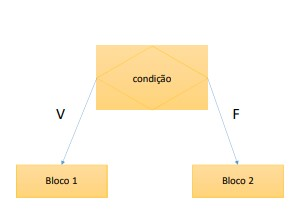

#### Sintaxe simples

```java
if (<condição>) {
  <comando 1>
  <comando 2>
}
```

- Se a ```<condição>``` for verdadeira, o bloco de código delimitado por chaves(*{}*) será executado, se falso, o bloco é pulado.

```java
// Exemplo 1

int x = 5;

System.out.println("Bom dia");

if (x < 0) { // Falso - Bloco não será executada
  System.out.println("Boa tarde");
}

System.out.println("Boa noite");
```

#### Sintaxe composta

```java
if (<condição>) {
  <comando 1>
  <comando 2>
} else {
  <comando 3>
  <comando 4>
}
```

- Se a ```<condição>``` for verdadeira, é executado o bloco do **if**, se falso, é executado o bloco do **else**.

```java
// Exemplo 2

Scanner sc = new Scanner(System.in);
int hora;

System.out.print("Que horas são? ");
hora = sc.nextInt();

if (hora < 12) {
  System.out.println("Bom dia!");
} else {
  System.out.println("Boa tarde!");
}

sc.close();
```

#### Sintaxe para múltiplas possibilidades

Imaginando a seguinte situação:

- Se quando a hora for menor que 12 eu mostrar: "Bom dia!";
- Quando a hora for maior ou igual a 12 e menor que 18 eu mostrar: "Bom tarde!";
- Quando a hora for maior ou igual a 18 eu mostrar: "Boa noite!".

```java
if (<condição 1>) {
  <comando 1>
  <comando 2>
} else if (<condição 2>) {
  <comando 3>
  <comando 4>
} else {
  <comando 5>
  <comando 6>
}
```

```java
// Exemplo 3

Scanner sc = new Scanner(System.in);
int horas;

System.out.print("Que horas são: ");
horas = sc.nextInt();

if (horas < 12) {
  System.out.println("Bom dia!");
} else if (horas < 18) {
  System.out.println("Boa tarde!");
} else {
  System.out.println("Boa noite!");
}

sc.close();
```

### 35. AVISO: exercícios para iniciantes PARTE 2

### 36. Exercícios para Iniciantes

[Exercícios 2](Recursos/pdf/Exercicios2-estrutura-condicional.pdf)

#### Exercício resolvido 1

[Link Youtube](https://www.youtube.com/watch?v=SRyQZBaA-_s)

Fazer um programa para ler as duas notas que um aluno obteve no primeiro e segundo semestres de uma disciplina anual. Em seguida, mostrar a nota final que o aluno obteve no ano juntamente com um texto explicativo. Caso a nota final do aluno seja inferior a 60.00, mostrar a mensagem "REPROVADO", conforme exemplos. Todos os valores devem ter uma casa decimal.

| Entrada | Saída             |
| ------- | ----------------- |
| 45.5    | NOTA FINAL = 76.8 |
| 31.3    | -                 |

| Entrada | Saída             |
| ------- | ----------------- |
| 34.0    | NOTA FINAL = 57.5 |
| 23.5    | REPROVADO         |

[Exercício resolvido 1](Workspace/aula37_Exercicio_resolvido_001)

#### Exercício resolvido 2

[Link Youtube](https://www.youtube.com/watch?v=3lhkB5I8P6E)

Leia 3 valores de ponto flutuante e efetue o cálculo das raízes da equação de Bhaskara. Se não for possível calcular as raízes, mosre a mensagem correspondente "*Impossível calcular*", Caso haja uma divisão por 0 ou raiz de número negativo.

- Entrada

Leia três valores de ponto flutuante (double) A, B e C

- Saída

Se não houver possibilidade de calcular as raízes, apresente a mensagem "*Impossível calcular*". Caso contrário, imprima o resultado das raízes com 5 dígitos após o ponto, com uma mensagem correspondente conforme exemplo abaixo. Imprima sempre o final de linha após cada mensagem.

Exemplos:

| Entrada       | Saída         |
| ------------- | ------------- |
| 10.0 20.1 5.1 | R1 = -0.29788 |
| -             | R2 = -1.71212 |

| Entrada      | Saída               |
| ------------ | ------------------- |
| 0.0 20.0 5.0 | Impossível calcular |

| Entrada        | Saída          |
| -------------- | -------------- |
| 10.3 203.0 5.0 | R1 = -0.02466  |
| -              | R2 = -19.68408 |

| Entrada      | Saída               |
| ------------ | ------------------- |
| 10.0 3.0 5.0 | Impossivel calcular |

[Exercício resolvido 2](Workspace/aula37_Exercicio_resolvido_002)

#### Exercício resolvido 3

[Link do youtube](https://www.youtube.com/watch?v=UjCVIcKccdQ)

Fazer um programa para ler três números inteiros. Em seguida, mostrar qual o menor dentre os três números lidos. Em caso de empate, mostrar apenas uma vez.

Exemplos:

| Entrada | Saída     |
| ------- | --------- |
| 7 3 8   | Menor = 3 |

| Entrada | Saída     |
| ------- | --------- |
| 5 12 5  | Menor = 5 |

| Entrada | Saída     |
| ------- | --------- |
| 9 9 9   | Menor = 9 |

[Exercício resolvido 3](Workspace/aula37_Exercício_resolvido_003)

#### Exercício 1

Fazer um programa para ler um número inteiro, e depois dizer se este número é negativo ou não.

Exemplos:

| Entrada | Saída        |
| ------- | ------------ |
| -10     | NEGATIVO     |
| 8       | NAO NEGATIVO |
| 0       | NAO NEGATIVO |

[Exercício 1](Workspace/aula37_Exercicio_001)

#### Exercício 2

Fazer um programa para ler um número inteiro e dizer se este número é par ou ímpar.

Exemplos:

| Entrada | Saída |
| ------- | ----- |
| 12      | PAR   |
| -27     | IMPAR |
| 0       | PAR   |

[Exercício 2](Workspace/aula37_Exercicio_002)

#### Exercício 3

Leia 2 valores inteiros (A e B). Após, o programa deve mostrar uma mensagem "Sao Multiplos" ou "Nao sao Multiplos", indicando se os valores lidos são múltiplos entre si. ATENÇÃO: os número devem poder ser digitados em ordem crescente ou decrescente.

Exemplos:

| Entrada | Saída             |
| ------- | ----------------- |
| 6 24    | Sao Multiplos     |
| 6 25    | Nao sao Multiplos |
| 26 6    | Sao Multiplos     |

[Exercício 3](Workspace/aula37_Exercicio_003)

#### Exercício 4

Leia a hora inicial e a hora final de um jogo. A seguir calcule a duração do jogo, sabendo que o mesmo pode começar em um dia e terminar em outro, tendo uma duração mínima de 1 hora e máxima de 24 horas.

Exemplos:

| Entrada | Saída                    |
| ------- | ------------------------ |
| 16 2    | O JOGO DURAOU 10 HORA(S) |
| 0 0     | O JOGO DURAOU 24 HORA(S) |
| 2 16    | O JOGO DURAOU 14 HORA(S) |

[Exercício 4](Workspace/aula37_Exercicio_004)

#### Exercício 5

Com base na tabela abaixo, escreva um programa que leia o código de um item e a quantidade deste item. A seguir, calcule e mostre o valor da conta a pagar.

| Código | Especificação   | Preço   |
| ------ | --------------- | ------- |
| 1      | Cachorro Quente | R$ 4.00 |
| 2      | X-Salada        | R$ 4.50 |
| 3      | X-Bacon         | R$ 5.00 |
| 4      | Torrada Simples | R$ 2.00 |
| 5      | Refrigerante    | R$ 1.50 |

Exemplos:

| Entrada | Saída           |
| ------- | --------------- |
| 3 2     | Total: R$ 10.00 |
| 2 3     | Total: R$ 13.50 |

[Exercício 5](Workspace/aula37_Exercicio_005)

#### Exercício 6

Você deve fazer um programa que leia um valor qualquer e apresente uma mensagem dizendo em qual dos seguintes intervalos ([0,25], (25, 50], (50, 75], (75, 100]) este valor se encontra. Obviamente se o valor não estiver em nenhum destes intervalos, deverá ser impressa a mensagem "Fora de intervalo".

Exemplos:

| Entrada | Saída               |
| ------- | ------------------- |
| 25.01   | Intervalo (25,50]   |
| 25.00   | Intervalo [0, 25]   |
| 100.00  | Intervalo (75, 100] |
| -25.02  | Fora de intervalo   |

[Exercício 6](Workspace/aula37_Exercicio_006)

#### Exercício 7

Leia 2 valores com uma casa decimal (x e y), que devem representar as coordenadas de um ponto em um plano. A seguir, determine qual o quadrante ao qual pertence o ponto, ou se está sobre um dos eixos cartgesianos ou na origem (x = y = 0).

Se o ponto estiver na origem, escreva a mensagem "Origem".

Se o ponto estiver sobre um dos eixos escreva "Eixo X" ou "Eixo Y", conforme for a situação.

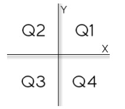

| Entrada  | Saída  |
| -------- | ------ |
| 4.5 -2.2 | Q4     |
| 0.1 0.1  | Q1     |
| 0.0 0.0  | Origem |

[Exercício 7](Workspace/aula37_Exercicio_007)

#### Exercício 8

Em um país imaginári denominado Lisarb, todos os habitantes ficam felizes em pagar seus impostos, pois sabem que nele não existem políticos corruptos e os recursos arrecadados são utilizado em benefício da população, sem qualqer desvio. A moeda deste país é o Rombus, cujo símbolo é o R$.

Leia um valor com duas casas decimais, equivalente ao salário de uma pessoa de Lisarb. em seguida, calcule e mostre o valor que eseta pessoa deve pagar de Imposto de Renda, segundo a tabela abaixo.

| Renda                        | Imposto de Renda |
| ---------------------------- | ---------------- |
| de R$ 0.00 a R$ 2000.00      | Isento           |
| de R$ 2000.01 até R$ 3000.00 | 8%               |
| de R$ 3000.01 até R$ 4500.00 | 18%              |
| acima de R$ 4500.01          | 28%              |

Lembre que, se o salário for R$ 3002.00, a taxa que incide é de 8% apenas sobre R$ 1000.00, pois a faixa de salário que fica de R$ 0.00 até R$ 2000.00 é isenta de Imposto de Renda. No exemplo fornecido (abaixo), a taxa é de 8% sobre R$ 1000.00 + 18% sobre R$ 2.00, o que resulta em R$ 80.36 no total.

O valor deve ser impresso com duas casas decimais.

| Entrada | Saída     |
| ------- | --------- |
| 3002.00 | R$ 80.36  |
| 1701.12 | Isento    |
| 4520.00 | R$ 355.60 |

[Exercício 8](Workspace/aula37_Exercicio_008)

### 37. Sintaxe opcional - Operadores de atribuição cumulativa

#### Operadores de atribuição cumulativos

| Operadores    | Equivalente     |
| ------------- | --------------- |
| ```a += b;``` | ```a = a + b``` |
| ```a -= b;``` | ```a = a - b``` |
| ```a *= b;``` | ```a = a * b``` |
| ```a /= b;``` | ```a = a / b``` |
| ```a %= b;``` | ```a = a % b``` |

Exemplo de uso:

Uma operadora de elefonia combra R$ 50.00 por um plano básico que dá direito a 100 minutos de telefone. Cada minuto que exceder a franquia de 100 minutos custa R$ 2.00. Fazer um programa para ler a quantidade de minutos que uma pessoa consumiu, daí mostrar o valor a ser pago.

| Entrada | Saída                   |
| ------- | ----------------------- |
| 22      | Valor a pagar: R$ 50.00 |
| 103     | Valor a pagar: R$ 56.00 |

```java
Locale.setDefault(Locale.US);
Scanner sc = new Scanner(System.in);

int qtdMinutos;
double valor = 50.0;

System.out.print("Digite a quantidade de minutos; ");
qtdMinutos = sc.nextInt();

if (qtdMinutos > 100) {
  valor += (qtdMinutos - 100) * 2.0; // Usando o operador de atribuição cumulativo
}

System.out.printf("Valor a pagar: R$ %.2f%n", valor);

sc.close();
```

[Exemplo 1](Workspace/aula38_Exemplo_001)

### 38. Sintaxe opcional - switch-case

A estrutura **switch**-**case** é utilizada quando se tem várias opções de fluxo a serem tratadas com base no valor de uma variável, ao invés de várias estruturas **if**-**else** encadeadas, é preferível utilizar a estrutura **switch**-**case**.

#### Sintaxe:

```java
switch (expressao) {
  case valor 1:
    comando 1;
    comando 2;
    break;
  case valor 2:
    comando 3;
    comando 4;
    break;
  default:
    comando 5;
    comando 6;
    break;
}
```

Exemplo de uso:

Fazer um programa para ler um valor inteiro de 1 a 7 representando um dia da semana (sendo 1 = domingo, 2 = segunda, e assim por diante).

Escrever na tela o dia da semana correspondente, conforme exemplos.

| Entrada | Saída                         |
| ------- | ----------------------------- |
| 1       | Dia da semana: domingo        |
| 4       | Dia da semana: quarta         |
| 9       | Dia da semana: valor inválido |

```java
// Exemplo 1

Scanner sc = new Scanner(System.in);

int number;
String dia;

System.out.println("Digite um número representando um dia da semana");
number = sc.nextInt();

switch (number) {

case 1:
  dia = "Domingo";
  break;
case 2:
  dia = "Segunda";
  break;
case 3:
  dia = "Terça";
  break;
case 4:
  dia = "Quarta";
  break;
case 5:
  dia = "Quinta";
  break;
case 6:
  dia = "Sexta";
  break;
case 7:
  dia = "Sábado";
  break;
default:
  dia = "Valor inválido";

}

System.out.println("Dia da semana: " + dia);

sc.close();
```

### 39. Expressões condicionais ternárias

É uma estrutura opcional ao *if*-*else* quando se deseja decidir um **valor** com base em uma condição.

#### Sintaxe

```java
(condição) ? valor_se_verdadeiro : valor_se_falso
```

#### Exemplos

```java
double preco = 34.5;
double desconto;

desconto = (preco < 20.0) ? preco * 0.1 : preco * 0.05;

System.out.println("O desconto é de: " + desconto);
```

### 40. Escopo e inicialização

- **Escopo de uma variável**: é a região do programa onde a variável é válida, ou seja, onde ela pode ser referenciada.
- Uma variável não pode ser usada se não for iniciada.

```java
Scanner sc = new Scanner(System.in);

double price = sc.nextDouble();
double discount = 0; // precisa ser inicializada antes do if

if (price > 100.0) {
  discount = price * 0.1;
}

System.out.println(discount);

sc.close();
```

## Seção 6: Estruturas repetitivas

### 41. Visão geral do capítulo

### 42. Material de apoio do capítulo

[Material de apoio](Recursos/pdf/06-estruturas-repetitivas.pdf)

### 43. Como utilizar o DEBUG no Eclipse (execução passo a passo)

- Para marcar uma linha de *breakpoint*:
  - *Run* -> *Toggle Breakpoint*
- Para iniciar o *debug*:
  - Botão direito na classe -> *Debug as* -> *Java Aplication*
- Para executar uma linha:
  - *F6*
- Para interromper o *debug*:
  - *Stop*

### 44. Estrutura repetitiva enquanto (while)

A estrutura repetitiva **while** (enquanto) é uma **estrutura de controle** que *repete* um bloco de coamandos enquanto uma condição for verdadeira. É utilizada quando **não** se sabe previamente a quantidade de repetições que será realizada.

#### Sintaxe

```java
while (condicao) {
  comando 1
  comando 2
}
```

#### Exemplo de uso

Fazer um progrmaa que leia números inteiros até que um zero seja lido. Ao final mostra a soma dos números lidos.

| Entrada | Saída |
| ------- | ----- |
| 5       | 11    |
| 2       |       |
| 4       |       |
| 0       |       |

```java
Scanner sc = new Scanner(System.in);

int num, soma;

System.out.print("Digite um número: ");
num = sc.nextInt();

soma = 0;

while (num != 0) {
  
  soma += num;
  
  System.out.print("Digite outro número: ");
  num = sc.nextInt();
    
}

System.out.println(soma);

sc.close();
```

### 45. Teste de mesa com estrutura repetitiva enquanto

### 46. Exercícios de teste de mesa com while

### 47. AVISO: exercícios para iniciantes PARTE 3

### 48. Exercícios para Inicantes - PARTE 3

[Exercícios 3](Recursos/pdf/Exercicios3-estrutura-while.pdf)

#### Exercício resolvido 1

[Link Youtube](https://www.youtube.com/watch?v=r3qCFqaNHds)

Leia uma quantidade indeterminada de duças de valores inteiros X e Y. Escreva para cada X e Y uma mensagem que indique se estes valores foram digitados em ordem crescente ou decrescente.

##### Entrada

A entrada contém vários casos de teste. Cada caso contém dois valores inteiros X e Y. A leitura deve ser encerrada ao ser fornecido valores iguais para X e Y.

##### Saída

Para cada caso de teste imprima "Crescente", caso os valores tenham sido digitado na ordem crescente, caso contrário imprima a mensagem "Decrescente".

| Entrada | Saída       |
| ------- | ----------- |
| 5 4     | Decrescente |
| 7 2     | Decrescente |
| 3 8     | Crescente   |
| 2 2     |             |

[Exercício resolvido 1](Workspace/aula049_Exercicio_resolvido_001)

#### Exercício resolvido 2

[Link Youtube](https://www.youtube.com/watch?v=vT0QEDHK2yU)

Faça um programa para ler um número indeterminado de dados, contendo cada um, a idade de um indivíduo. O último dado, que não entrar nos cálculos, contém um valor de idade negativa. Calcular e imprimir a idade média deste grupo de indivíduos. se for entrado um valor negativo na primeira vez, mostrar a mensagem "impossível calcular".

| Entrada | Saída |
| ------- | ----- |
| 31      | 34.67 |
| 27      |       |
| 46      |       |
| -5      |       |

| Entrada | Saída               |
| ------- | ------------------- |
| -10     | impossível calcular |

[Exercício resolvido 2](Workspace/aula049_Exercicio_resolvido_002)

#### Exercício 1

Escreva um programa que repita a leitura de uma senha até que ela seja válida. Para cada leitura de senha incorreta informada, escrever a mensagem "Senha Invalida". Quando a senha for informada corretamentne deve ser impressa a mensagem "Acesso Permitido" e o algoritmo encerrado. Considere que a senha correta é o valor 2002.

Exemplo:

| Entrada | Saída            |
| ------- | ---------------- |
| 2200    | Senha Invalida   |
| 1020    | Senha Invalida   |
| 2022    | Senha Invalida   |
| 2002    | Acesso Permitido |

[Exercício 1](Workspace/Aula049_Exercicio_001)

#### Exercício 2

Escreva um programa para ler as coordenadas (X, Y) de uma quantidade indeterminada de pontos no sistema cartesiano. Para cada ponto escrever o quadrante a que ele pertence. O algoritmo será encerrado quando pelo menos uma de duas coordenadas for NULA (Nesta situação sem escrever menagem alguma).

Exemplo:

| Entrada | Saída    |
| ------- | -------- |
| 2 2     | primeiro |
| 3 -2    | quarto   |
| -8 -1   | terceiro |
| -7 1    | segundo  |
| 0 2     |          |

[Exercício 2](Workspace/aula049_Exercicio_002)

#### Exercício 3

Um posto de combustíveis deseja determinar qual de seus produtos tem a preferência de seus clientes. Escreva um algoritmo para ler o tipo de combustível abastecido (codificando da seguinte forma: 1. Álcool 2. Gasolina 3. Diesel 4 fim). Caso o usuário informe um código inválido (fora da faixa de 1 a 4) deve ser solicitado um novo código (até que seja válido). O programa será encerrado quano o código informado for o número 4. Deve ser escrito a mensagem: "MUITO OBRIGADO" e a quantidade de clientes que abasteceram cada tipo de combustível, conforme exemplo.

Exemplo:

| Entrada | Saída          |
| ------- | -------------- |
| 8       | MUITO OBRIGADO |
| 1       | Alcool: 1      |
| 7       | Gasolina: 2    |
| 2       | Diesel: 0      |
| 2       |                |
| 4       |                |

[Exercício 3](Workspace/aula049_Exercicio_003)

### 49. Estrutura repetitiva "para" (for)

É uma **estrutura de controle** que **repete** um bloco de comandos **para** um certo **intervalo de valores**.

#### Sintaxe

```java
for (início; condição; incremento) {
  comando 1
  comando 2
}

// início - Executa somente na primeira vez
// condição - V = Executa e volta | F = Pula fora
// Incremento - Executa toda vez depois de voltar
```

#### Exemplo

Fazer um programa que lê um valor inteiro N e depois N números inteiros. Ao final, mostra a soma dos N números lidos.

| Entrada | Saída |
| ------- | ----- |
| 3       | 11    |
| 5       |       |
| 2       |       |
| 4       |       |

[Exemplo](Workspace/aula050_Exemplo_001)

### 50. Teste de mesa com estrutura repetitiva para

### 51. Exercícios de testes de mesa com for

### 52. AVISO: exercícios para iniciiantes PARTE 4

### 53. Exercícios para iniciantes PARTE 4

[Exercícios 4](Recursos/pdf/Exercicios4-estrutura-for.pdf)

#### Exercício resolvido 01

[Link Youtube](https://www.youtube.com/watch?v=JTa8WEhV38E)

Leia 1 valor inteiro N (2 < N < 2N). A seguir mostre a tabuada de N:
1 x N = N
2 x N = 2N
...
10 x N = 10N

##### Entrada

A entrada contém um número inteiro **N** (2 < **N** < 1000).

##### Saída

Imprima a tabuada de N, conforme o exemplo fornecido.

| Entrada | Saída           |
| ------- | --------------- |
| 140     | 1 x 140 = 140   |
|         | 2 x 140 = 280   |
|         | 3 x 140 = 420   |
|         | 4 x 140 = 560   |
|         | 5 x 140 = 700   |
|         | 6 x 140 = 840   |
|         | 7 x 140 = 980   |
|         | 8 x 140 = 1120  |
|         | 9 x 140 = 1260  |
|         | 10 x 140 = 1400 |

#### Exercícios resolvido 02

[Link Youtube](https://www.youtube.com/watch?v=RVJnkOyc7Kk)

Leia 2 valores inteiros *x* e *y*. A seguir, calcule e mostre a soma dos números ímpares entre eles.

##### Entrada

O arquivo de entrada contém dois valores inteiros.

##### Saída

O programa deve imprimir um valor inteiro. Este valor é a soma dos valores ímpares que estão entre os valores fornecidos na entrada que deverá caber em um inteiro.

| Entrada | Saída |
| ------- | ----- |
| 6       | 5     |
| -5      |       |

| Entrada | Saída |
| ------- | ----- |
| 15      | 13    |
| 12      |       |

| Entrada | Saída |
| ------- | ----- |
| 12      | 0     |
| 12      |       |

[Exercício resolvido 2](Workspace/aula051_Exercicio_resolvido_002)

#### Exercício 1

Leia um valor inteiro x (1 <= x <= 100). Em seguida mostre os ímpares de 1 até x, um valor por linha, inclusive o x, se for o caso.

Exemplo:

| Entrada | Saída |
| ------- | ----- |
| 8       | 1     |
|         | 5     |
|         | 7     |
|         | 3     |

[Exercício 1](Workspace/aula054_Exercicio_001)

#### Exercício 2

Leia um valor inteiro N. Este valor será a quantidade de valores inteiros X que serão lidos em seguida.

Mostre quantos destes valores X estão dentro do intervalo [10, 20] e quantos estão fora do intervalo, mostrando essas informações conforme exemplo (use a palavra "*in*" para dentro do intervalo, e "*out*" para fora do intervalo).

Exemplo:

| Entrada | Saída |
| ------- | ----- |
| 5       | 2 in  |
| 14      | 3 out |
| 10      |       |
| 123     |       |
| -25     |       |
| 32      |       |

[Exercício 2](Workspace/aula054_Exercicio_002)

#### Exercício 3

Leia 1 valor inteiro N, que representa o número de casos de teste que vem a seguir. cada caso de teste consiste de 3 valores reais, cada um deles com uma casa decimal. Apresente a média ponderada para cada um destes conjunto de 3 valores, sendo que o primeiro valor tem peso 2, o segundo valor tem peso 3 e o terceiro valor tem peso 5.

Exemplo:

| Entrada      | Saída |
| ------------ | ----- |
| 3            | 5.7   |
| 6.5 4.3 6.2  | 6.3   |
| 5.1 4.2 8.1  | 9.3   |
| 8.0 9.0 10.0 |       |

[Exercício 3](Workspace/aula054_Exercicio_003)

#### Exercício 4

Fazer um programa para ler um número N. Depois leia N pares de números e mostre a divisão do primeiro pelo segundo. Se o denominador for igual a zero, mostrar a mensagem "*divisao impossivel*".

Exemplo:

| Entrada | Saída              |
| ------- | ------------------ |
| 3       | -1.5               |
| 3 -2    | divisao impossivel |
| -8 0    | 0.0                |
| 0 8     |                    |

[Exercício 4](Workspace/aula054_Exercicio_004)

#### Exercício 5

Ler um valor N. Calcular e escrever seu respectivo fatorial. Fatorial de N = N * (N - 1) * (N - 2) * * (N - 3) * ... * 1. Lembrando que, por definição, fatorial de 0 é 1.

Exemplo:

| Entrada | Saída |
| ------- | ----- |
| 4       | 24    |

| Entrada | Saída |
| ------- | ----- |
| 1       | 1     |

| Entrada | Saída |
| ------- | ----- |
| 5       | 120   |

| Entrada | Saída |
| ------- | ----- |
| 0       | 1     |

[Exercício 5](Workspace/aula054_Exercicio_005)

#### Exercício 6

Ler um número inteiro N e calcular todos os seus divisores

Exemplo:

| Entrada | Saída |
| ------- | ----- |
| 6       | 1     |
|         | 2     |
|         | 3     |
|         | 6     |

[Exercício 6](Workspace/aula054_Exercicio_006)

#### Exercício 7

Fazer um programa para ler um número inteiro positivo N. O programa deve entrão mostrar na tela N linhas, começando de 1 até N. Para cada linha, mostrar o número de ljinhas, depois o quadrado e o cubo do valor, conforme exemplo.

Exemplo:

| Entrada | Saída    |
| ------- | -------- |
| 5       | 1 1 1    |
| -       | 2 4 8    |
| -       | 3 9 27   |
| -       | 4 16 64  |
| -       | 5 25 125 |

[Exercício 7](Workspace/aula054_Exercicio_007)

### 54. Estrutura repetitiva faça-enquanto (do-while)

É uma **estrutura de controle** que repete um bloco de comandos enquanto uma condição for verdadeira. contudo, diferente da estrutura *while*, a instrução *do-while* é executada ao menos um vez e sua condição é verificada no final.

Apesar de menos utilizada que as outras estruturas já estudadas, em alguns casos esta esta se encaixa melhor.

#### Sintaxe

```java
do {
  comando 1
  comando 2
} while ( condicao );
```

#### Exemplo de uso

Fazer um programa para ler uma temperatura em Celsius e mostrar o equivalente em Fahrenheit. Perguntar se o usuário deseja repetir (s/n). Caso o usuário digite "s", repetiro o programa.

Fórmula: F = 9c / 5 + 32

Exemplo:

```powershell
Digite a temperatura em Celcius: 30.0
Equivalente em Fahrenheit: 86.0
Deseja repetir (s/n): s
Digite a temperatura em Celcius: 21.0
Equivalente em Fahrenheit: 69.8
Deseja repetir (s/n): s
Digite a temperatura em Celcius: -10.5
Equivalente em Fahrenheit: 13.1
Deseja repetir (s/n): n
```

```java
Locale.setDefault(Locale.US);
Scanner sc = new Scanner(System.in);

char option;

do {
  
  System.out.print("Digite a temperatura em Celcius: ");
  double c = sc.nextDouble();
  double f = 9 * c / 5 + 32;
  System.out.printf("Equivalente em Fahrenheit: %.1f%n", f);
  System.out.print("Deseja repetir (s/n): ");
  option = sc.next().charAt(0);
  
} while (option == 's');

sc.close();
```

[Exemplo 1](Workspace/aula055_Exemplo_001)

## Seção 7: Outros tópicos básicos sobre Java

### 55. Material de apoio do capítulo

[Material de apoio](Recursos/pdf/07-outros-topicos-basicos.pdf)

### 56. Restrições e convenções para nomes

#### Restrições para nomes de variáveis

- Não podem começar com dígito: use uma letra ou *_*
- Não usar acentos ou til
- Não pode ter espaço em branco
- Sugestão: use nomes que tenham um significado

Exemplos:

| Errado                      | Certo                     |
| --------------------------- | ------------------------- |
| int 5minutes;               | int _5minutes;            |
| int salário;                | int salario;              |
| int salario do funcionario; | int salarioDoFuncionario; |

#### Convenções

- **Camel Case** : *lastName*
  - pacotes
  - atributos
  - métodos
  - variáveis e parâmetros

- **Pascal Case**:  *ProductService*
  - classes

### 57. Operadores bitwise

**Operadores bitwise** são aqueles que realizam operações lógicas bit a bit em valores.

| Operador | Significado                       |
| -------- | --------------------------------- |
| &        | Operação "E" bit a bit            |
| &boxv;   | Operação "OU" bit a bit           |
| ^        | Operação "OU-Exclusivo" bit a bit |

#### Tabela verdade

| C1  | C2  | C1 & C2 |
| --- | --- | ------- |
| F   | F   | F       |
| F   | V   | F       |
| V   | F   | F       |
| V   | V   | V       |

| C1  | C2  | C1 &boxv; C2 |
| --- | --- | ------------ |
| F   | F   | F            |
| F   | V   | V            |
| V   | F   | V            |
| V   | V   | V            |

| C1  | C2  | C1 ^ C2 |
| --- | --- | ------- |
| F   | F   | F       |
| F   | V   | V       |
| V   | F   | V       |
| V   | V   | F       |

#### Exemplos

```java
// Exemplo 1

int n1 = 89;
int n2 = 60;

System.out.println(n1 & n2); // 24
System.out.println(n1 | n2); // 125
System.out.println(n1 ^ n2); // 101
```

[Exemplo 1](Workspace/aula058_Exemplo_001)

```java
// Exemplo 2

Scanner sc = new Scanner(System.in);

int mask = 0b100000;
int n = sc.nextInt();

if ((n & mask) != 0) {
  System.out.println("6th bit is true!");
} else {
  System.out.println("6th bit is false!");
}

sc.close();

```

[Exemplo 2](Workspace/aula058_Exemplo_002)

### 58. Funções interessantes para String

#### Checklist

- Formatar: *toLowerCase()*, *toUpperCase()*, *trim()*
- Recortar: *substring(inicio)*, *substring(inicio, fim)*
- Substituir: *replace(char, char)*, *replace(string, string)*
- Buscar: *IndexOf()*, *LastIndexOf()*
- dividir: *str.Split(" ")*

#### Exemplos

```java
// Exemplo 1
String original = "abcde FGHIJ ABC abc DEFG    ";

String s01 = original.toLowerCase();
String s02 = original.toUpperCase();
String s03 = original.trim();
String s04 = original.substring(2);
String s05 = original.substring(2, 9);
String s06 = original.replace('a', 'x');
String s07 = original.replace("abc", "xy");
int i = original.indexOf("bc");
int j = original.lastIndexOf("bc");

System.out.println("Original: -" + original + "-"); // Original: -abcde FGHIJ ABC abc DEFG    -
System.out.println("toLowerCase: -" + s01 + "-"); // toLowerCase: -abcde fghij abc abc defg    -
System.out.println("toUpperCase: -" + s02 + "-"); // toUpperCase: -ABCDE FGHIJ ABC ABC DEFG    -
System.out.println("trim: -" + s03 + "-"); // trim: -abcde FGHIJ ABC abc DEFG-
System.out.println("substring(2): -" + s04 + "-"); // substring(2): -cde FGHIJ ABC abc DEFG    -
System.out.println("substring(2, 9): -" + s05 + "-"); // substring(2, 9): -cde FGH-
System.out.println("replace('a', 'x'): -" + s06 + "-"); // replace('a', 'x'): -xbcde FGHIJ ABC xbc DEFG    -
System.out.println("replace(\"abc\", \"xy\"): -" + s07 + "-"); // replace("abc", "xy"): -xyde FGHIJ ABC xy DEFG    -
System.out.println("indexOf(\"bc\"): " + i); // indexOf("bc"): 1
System.out.println("lastIndexOf(\"bc\"): " + j); //lastIndexOf("bc"): 17
```

[Exemplo 1](Workspace/aula059_Exemplo_001)

```java
// Exemplo 2
String s = "potato apple lemon";

String[] vect = s.split(" ");
String word1 = vect[0];
String word2 = vect[1];
String word3 = vect[2];

System.out.println(word1); // potato
System.out.println(word2); // apple
System.out.println(word3); // lemon
```

### 59. Comentários em Java (básico)

#### Comentário de linha

```java
// Este é um comentário de linha
```

#### Comentário de bloco

```java
/**
 * Este
 * é
 * um
 * comentário 
 * de
 * bloco
 */
```

### 60. Funções (sintaxe)

- Representam um processamente que possui um significado.
  - Math.sqrt(double)
  - System.out.println(string)

- Principais vantagens: **modularização**, **delegação** e **reaproveitamento**

- Dados de entrada e saída
  - Funções podem receber dados de entrada (parâmetros ou argumentos)
  - Funções podem ou não retornar uma saída

- Em orientação a objetos, funções em classes recebem o nome de "métodos".

#### Exemplo

Fazer um programa para ler três números inteiros e mostrar na tela o maior deles.

Exemplo

```powershell
Enter theree numbers:
5
8
3
higher = 8
```

[Exemplo 1](Workspace/aula061_Exemplo_001)

## Seção 8: Introdução à Programação Orientada a Objetos

### 61. Visão geral do capítulo

### 62. Material de apoio do capítulo

[Material de apoio](Recursos/pdf/08-classes-atributos-membros-staticos.pdf)

### 63. Resolvendo um problema sem orientação a objetos

Fazer um programa para ler as medidas dos lados de dois triângulos X e Y (suponha medidas válidas). Em seguida, mostrar o valor das áreas dos dois triângulos e dizer qual dos dois triângulos possuí a maior área.

A formula para calcular a área de um triângulo a partir das medidas de seus lados *a*, *b* e *c* é a seguinte (fórmula de Heron):

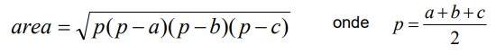

Exemplo:

```powershell
Enter the measures of triangle X:
3.00
4.00
5.00
Enter the measures of triangle Y:
7.50
4.50
4.02
Triangle X area: 6.0000
Triangle Y area: 7.5638
Larger area: Y
```

[Exemplo 1](Workspace/aula064_Exemplo_001)

### 64. Criando uma classe com três atributos para representar melhor o triângulo

#### Discussão

Triângulo é uma entidade com três atributos: *a*, *b* e *c*

Estamos usando três variáveis distintas para representar cada triângulo:

```double aX, bX, cX, aY, bY, cY;```

Para melhorár isso, vamos usar uma **classe** para representar um triângulo

#### classe

É um tipo estruturada que pode conter (membros):

- **Atributos** (*dados* / *campos*)
- **Métodos** (*funções* / *operações*)

A classe também pode prover outros recursos, tais como:

- Construtores
- Sobrecarga
- Encapsulamento
- Herança
- Polimorfismo

Exemplos:

- **Entidades**: Produto, Cliente, Triângulo
- **Serviços**: ProdutoService, ClienteService, EmailService, StorageService
- **Controladores**: ProdutoController, ClienteController
- **Utilitário**: Calculadora, Compactador
- **outros**: Views, Repositórios, Gerenciadores, etc

#### Instanciação

Conforme pode ser visto na imagem abaixo, quando declaramos a variável *x* e *y* do tipo *triangle*, estamos criando na memória estática (**stack**), apenas espaço para armazenar as referências (ponteiro) para os futuros objetos. Já quando instanciamos, isto é, utilizamos o comando *new*, estamos alocando na memória dinâmica (**Heap**) o espaço da memória para o armazenamento dos dados do objeto.

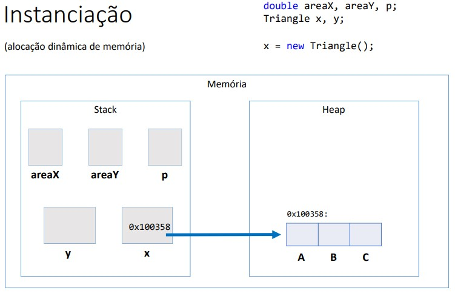

[Exemplo 1](Workspace/aula065_Exemplo_001)

### 65. Criando um método para obtermos os benefícios de reaproveitamento e delegação.

#### Discussão

Com o uso da **classe**, agora nós temos uma variável composta do tipo "Triangle" para representar cada triângulo:

```java
Triangle x, y;
x = new Triangle();
y = new Triangle();
```

Agora vamos melhorar nossa **classe**, acrescentando nela um **método** para calcular a área.

#### Projeto da classe (UML)

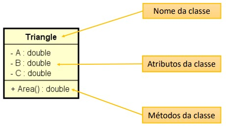

#### Benefícios

Quais são os benefícios de se calcular a área de um triângulo por meio de um **método** dentro da **classe** *Triangle*?

1. **Reaproveitamento de código**: nós eliminamos o código repetido (cálculo das áreas dos triângulos x e y) no programa principal.
2. **Delegação de responsabilidades**: quem deve ser responsável por saber como calcular a área de um triângulo é o próprio triângulo. A lógica do cálculo da área não deve estar em outro lugar.

[Exemplo 1](Workspace/aula066_Exemplo_001)

### 66. Começando a resolver um segundo problema exemplo

Fazer um programa para ler os dados de um produto em estoque (nome, preço e quantidade no estoque). Em seguida:

- Mostrar os dados do produto (nome, preço, quantidade no estoque, valor total no estoque).
- Realizar uma entrada no estoque e mostrar novamente os dados do produto.
- Realizar uma saída no estoque e mostrar novamente os dados do produto.

Para resolver este problema, você deve criar uma **classe** conforme projeto a seguir:

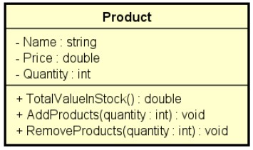

Exemplo:

```powershell
Enter product data:
Name: TV
Price: 900.00
Quantity in stock: 10

Product data: TV, $ 900.00, 10 units, Total: $ 9000.00

Enter the number of products to be added in stock: 5

Updated data: TV, $ 900.00, 15 units, Total: $ 13500.00

Enter the number of products to be removed from stock: 3

Updated data: TV, $ 900.00, 12 units, Total: $ 10800.00
```

[Exemplo 1](Workspace/aula067_Exemplo_001)

### 67. Object e toString

#### Discussão

- Toda a classe em **Java** é uma subclasse da classe **Object**.
- **Object** possui os seguintes métodos.
  - **getClass** - retorna o tipo do objeto
  - **equals** - compara se o objeto é igual a outro
  - **hashCode** - retorna um código hash do objeto
  - **toString** - converte o objeto para String

[Exemplo 1](Workspace/aula068_Exemplo_001)

### 68. Finalizando o programa

[Exemplo 1](Workspace/aula069_Exemplo_001)

### 69. Exercícios de fixação

#### Exercício 1

Fazer um programa para ler os valores da largura e altura de um retângulo. Em seguida, mostrar na tela o valor de sua área, perímetro e diagonal. Usar uma classe como mostrado no projeto abaixo.

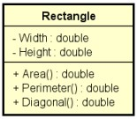

Exemplo:

```powershell
Enter rectangle width and height:
3.00
4.00
AREA = 12.00
PERIMETER = 14.00
DIAGONAL = 5.00
```

[Exercício 1](Workspace/aula070_Exercicio_001)

#### Exercício 2

Fazer um proggrama para ler os dados de um funcionário (nome, salário bruto e imposto). Em seguida, mostrar os dados do funcionário (nome e salário líquido). Em mseguida, aumentar o salário do funcionário com base em uma porcentagem dada (somente o salário bruto é afetado pela porcentagem) e mostrar novamente os dados do funcionário. Use a classe projetada abaixo:

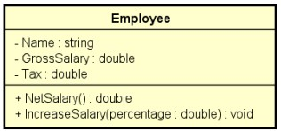

Exemplo:

```powershell
Nome: João Silva
Gross salary: 6000.00
Tax: 1000.00

Employee: João Silva, $ 5000.00

Which percentage to increase salary? 10.0

Updated data: João Silva, $ 5600.00
```

[Exercício 2](Workspace/aula070_Exercicio_002)

#### Exercício 3

Fazer um programa para ler o nome de um aluno e as três notas que ele obteve nos três trimestres do ano (primeiro trimestre vale 30 e o segundo e terceiro valem 35 cada). Ao final, mostrar qual a nota final do aluno no ano. Dizer também se o aluno está aprovado (PASS) ou não (FAILED) e, em caso negativo, quantos pontos faltam para o aluno obter o mínimo para ser aprovado (que é 60% da nota). Você deve criar uma classe *Student* para resolver este problema.

Exemplo:

| Entrada    | Saída               |
| ---------- | ------------------- |
| Alex Green | FINAL GRADE = 90.00 |
| 27.00      | PASS                |
| 31.00      | -                   |
| 32.00      | -                   |

| Entrada    | Saída               |
| ---------- | ------------------- |
| Alex Green | FINAL GRADE = 52.00 |
| 17.00      | FAILED              |
| 20.00      | MISSING 8.00 POINTS |
| 15.00      | -                   |

[Exercício 3](Workspace/aula070_Exercicio_003)

[Resposta dos exercícios](Recursos/pdf/08-correcao-exercicios-fixacao.pdf)

### 70. Membros estáticos - Parte 1

Também chamados de **membros de classe** (*em oposição a membros de instância*), são membros que fazem sentido independentemente de objeto. Não precisam de objeto para serem chamados. São chamados a partir do próprio nome da classe.

- Aplicações comuns
  - Classes utilitárias. Ex.: ```Math.sqrt(double)```
  - Declaração de constantes

Um classe que possuí somente membros estáticos, pode ser uma classe estática também. Esta classe não poderá ser instanciada.

Em um diagrama UML, as classes estáticas são representadas com um *underline*.

#### Exemplo de uso

Fazer um programa para ler um valor numérico qualquer, e daí mostrar quanto seria o valor de uma circunferência e do volume de uma esfera para um raio daquele valor. Informar também o valor de PI com duas casas decimais.

Exemplo:

```powershell
Enter radius: 3.0
Circumference: 18.84
Volume: 113.04
PI value: 3.14
```

#### Faremos a solução em 3 versões:

- Versão 1: métodos na própria classe do programa;
  - *Nota*: dentro de um método estático você não pode chamar membros de instância da mesma classe.
- Versão 2: classe Calculator com membros de instância;
- Versão 3: classe Calculator com método estático.

#### Versão 1 - Métodos na própria classe do programa

[Exemplo 1](Workspace/aula071_Exemplo_001)

#### Versão 2 - Classe Calculator com membros de instância

[Exemplo 2](Workspace/aula071_Exemplo_002)

### 71. Membros estáticos - Parte 2

#### Discussão

Ao contrário do problema resolvido anteriormente, referente aos triângulos, que cada um possuía a sua área, no caso da calculadora, os valores dos cálculos não mudam para calculadoras diferentes, ou seja, são cálculos estáticos. o valor de PI também é estático.

Como exemplo, caso intanciemos duas calculadoras, os valores de suas operações seriam iguais, confome destacado abaixo:

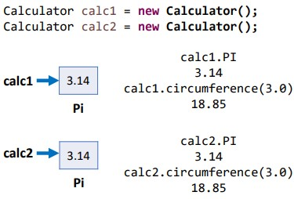

#### Versão 3 - Classe Calculator com método estático

[Exemplo 1](Workspace/aula072_Exemplo_001)

### 72. Exercício de fixação

Faça um programa para lere a cotação do dólar, e depois um valor em dólares a ser comprado por uma pessoa em reais. Informar quantos reais a pessoa vai pagar pelos dólares, considerando ainda que a pessoa terá que pagar 6% de IOF sobre o valor em dólar. Criar uma classe **CurrencyConverter** para ser responsável pelos cálculos.

Exemplo:

```powershell
What is the dollar price? 3.10
How many dollars will be bought? 200.00
Amount to be paid in reais = 657.20
```

[Exercício 1](Workspace/aula073_Exercicio_001)

## Seção 9: Construtores, palavra this, sobrecarga, encapsulamento

### 73. Visão geral do capítulo

### 74. Material de apoio do capítulo

[Material de apoio](Recursos/pdf/09-construtores-this-sobrecarga-encapsulamento.pdf)

### 75. Construtores

**Construtor** é uma operação especial da classe, que executa no momento da instanciação do objeto.

Se um construtor customizado não for especificado, a classe disponibiliza o construtor padrão: ```Product p = new Product();```

É possível especificar mais de um construtor na mesma classe (**sobrecarga**)

#### Usos comuns:

- Inicial valores dos atributos
- Permitir ou obrigar que o objeto receba *dados* / *dependências* no momento de sua instanciação (injeção de dependências).

#### Problema exemplo

Fazer um programa para ler os dados de um produto em estoque (nome, preço e quantidade no estoque). Em seguida:

- Mostrar os dados do produto (nome, preço, quantidade no estoque, valor total no estoque).
- Realizar uma entrada no estoque e mostrar novamente os dados do produto.
- Realizar uma saída no estoque e mostrar novamente os dados do produto.

Para resolver este problema, você deve criar uma **classe** conforme projeto a seguir:


Exemplo:

```powershell
Enter product data:
Name: TV
Price: 900.00
Quantity in stock: 10

Product data: TV, $ 900.00, 10 units, Total: $ 9000.00

Enter the number of products to be added in stock: 5

Updated data: TV, $ 900.00, 15 units, Total: $ 13500.00

Enter the number of products to be removed from stock: 3

Updated data: TV, $ 900.00, 12 units, Total: $ 10800.00
```

#### Proposta de melhoria

Quando executamos o comando abaixo, instanciamos um produto "**product**" com seus atributos "Vazios":

```product = new product()```

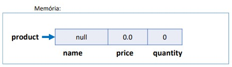

Entretando, faz sentido um produto que não tem nome? faz sentido um produto que não tem preço?

Com o intuíto de evitar a existência de produtos sem nome e sem preço, é possível fazer com que seja "Obrigatória" a iniciação deses valores?

[Exemplo 1](Workspace/aula076_Exemplo_001)

### 76. Palavra this

A palavra **this** é uma referência para o próprio objeto.

#### Usos comuns:

- Diferenciar atributos de variáveis locais.
- Passar o próprio objeto como argumento na chamada de um método ou construtor.

### 77. Sobrecarga

É um recurso que um aclasse possui de oferecer mais de uma operação com o mesmo nome, porém com diferentes listas de parâmetros.

#### Proposta de melhoria

Proposta de melhoria do projeto do programa para ler os dados de um produto em estoque:

- Vamos criar um construtor opcional, o qual recebe apenas o nome e o preço do produto. A quantidade em estoque deste novo produto, por padrão, deverá então ser iniciada com o valor zero.

- **Nota**: é possível também inclouir um construtor padrão.

### 78. Encapsulamento

**Encapsulamento** é um princípio que consiste em esconder detalhes de implementação de uma classe, expondo apenas as operações seguras e que mantenham os objetos em um estado consistente.

- **Regra de ouro**: o objeto deve sempre estar em um estado consistente, e a própria classe deve garantir isso.

#### Regra geral básica

- Um objeto **não** deve expor nenhum atributo (modificador de acesso deve ser ***private***)
- O atributos devem ser acessados por meio do método *get* e *set*
  - Padrão JavaBeans: [https://pt.wikipedia.org/wiki/JavaBeans](https://pt.wikipedia.org/wiki/JavaBeans)

#### Exemplo de uso

[Exemplo 1](Workspace/aula079_Exemplo_001)

### 79. Gerando automaticamente construtores, getters e setters com Eclipse

#### Gerando construtor

Coloque o cursor onde você deseja incluir o construtor e utilize um dos dois métodos:

- Método 1
  - Botão direito -> Source -> Generate Constructor using Fields
- Método 2
  - ```Ctrl``` + ```3``` -> Digitar ```gcuf``` (Generate Constructor using Fields)

#### Gerando getters e setters

Coloque o cursor onde você deseja incluir os métodos e utilize um dos dois métodos:

- Método 1
  - Botão direito -> Source -> Generate Getters and Setters
- Método 2
  - ```Ctrl``` + ```3``` -> Digitar ```ggas``` (Generate Getters and Setters)

[Exemplo 1](Workspace/aula080_Exemplo_001)

### 80. Modificadores de acesso

- [https://docs.oracle.com/javase/tutorial/java/javaOO/accesscontrol.html](https://docs.oracle.com/javase/tutorial/java/javaOO/accesscontrol.html)
- **private**: o membro só pode ser acessado na **própria classe**
- **(nada)**: o membro só pode ser acessado nas classes do **mesmo pacote**
- **protected**: o membro só pode ser acessado no **mesmo pacote**, bem como em **subclasses de pacotes diferentes**
- **public**: o membro é acessado por todas as classes (a menos que ele resida em um módulo diferente que não exporte o pacote onde ele está)

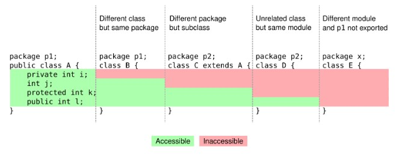

Fonte: [https://stackoverflow.com/questions/215497/what-is-the-difference-between-public-protected-package-private-and-private-in](https://stackoverflow.com/questions/215497/what-is-the-difference-between-public-protected-package-private-and-private-in)

### 81. Exercício de fixação

Em um banco, para se cadastrar uma conta bancária, é necessário informar o número da conta, o nome do titular da conta, e o valor de depósito inicial que o titular depositou ao abrir a conta. Este valor de depósito inicial, entratanto, é opcional, ou seja: se o titular não tiver dinheiro a depositar no momento de abrir sua conta, o depósito inicial não será feito e o saldo inicial da conta será, naturalmente, zero.

importante: uma vez que uma conta bancária foi aberta, o número da conta nunca poderá ser alterado. já o nome do titular pode ser alterado (pois uma pessoa pode mudar de nome por ocasião de casamento, por exemplo).

Por fim, o saldo da conta não pode ser alterado livremente. É preciso haver um mecanismo para proteger isso. O saldo só aumento por meio de depósitos, e só diminui por meio de saques. Para cada saque realizado, o banco cobra uma taxa de $ 5.00. Nota: a conta pode ficar com saldo negativo se o saldo não for suficiente para realizar o saque e/ou pagar a taxa.

Você deve fazer um programa que realize o cadastro de uma conta, dando opção para que seja ou não informado o valor de depósito inicial. Em seguida, realizar um depósito e depois um saque, sempre mostrando os dados da conta após cada operação.

Exemplos:

```powershell
Enter account number: 8532
Enter account holder: Alex Green
Is there an initial deposit (y/n)? y
Enter initial deposit value: 500.00

Account data:
Account 8532, Holder: Alex Green, Balance: $ 500.00

Enter a deposit value: 200.00
Updated account data:
Account 8532, Holder: Alex Green, Balance: $ 700.00

Enter a withdraw value: 300.00
Updated account data:
Account 8532, Holder: Alex Green, Balance: $ 395.00
```

```powershell
Enter account number: 7801
Enter account holder: Maria Brown
Is there an initial deposit (y/n)? n

Account data:
Account 7801, Holder: Maria Brown, Balance: $ 0.00

Enter a deposit value: 200.00
Updated account data:
Account 7801, Holder: Maria Brown, Balance: $ 200.00

Enter a withdraw value: 198.00
Updated account data:
Account 7801, Holder: Maria Brown, Balance: $ -3.00
```

[Exercício 1](Workspace/aula082_Exercicio_001)

### 82. Correção do exercício de fixação - Parte 1

[Exercício 1 correção parte 1](Workspace/aula083_Exercicio_001)

### 83. Correção do exercício de fixação - Parte 2

[Exercício 1 correção parte 2](Workspace/aula083_Exercicio_001)

## Seção 10: Comportamento de memória, arrays e listas

### 84. Visão geral do capítulo

### 85. Material de apoio do capítulo

[Material de apoio](Recursos/pdf/10-memoria-arrays-e-listas.pdf)

[Exercícios de fixação](Recursos/pdf/Exercicios5-vetores.pdf)

### 86. Tipos referência vs. tipos valor

#### Classes são tipos referência

Em Java, variáveis cujo tipos são classes não devem ser entendidas como caixas, mas sim "*tentáculos*" ou "*ponteiros*" para caixas.

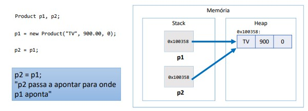

Conforme imagem, quando instanciamos um objeto, na **memória stack** é registrado apenas o ponteiro para o local da **memória heap** onde verdadeiramente os valores do objeto estão armazenados.

É importante também entender que quando atribuímos um objeto para outro, na verdade estamos apenas passando o endereço de memória para onde o primeiro objeto estava apontando, desta forma, se alterarmos os dados, a partir de qualquer um dos objetos, esta alteração estará disponívle para qualquer um dos objetos.

De forma simplificada, temos:

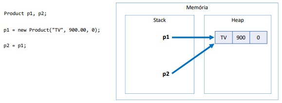

#### Valor "null"

Tipos referência aceitam o valor "*null*", que indica que a variável não aponta para ninguém.

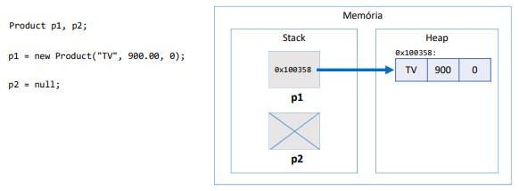

#### Tipos primitivos são tipos valor

Em Java, tipos primitivos são tipo valor. Tipos valor são **caixas** e não ponteiros.

Neste caso, quando atribuímos uma variável a outra, o que é transferido é o próprio valor.

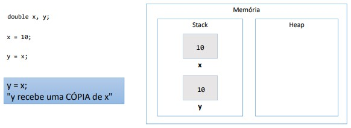

Segue tabela com os 8 tipos primitivos da linguagem Java:

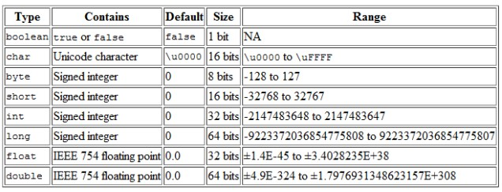

Variáveis de tipos primitivos precisam **obrigatoriamente** serem inicializadas para podermos imprimir na tela, caso contrário o compilador indicará um erro.

#### Valores padrão

Quando alocamos (*new*) qualquer tipo estruturado (*classe* ou *array*), são atribuídos valores padrão aos seus elementos:

- Número: **0**
- Bollean: **false**
- char: **0** (*zero*)
- objeto: **null**

Exemplo:

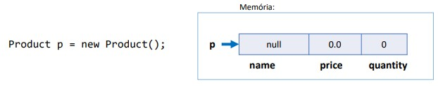

#### Tabela comparativa (Resumo)

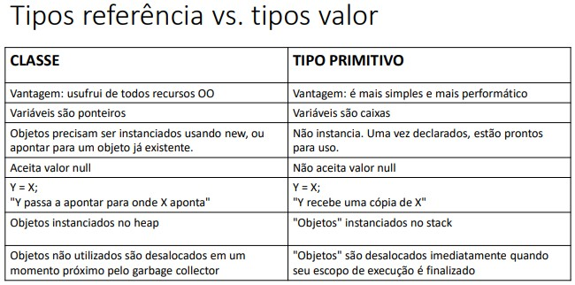

### 87. Desalocação de memória - garbage collector e escopo local

#### Garbage Collector

**Garbage collector** é um processo que automatiza o gerenciamento de memória de um programa em execução.

O **garbage collector** monitora os objetos alocados dinamicamente pelo programa (na memória *heap*), desalocando aqueles que não estão mais sendo utilizados.

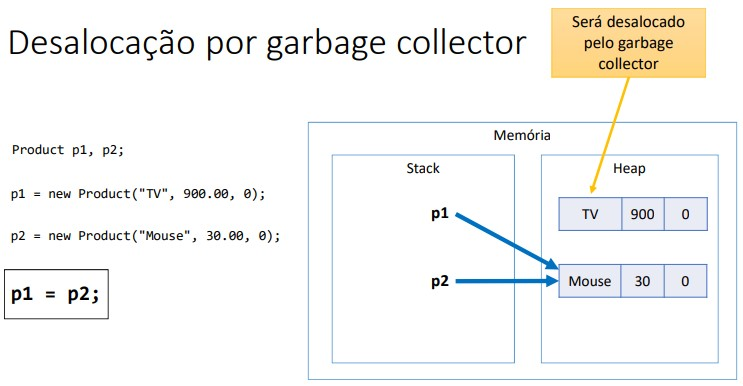

#### Desalocação por escopo

Conforme pode verificado no esquema abaixo. A variável *x* pertence ao escopo do método já a variável *y* pertence apenas ao escopo do *if*, assim após a execução do código que estiver dentro deste escopo, a variável será desalocada.

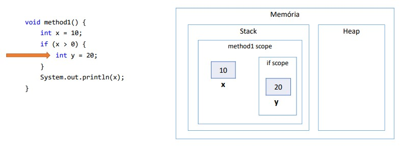

#### Resumo

- Objetos alocados dinamicamente, quando não possuem mais referência para eles, serão desalocados pelo *garbage collector*.
- Variáveis locais são desalocadas imediatamente assim que seu escopo local sai de execução.

### 88. Vetores - Parte 1

#### Checklist

- Revisão do conceito de vetor
- Declaração e instanciação
- Manipulação de vetor de elementos tipo valor (tipo primitivo)
- Manipulação de vetor de elementos tipo referência (classe)
- Acesso aos elementos
- Propriedade *lenght*

#### Vetores

- Em programação, "**vetor**" é o nome dado a arranjos unidimensionais.

- Arranjo (**array**) é uma estrutura de dados:
  - Homogênea (dados do mesmo tipo)
  - Ordenada (elementos acessados por meio de padrões)
  - Alocada de uma vez só, em um bloco contíguo de memória

- **Vantagens**
  - Acesso imediato aos elementos pela sua posição
- **Desvantagens**
  - Tamanho fixo
  - Dificuldade para se realizar inserções e deleções

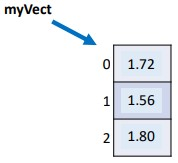

#### Exemplo de uma declaração de vetor

```java
double[] vect = new double[3];
```

#### Problema exemplo 1

Fazer um programa para ler um número inteiro N e a altura de N pessoas. Armazene as N alturas em um vetor. Em seguida, mostrar a altura média dessas pessoas.

| Entrada | Saída                 |
| ------- | --------------------- |
| 3       | AVAREGE HEIGHT = 1.69 |
| 1.72    |                       |
| 1.56    |                       |
| 1.80    |                       |

[Problema exemplo 1]

### 89. Vetores - Parte 2

#### Problema exemplo 2

Fazer um programa para ler um número inteiro N e os dados (nome e preço) de N Produtos. Armazene os N produtos em um vetor. em seguida, mostrar o preço médido dos produtos.

| Entrada | Saída                  |
| ------- | ---------------------- |
| 3       | AVAREGE PRICE = 700.00 |
| TV      |                        |
| 900.00  |                        |
| Fryer   |                        |
| 400.00  |                        |
| Stove   |                        |
| 800.00  |                        |

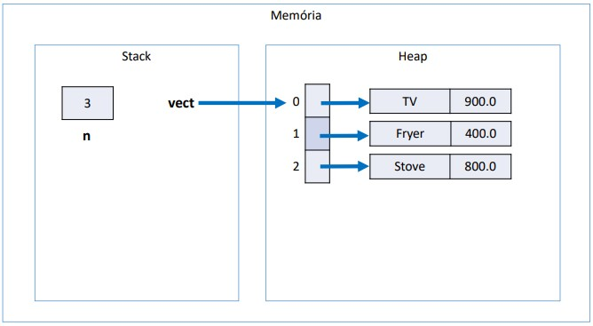

#### Atributo lenght

Retorna o número de posições de um vetor.

Exemplo:

```java

double[] vect = new double[8];

System.out.print(vect.lenght); // 8

```

### 90. Exercícios de fixação sobre vetores

#### Exercício 1 - Problema "negativos"

Faça um programa que leia um número inteiero positivo N (Máximo = 10) e depois N números inteiros e armazene-os em um vetor. Em seguida, mostra na tela todos os números negativos lidos.

Exemplo:

```powershell
Quantos numeros você vai digitar: 6
Digite um número: 8
Digite um número: -2
Digite um número: 9
Digite um número: 10
Digite um número: -3
Digite um número: -7
NUMEROS NEGATIVOS:
-2
-3
-7
```

[Exercício 1](Workspace/aula091_Exercicio_001)

#### Exercício 2 - Problema "soma_vetor"

Faça um programa que leia N números reais e armazene-os em um vetor. Em seguida:

- Imprima todos os elementos do vetor
- Mostre na tela a soma e a média dos elementos do vetor.

Exemplo:

```powershell
Quantos numeros voce vai digitar? 4
Digite um numero: 8.0
Digite um numero: 4.0
Digite um numero: 10.0
Digite um numero: 14.0

VALORES = 8.0 4.0 10.0 14.0
SOMA = 36.00
MEDIA = 9.00
```

[Exercício 2](Workspace/aula091_Exercicio_002)

#### Exercício 3 - Problema "alturas"

Fazer um programa para ler nome, idade e altura de N pessoas, conforme exemplo. Depois, mostrar na tela a altura média das pessoas, e mostrar também a porcentagem de pessoas com menos de 16 anos, bem como os nomes dessas pessoas caso houver.

Exemplo:

```powershell
Quantas pessoas serao digitadas? 5
Dados da 1a pessoa: 
Nome: Joao
Idade: 15
Altura: 1.82
Dados da 2a pessoa: 
Nome: Maria
Idade: 16
Altura: 1.60
Dados da 3a pessoa: 
Nome: Teresa
Idade: 14
Altura: 1.58
Dados da 4a pessoa: 
Nome: Carlos
Idade: 21
Altura: 1.65
Dados da 5a pessoa: 
Nome: Paulo
Idade: 17
Altura: 1.78

Altura média: 1.69 
Pessoas com menos de 16 anos: 40.0% 
Joao 
Teresa
```

[Exercício 3](Workspace/aula091_Exercicio_003)

#### Exercício 4 - Problema "numeros_pares"

Faça um programa que leia N números inteiros e armazene-os em um vetor. Em seguida, mostre na tela todos os números pares, e também a quantidade de números pares.

Exemplo:

```powershell
Quantos numeros voce vai digitar? 6
Digite um numero: 8
Digite um numero: 2
Digite um numero: 11
Digite um numero: 14
Digite um numero: 13
Digite um numero: 20

NUMEROS PARES: 
8 2 14 20 

QUANTIDADE DE PARES = 4 
```

[Exercício 4](Workspace/aula091_Exercicio_004)

#### Exercício 5 - Problema "maior_posicao"

Faça um programa que leia N números reais e armazene-os em um vetor. Em seguida, mostrar na tela o maior número do vetor (supor não haver empates). Mostrar também a posição do maior elemento, considerando a primeira posição como 0 (zero).

Exemplo:

```powershell
Quantos numeros voce vai digitar? 6
Digite um numero: 8.0
Digite um numero: 4.0
Digite um numero: 10.0
Digite um numero: 14.0
Digite um numero: 13.0
Digite um numero: 7.0

MAIOR VALOR = 14.0
POSICAO DO MAIOR VALOR = 3
```

[Exercício 5](Workspace/aula091_Exercicio_005)

#### Exercício 6 - Problema "soma_vetores"

Faça um programa para ler dois vetores A e B, contendo N elementos cada. Em seguida, gere um terceiro vetor C onde cada elemento de C é a soma dos elementos correspondentes de A e B. Imprima o vetor C gerado.

Exemplo:

```powershell
Quantos valores vai ter cada vetor? 6
Digite os valores do vetor A: 
8 
2 
11 
14 
13 
20 
Digite os valores do vetor B: 
5 
10 
3 
1 
10 
7 
VETOR RESULTANTE: 
13 
12 
14 
15 
23 
27
```

[Exercício 6](Workspace/aula091_Exercicio_006)

#### Exercício 7 - Problema "abaixo_da_media"

Fazer um programa para ler um número inteiro N e depois um vetor de N números reais. Em seguida, mostrar na tela a média aritmética de todos os elementos com três casas decimais. Depois mostrar todos os elementos do vetor que estejam abaixo da média, com uma casa decimal cada.

Exemplo:

```powershell
Quantos elementos vai ter o vetor? 4
Digite um numero: 10.0
Digite um numero: 15.5
Digite um numero: 13.2
Digite um numero: 9.8

MEDIA DO VETOR = 12.125 
ELEMENTOS ABAIXO DA MEDIA: 
10.0 
9.8
```

[Exercício 7](Workspace/aula091_Exercicio_007)

#### Exercício 8 - Problema "media_pares"

Fazer um programa para ler um vetor de N números inteiros. Em seguida, mostrar na tela a média aritmética somente dos números pares lidos, com uma casa decimal. Se nenhum número par for digitado, mostrar a mensagem "NENHUM NUMERO PAR".

Exemplos:

```powershell
Quantos elementos vai ter o vetor? 6
Digite um numero: 8 
Digite um numero: 2 
Digite um numero: 11 
Digite um numero: 14 
Digite um numero: 13 
Digite um numero: 20
MEDIA DOS PARES = 11.0
```

```powershell
Quantos elementos vai ter o vetor? 3
Digite um numero: 7 
Digite um numero: 9 
Digite um numero: 11 
NENHUM NUMERO PAR
```

[Exercício 8](Workspace/aula091_Exercicio_008)

#### Exercício 9 - Problema "mais_velho"

Fazer um programa para ler um conjunto de nomes de pessoas e suas respectivas idades. Os nomes devem ser armazenados em um vetor, e as idades em um outro vetor. Depois, mostrar na tela o nome da pessoa mais velha.

Exemplo:

```powershell
Quantas pessoas voce vai digitar? 5
Dados da 1a pessoa: 
Nome: Joao
Idade: 16
Dados da 2a pessoa: 
Nome: Maria
Idade: 21
Dados da 3a pessoa: 
Nome: Teresa
Idade: 15
Dados da 4a pessoa: 
Nome: Carlos
Idade: 23
Dados da 5a pessoa: 
Nome: Paulo
Idade: 17
PESSOA MAIS VELHA: Carlos
```

[Exercício 9](Workspace/aula091_Exercicio_009)

#### Exercício 10 - Problema "aprovados"

Fazer um programa para ler um conjunto de N nomes de alunos, bem como as notas que eles tiraram no 1º e 2º semestres. Cada uma dessas informações deve ser armazenada em um vetor. Depois, imprimir os nomes dos alunos aprovados, considerando aprovados aqueles cuja média das notas seja maior ou igual a 6.0 (seis).

Exemplo:

```powershell
Quantos alunos serao digitados? 4
Digite nome, primeira e segunda nota do 1o aluno: 
Joao Silva 
7.0 
8.5 
Digite nome, primeira e segunda nota do 2o aluno: 
Maria Teixeira 
9.2 
6.5 
Digite nome, primeira e segunda nota do 3o aluno: 
Carlos Carvalho 
5.0 
6.0 
Digite nome, primeira e segunda nota do 4o aluno: 
Teresa Pires 
5.5 
6.5 
Alunos aprovados: 
Joao Silva 
Maria Teixeira 
Teresa Pires 
```

[Exercício 10](Workspace/aula091_Exercicio_010)

#### Exercício 11 - Problema "dados_pessoas"

Tem-se um conjunto de dados contendo a altura e o gênero (M, F) de N pessoas. Fazer um programa que calcule e escreva a maior e a menor altura do grupo, a média de altura das melhoeres, e o número de homens.

Exemplo:

```powershell
Quantas pessoas serao digitadas? 5
Altura da 1a pessoa: 1.70
Genero da 1a pessoa: F
Altura da 2a pessoa: 1.83 
Genero da 2a pessoa: M
Altura da 3a pessoa: 1.54 
Genero da 3a pessoa: M
Altura da 4a pessoa: 1.61 
Genero da 4a pessoa: F
Altura da 5a pessoa: 1.75 
Genero da 5a pessoa: F
Menor altura = 1.54 
Maior altura = 1.83 
Media das alturas das mulheres = 1.69 
Numero de homens = 2
```

[Exercício 11](Workspace/aula091_Exercício_011)

### 91. Correção do exercício negativos

[Correção exercício 1](Workspace/aula092_Exercicio_001)

### 92. Correção do exercício alturas

[Correção exercício 3](Workspace/aula093_Exercicio_001)

### 93. Desafio sobre vetores (pensionato)

A dona de um pensionato possui dez quartos para alugar para estudantes, sendo esses quartos identificados pelos números 0 a 9.

Fazer um programa que inicie com todos os dez quartos vazios, e depois leia uma quantidade N representando o número de estudantes que vão alugar quartos (N pode ser de 1 a 10). Em seguida, registre o aluguel dos N estudantes. Para cada registro de aluguel, informar o nome e e-mail do estudante, bem como qual dos quartos ele escolheu (0 a 9). Suponha que seja escolhido um quarto vago. Ao final, seu programa deve imprimir um relatório de todas ocupações do pensionato, por ordem de quarto, conforme exemplo.

```powershell
How many rooms will be rented? 3

Rent #1:
Name: Maria Green
Email: maria@gmail.com
Room: 5

Rent #2:
Name: Marco Antonio
Email: marco@gmail.com
Room: 1

Rent #3:
Name: Alex Brown
Email: alex@gmail.com
Room: 8

Busy rooms:
1: Marco Antonio, marco@gmail.com
5: Maria Green, maria@gmail.com
8: Alex Brown, alex@gmail.com
```

[Exercício 1](Workspace/aula094_Exercicio_001)

### 94. Correção do desafio sobre vetores (pensionato)

[Exercício 1](Workspace/aula095_Exercicio_001)

### 95. Boxing, umboxing e wrapper classes

#### Boxing

É o processo de conversão de um objeto tipo valor para um objeto tipo referência compatível.

Exemplo:

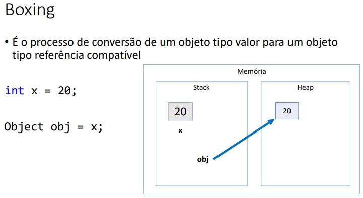

#### Unboxing

É o processo de conversão de um objeto tipo referência para um objeto tipo valor compatível.

Exemplo:

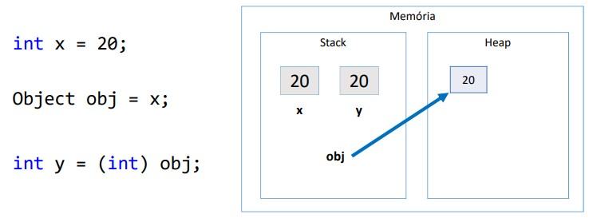

#### Exemplo de boxing e umboxing

[Exemplo 1](Workspace/aula096_Exemplo_001)

#### Wrapper classes

**Wrapper classes** são classes equivalentes aos tipos primitivos.

O **Java** possuem as Wrapper classes para podermos realizar o **Boxing** e **unboxing** de forma natural.

- Uso comum: campo de entidades em sistemas de informação (**importante**)
  - Pois tipos referência (classes) aceitam valor *null* e usufruem dos recursos de OO.


Exemplo:

```java
int x = 20

Integer objt = x // Boxing

System.out.println(obj) // 20

int y = obj * 2; // Unboxing - Não há necessidade de casting

System.out.println(y) // 40
```

### 96. Laço for each

Sintaxe opcional e simplificada para percorrer coleções.

#### Sintaxe

```java
for (Tipo apelido : coleção) {
  <comando 1>
  <comando 2>
}
```

#### Exemplo

```java
String[] vect = new String[] {"Maria", "Bob", "Alex"};

for (int i = 0; i < vect.length; i++) {
  System.out.println(vect[i]);
}

// O comando abaixo é equivalente ao do for anterior

for (String name : vect) {
  System.out.println(name);
}
```

[Exemplo 1](Workspace/aula097_Exemplo_001)

### 97. Listas - Parte 1

- Referência: [https://docs.oracle.com/en/java/javase/17/docs/api/java.base/java/util/List.html](https://docs.oracle.com/en/java/javase/17/docs/api/java.base/java/util/List.html)

- Assuntos pendentes:
  - interface
  - generics
  - predicados (lambda)

#### Conceito

- **Lista** é uma estrutura de dados:
  - Homogênea (dados do mesmo tipo)
  - Ordenada (elementos acessados por meior de posições)
  - Inicia vazia, e seus elementos são alocados sob demanda
  - Cada elemento ocupa um "*nó*" (ou nodo) da lista

- Tipo (Interface): **List**

- Classes que a implementam: **ArrayList**, **LinkedList**, etc.

- Vantagens:
  - Tamanho variável
  - Facilidade para se realizar inserções e deleções
- Desvantagens
  - Acesso sequencial aos elementos (Algumas implementações otimizam este acesso)

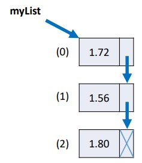

### 98. Listas - Parte 2

#### Demonstração de operações com listas

- Tamanho da lista: ```size()```
- Obter o elemento de uma posição: ```get(position)```
- Inserir elemento na lista: ```add(obj)```, ```add(int, obj)```
- Remover elementos da lista: ```remove(obj)```, ```remove(int)```, ```removeIf(Predicate)```
- Encontrar posição de elemento: ```indexOf(obj)```, ``lastIndexOf(obj)``
- Filtrar lista com base em predicado: ```List<Integer> result = list.stream().filter(x -> x > 4).collect(Collectors.toList());```
- Encontrar primeira ocorrência com base em predicado: ```Integer result = list.stream().filter(x -> x > 4).findFirst().orElse(null);```

[Exemplo 1](Workspace/aula099_Exemplo_001)

### 99. Exercício proposto

Fazer um programa para ler um número inteiro N e depois os dados (id, nome e salário) de N funcionários. Não deve haver repetição de id.

Em seguida, efetuar o aumento de X por cento no salário de um determinado funcionário. Para isso, o programa deve ler um id e o valor X. Se o id informado não existir, mostrar uma mensagem e abortar a operação. Ao final, mostrar a listagem atualizada dos funcionários, conforme exemplos.

Lembre-se de aplicar a técnica de encapsulamento para não permitir que o salário possa ser mudado livremente. Um salário só pode ser aumentado com base em um operação de aumento por porcentagem dada.

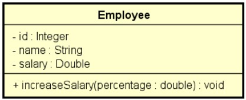

Exemplos:

```powershell
How many employees will be registered? 3

Emplyoee #1:
Id: 333
Name: Maria Brown
Salary: 4000.00

Emplyoee #2:
Id: 536
Name: Alex Grey
Salary: 3000.00

Emplyoee #3:
Id: 772
Name: Bob Green
Salary: 5000.00

Enter the employee id that will have salary increase : 536
Enter the percentage: 10.0

List of employees:
333, Maria Brown, 4000.00
536, Alex Grey, 3300.00
772, Bob Green, 5000.00
```

```powershell
How many employees will be registered? 2

Emplyoee #1:
Id: 333
Name: Maria Brown
Salary: 4000.00

Emplyoee #2:
Id: 536
Name: Alex Grey
Salary: 3000.00

Enter the employee id that will have salary increase: 776
This id does not exist!

List of employees:
333, Maria Brown, 4000.00
536, Alex Grey, 3000.00
```

[Exercício de fixação 1](Workspace/aula100_Exercício_001)

### 100. Correção em vídeo do exercício proposto

[Link Youtube](https://youtu.be/Xj-osdBe3TE)

[Exercício corrigido](Workspace/aula101_Exercicio_001)

### 101. Matrizes

Em programação, **matriz** é o nome dado a arranjos (*arrays*) bidimensionais. É um "*vetor de vetores*".

- Arranjo (array) é uma estrutura de dados:
  - Homogênea (dados do mesmo tipo)
  - Ordenada (elementos acessados por meio de posições)
  - Alocada de uma vez só, em um bloco contíguo de memória

- Vantagens:
  - Acesso imediato aos elementos pela sua posição
- Desvantagens:
  - Tamanho fixo
  - Dificuldade para se realizar inserções e deleções

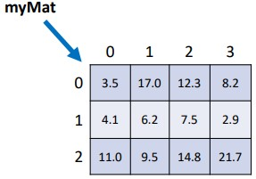

### 102. Exercício resolvido

Fazer um programa para ler um número inteiro N e uma matriz de ordem N contendo números inteiros. Em seguida, mostrar a ediagonal principal e a quantidade de valores negativos da matriz.

Exemplo:

| Entrada | Saída                |
| ------- | -------------------- |
| 3       | Main diagonal:       |
| 5 -3 10 | 5 8 -4                |
| 15 8 2  | Negative numbers = 2 |
| 7 9 -4  |                      |

[Exercício 1](Workspace/aula103_Exercicio_001)

### 103. Exercício proposto

Fazer um programa para ler dois números inteiros M e N, e depois ler uma matris de M linhas por N colunas contendo números inteiros, podendo haver repetições. Em seguida, ler um número inteiro X que pertence à matriz. Para cada ocorrência de X, mostrar os valores à esquerda, acima, à direita e abaixo, de x, quando houver, conforme exemplo:

```powershell
3 4
10 8 15 12
21 11 23 8
14 5 13 19
8
Position 0,1:
Left: 10
Right: 15
Down: 11
Position 1,3:
Left: 23
Up: 12
Down: 19
```

[Exercício 1](Workspace/aula104_Exercicio_001)

## Seção 11: Tópicos especiais em Java: data-hora

### 104. Boas-vindas e avisos

Parte 1 - Trabalhando com data-hora (Java 8+)

Parte 2 - Date e Calendar (Java 7) - Dois últimos vídeos

### 105. Material de apoio do capítulo

[Material Parte 1](Recursos/pdf/11-trabalhando-com-data-hora.pdf)

[Material Parte 2](Recursos/pdf/11-date-calendar.pdf)

### 106. Introdução a data-hora e duração

#### Conceitos importantes

- **Importante** - Os objetos de data hora instanciados são **imutáveis**.

- **Data-[hora] local**:
  - ano-mês-dia-[hora] sem fuso horário
  - [hora] *opcional*

- **Data-hora global**:
  - ano-mês-dia-hora com fuso horário

- **Duração**:
  - Tempo decorrido entre duas-horas

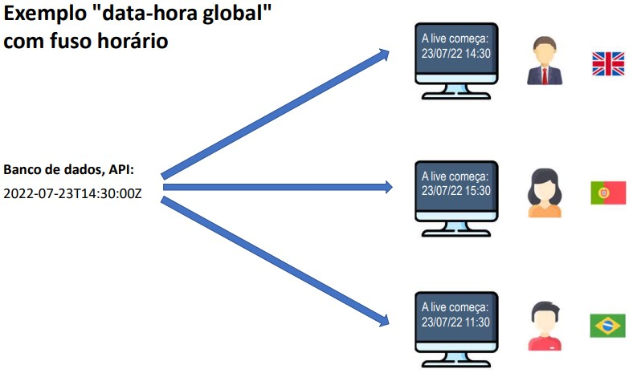

#### Quando usar?

- **Data-[hora] local**:
  - Quando o momento exato não interessa a pessoas de outro fuso horário.
  - Uso comum: sistemas de região única, Excel.
    - Data de nascimento: "15/06/2021"
    - Data-hora da venda: "13/08/2022 às 15:32" (presumindo não interessar fuso horário)

- **Data-hora global**:
  - Quando o momento exato interessa a pessoas de outro fuso horário.
  - Uso comum: sistemas multi-região, web.
    - Quando será o sorteio? "21/08/2022 às 20h (horário de São Paulo)"
    - Quando o comentário foi postado? "há 17 minutos"
    - Quando foi realizada a venda? "13/08/2022 às 15:32 (horário de São Paulo)"
    - Início e fim do evento? "21/08/2022 às 14h até 16h (horário de São Paulo)"

### 107. Entendendo timezone (fuso horário)

#### GMT - Treenwich Mean Time

- Horário de Londres
- Horário do padrão UTC - Coordinated Universal Time
- Também chamado de "Z" time, ou *Zulu* time

#### Outros fusos horários são relativos ao GMT/UTC:

- São Paulo: GMT-3
- Manaus: GMT-4
- Portugal: GMT+1

#### Muitas linguagens/tecnologias usam nomes para as timezones:

- "US/Pacific"
- "America/Sao_paulo"
- etc

### 108. Padrão ISO 8601

Este padrão especifica como você deve representar datas e horas no padrão texto.

#### Data-[hora] local:

- 2022-07-21
- 2022-07-21T14:52
- 2022-07-21T14:52:09
- 2022-07-21T14:52:09.4073

#### Data-hora global:

- 2022-07-23T14:52:09Z
- 2022-07-23T14:52:09.254935Z
- 2022-07-23T14:52:09-03:00

### 109. Operações importantes com data-hora

Segue as operações com dadas mais importantes que devemos ser capaz de realizar com Java.

#### Instanciação

- (agora) -> Data-hora
- Texto ISO 8601 -> Data-hora
- Texto formata customizado -> Data-hora
- dia, mês, ano, [horário] -> Data-hora local

#### Formatação

- Data-hora -> Texto ISO 8601
- data-hora -> Texto formata customizado

- Converter data-hora global para local
  - Data-hora global, timezone (sistema local) -> Data-hora local

- Obter dados de uma data-hora local
  - Data-hora local -> dia, mês, ano, horário

- Cálculos com data-hora
  - Data-hora +/- tempo -> Data-hora
  - Data-hora 1, Data-hora 2 -> Duração

### 110. Instanciando data-hora em Java

#### Principais tipos Java (versão 8+)

- Data-hora local
  - *LocalDate*
  - *LocalDateTime*

- Data-hora global
  - *Instant*

- Duração
  - *Duration*

- Outros
  - *ZoneId*
  - *ChronoUnit*

#### Instanciação

```java
/**
  * Link para a especificação do DateTimeFormatter
  * https://docs.oracle.com/en/java/javase/17/docs/api/java.base/java/time/format/DateTimeFormatter.html
  */

DateTimeFormatter fmt1 = DateTimeFormatter.ofPattern("dd/MM/yyyy");
DateTimeFormatter fmt2 = DateTimeFormatter.ofPattern("dd/MM/yyyy HH:mm");

// (agora) -> Data-hora
LocalDate d01 = LocalDate.now();
LocalDateTime d02 = LocalDateTime.now();
Instant d03 = Instant.now();

// Texto ISO 8601 -> Data-Hora
LocalDate d04 = LocalDate.parse("2022-07-20");
LocalDateTime d05 = LocalDateTime.parse("2022-07-20T01:30:26");
Instant d06 = Instant.parse("2022-07-20T01:30:26Z");
Instant d07 = Instant.parse("2022-07-20T01:30:26-03:00");

// Texto formato customizado -> Data-hora
LocalDate d08 = LocalDate.parse("20/07/2022", fmt1);
LocalDateTime d09 = LocalDateTime.parse("20/07/2022 01:30", fmt2);

// dia, mês, ano, [horário] -> data-hora local
LocalDate d10 = LocalDate.of(2022, 7, 20);
LocalDateTime d11 = LocalDateTime.of(2022, 7, 20, 1, 30);


System.out.println("(agora) -> Data-hora");
System.out.println("d01 = " + d01); // d01 = 2022-09-27
System.out.println("d02 = " + d02); // d02 = 2022-09-27T13:22:45.547121600
System.out.println("d03 = " + d03); // d03 = 2022-09-27T16:22:45.547121600Z

System.out.println();
System.out.println("Texto ISO 8601 -> Data-Hora");
System.out.println("d04 = " + d04); // d04 = 2022-07-20
System.out.println("d05 = " + d05); // d05 = 2022-07-20T01:30:26
System.out.println("d06 = " + d06); // d06 = 2022-07-20T01:30:26Z
System.out.println("d07 = " + d07); // d07 = 2022-07-20T04:30:26Z

System.out.println();
System.out.println("Texto formato customizado -> Data-hora");
System.out.println("d08 = " + d08); // d08 = 2022-07-20
System.out.println("d09 = " + d09); // d09 = 2022-07-20T01:30

System.out.println();
System.out.println("dia, mês, ano, [horário] -> data-hora local");
System.out.println("d10 = " + d10); // d10 = 2022-07-20
System.out.println("d11 = " + d11); // d11 = 2022-07-20T01:30
```

[Exemplo](Workspace/aula111_Exemplo_001)

### 111. Convertendo data-hora para texto

#### Formatação

```java
/**
  * Link para a especificação do DateTimeFormatter
  * https://docs.oracle.com/en/java/javase/17/docs/api/java.base/java/time/format/DateTimeFormatter.html
  */
  
  LocalDate d04 = LocalDate.parse("2022-07-20");
  LocalDateTime d05 = LocalDateTime.parse("2022-07-20T01:30:26");
  Instant d06 = Instant.parse("2022-07-20T01:30:26Z");
  
  DateTimeFormatter fmt1 = DateTimeFormatter.ofPattern("dd/MM/yyyy");
  DateTimeFormatter fmt2 = DateTimeFormatter.ofPattern("dd/MM/yyyy HH:mm");
  DateTimeFormatter fmt3 = DateTimeFormatter.ofPattern("dd/MM/yyyy HH:mm").withZone(ZoneId.systemDefault());
  DateTimeFormatter fmt4 = DateTimeFormatter.ISO_DATE_TIME; // formato sem fuso horário
  DateTimeFormatter fmt5 = DateTimeFormatter.ISO_INSTANT; // formato com fuso horário
  
  System.out.println("d04 = " + d04.format(fmt1)); // d04 = 20/07/2022
  System.out.println("d04 = " + fmt1.format(d04)); // d04 = 20/07/2022
  System.out.println("d04 = " + d04.format(DateTimeFormatter.ofPattern("dd/MM/yyyy"))); // d04 = 20/07/2022
  System.out.println("d04 = " + d05.format(fmt4)); // d05 = 2022-07-20T01:30:26
  
  System.out.println();
  System.out.println("d05 = " + d05.format(fmt1)); // d05 = 20/07/2022
  System.out.println("d05 = " + d05.format(fmt2)); // d05 = 20/07/2022 01:30
  
  System.out.println();
  System.out.println("d06 = " + fmt3.format(d06)); // d05 = 20/07/2022 01:30
  System.out.println("d06 = " + fmt5.format(d06)); // d06 = 2022-07-20T01:30:26Z
  System.out.println("d06 = " + d06); // também imprime no formato ISO - d06 = 2022-07-20T01:30:26Z
```

[Exemplo](Workspace/aula112_Exemplo_001)

### 112. Convertendo data-hora global para local

#### Obtendo uma lista de todos os ZoneIds disponíveis

```java
for (String s : ZoneId.getAvailableZoneIds()) {
  System.out.println(s);
}
```

Resultado: [ZoneIds.md](ZoneIds.md)

#### Convertendo data-hora para local

```java

  // Converter data-hora global para local

  LocalDate d04 = LocalDate.parse("2022-07-20");
  LocalDateTime d05 = LocalDateTime.parse("2022-07-20T01:30:26");
  Instant d06 = Instant.parse("2022-07-20T01:30:26Z");

  LocalDate r1 = LocalDate.ofInstant(d06, ZoneId.systemDefault());
  LocalDate r2 = LocalDate.ofInstant(d06, ZoneId.of("Portugal"));
  LocalDateTime r3 = LocalDateTime.ofInstant(d06, ZoneId.systemDefault());
  LocalDateTime r4 = LocalDateTime.ofInstant(d06, ZoneId.of("Portugal"));

  System.out.println("Converter data-hora global para local:");
  System.out.println("r1 = " + r1); // r1 = 2022-07-19 (Brasil  -03:00)
  System.out.println("r2 = " + r2); // r2 = 2022-07-20 (Portugal +01:00)
  System.out.println("r3 = " + r3); // r3 = 2022-07-19T22:30:26 (Brasil  -03:00)
  System.out.println("r4 = " + r4); // r4 = 2022-07-20T02:30:26 (Portugal +01:00)

  // Obter dados de uma data-hora local
  System.out.println();
  System.out.println("Obter dados de uma data-hora local:");
  System.out.println("d04 dia = " + d04.getDayOfMonth()); // d04 dia = 20
  System.out.println("d04 mês = " + d04.getMonthValue()); // d04 mês = 7
  System.out.println("d04 ano = " + d04.getYear()); // d04 ano = 2022
  System.out.println("d05 Hora = " + d05.getHour()); // d05 Hora = 1
  System.out.println("d05 minutos = " + d05.getMinute()); // d05 minutos = 30
```

[Exemplo](Workspace/aula113_Exemplo_001)

### 113. Cálculos com data-hora

```java
LocalDate d04 = LocalDate.parse("2022-07-20");
LocalDateTime d05 = LocalDateTime.parse("2022-07-20T01:30:26");
Instant d06 = Instant.parse("2022-07-20T01:30:26Z");

LocalDate pastWeekLocalDate = d04.minusDays(7);
LocalDate nextWeekLocalDate = d04.plusDays(7);

LocalDateTime pastWeekLocalDateTime = d05.minusDays(7);
LocalDateTime nextWeekLocalDateTime = d05.plusDays(7);

Instant pastWeekInstant = d06.minus(7, ChronoUnit.DAYS);
Instant nextWeekInstant = d06.plus(7, ChronoUnit.DAYS);

System.out.println();
System.out.println("Data-hora +/- tempo -> Data-hora");
System.out.println("pastWeekLocalDate: " + pastWeekLocalDate); // pastWeekLocalDate: 2022-07-13
System.out.println("nextWeekLocalDate: " + nextWeekLocalDate); // nextWeekLocalDate: 2022-07-27
System.out.println("pastWeekLocalDateTime: " + pastWeekLocalDateTime); // pastWeekLocalDateTime: 2022-07-13T01:30:26
System.out.println("pastWeekLocalDateTime: " + nextWeekLocalDateTime); // pastWeekLocalDateTime: 2022-07-27T01:30:26
System.out.println("pastWeekInstant: " + pastWeekInstant); // pastWeekInstant: 2022-07-13T01:30:26Z
System.out.println("nextWeekInstant: " + nextWeekInstant); // nextWeekInstant: 2022-07-27T01:30:26Z

Duration t1 = Duration.between(pastWeekLocalDate.atStartOfDay(), d04.atStartOfDay());
Duration t2 = Duration.between(pastWeekLocalDateTime, d05);
Duration t3 = Duration.between(pastWeekInstant, d06);
Duration t4 = Duration.between(d06, pastWeekInstant);

System.out.println();
System.out.println("Data-hora 1, Data-hora 2 -> Duração");
System.out.println("t1 em dias: " + t1.toDays()); // t1 em dias: 7
System.out.println("t2 em dias: " + t2.toDays()); // t2 em dias: 7
System.out.println("t3 em dias: " + t3.toDays()); // t3 em dias: 7
System.out.println("t4 em dias: " + t4.toDays()); // t4 em dias: -7
```

[Exemplo](Workspace/aula114_Exemplo_001)

### 114. Aviso: próximas duas aulas são sobre Date e Calendar

 conforme informado anteriormente, na introdução deste capítulo, as próximas duas aulas serão sobre os tipos Date e Calendar, que é o modelo antigo de data-hora usado pelo Java antes da versão 8. Deixei essas aulas aqui para vocês como referência opcional caso precisem trabalhar com esse modelo antigo em algum sistema legado em Java.

### 115. Trabalhando com datas - Date

O *Date* representa um Instante

Pacote *java.util*

[Documentação](https://docs.oracle.com/en/java/javase/17/docs/api/java.base/java/util/Date.html)

Um objeto Date internamente armazena:

- O número de milissegundos desde a meia noite do dia 1 de janeiro de 1970 GMT (UTC)
  - **GMT** - *Greenwich Mean Time* (*time zone*)
  - **UTC** - *Coordinated Universal time* (*time standard*)

#### SimpleDateFormat

Define formatos para conversão entre Date e String;

Exemplos:

- dd/MM/yyyy -> 23/07/2018
- dd/MM/yyyy HH:mm:ss -> 23/07/2018 15:42:07

[Documentação](https://docs.oracle.com/en/java/javase/17/docs/api/java.base/java/text/SimpleDateFormat.html)

#### Padrão ISO 8601 e classe Instant

- Formato: yyyy-MM-ddTHH:mm:ssZ

- Exemplo: "2018-06-25T15:42:07Z"

- ```Date y3 = Date.from(Instant.parse("2018-06-25T15:42:07Z"));```

[Exemplo](Workspace/aula116_Exemplo_001)

### 116. Manipulando um Date com Calendar

#### Somando uma unidade de tempo

```java
SimpleDateFormat sdf = new SimpleDateFormat("dd/MM/yyy HH:mm:ss");

Date d = Date.from(Instant.parse("2018-06-25T15:42:07Z"));

System.out.println(sdf.format(d)); // 25/06/2018 12:42:07

Calendar cal = Calendar.getInstance();
cal.setTime(d);
cal.add(Calendar.HOUR_OF_DAY, 4);
d = cal.getTime();

System.out.println(sdf.format(d)); // 25/06/2018 16:42:07
```

[Exemplo 1](Workspace/aula117_Exemplo_001)

#### Obtendo uma unidade de tempo

```java
SimpleDateFormat sdf = new SimpleDateFormat("dd/MM/yyyy HH:mm:ss");

Date d = Date.from(Instant.parse("2018-06-25T15:42:07Z"));

Calendar cal = Calendar.getInstance();
cal.setTime(d);
int minutes = cal.get(Calendar.MINUTE);
int month = 1 + cal.get(Calendar.MONTH);

System.out.println("Minutes: " + minutes); // Minutes: 42
System.out.println("Month: " + month); // Month: 6
```

[Exemplo 2](Workspace/aula117_Exemplo_002)

## Seção 12: Bônus - nivelamento sobre Git e Github

### 117. Apresentação do bônus Git e Github

### 118. Material de apoio do capítulo

[Material de apoio](12-Recursos/pdf/12-Introdução-ao-Git-e-Github-(slides).pdf)

[Resolvendo problemas comuns](Recursos/pdf/12-Resolvendo-problemas-comuns-(slides).pdf)

### 119. Introdução ao Git e Github

#### Git

**GIT é um sistema de versionamento**: Você controla as modificações de um projeto por meio de versões chamadas "commits".

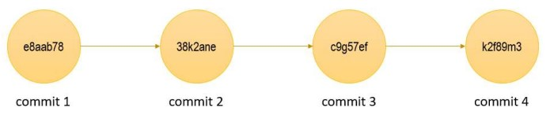

#### Github

**Github** é um serviço online de hospedagem de repositórios Git remotos.

- Possui uma interface gráfica web: [github.com](https://github.com/)
- É uma plataforma social (usuários, página de perfil, seguidores, colaboração, etc.). Dica: currículo
- Maior serviço do mundo de hospedagem de projetos de código aberto
- Modelo de cobrança: gratuíto para projetos de código aberto, pago para projetos privados
- Alternativas: BitBucket, Gitlab, etc.

### 120. Repositório local e repositório remoto

Um projeto controlado pelo Git é chamado de **repositório** de versionamento.

Tipicamente uma cópia "oficial" do repositório fica salvo em um **servidor** (*repositório remoto*)

Cada pessoa que trabalha no projeto pode fazer uma cópia do repositório para seu computador (*repositório local*). A pessoa então faz suas alterações no projeto (novos commits) e depois salva as alterações no servidor.

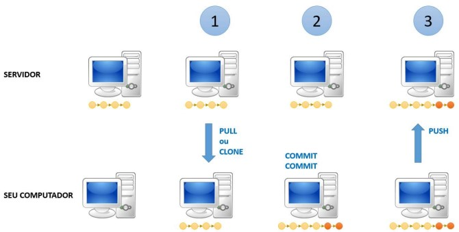

### 121. Instalação do Git no Windows

[Link para download: https://git-scm.com/](https://git-scm.com/)

### 122. Configurando sua identificação

```powershell
git config --global user.name "Seu nonme"
git config --global user.email "Seu email de cadastro do Github"

git config --list # lista as configurações
```

#### Alterar o branch padrão de master para main:

```git config --global init.defaultBranch main```

### 123. Mostrar arquivos ocultos e extensões

Iniciar -> Opções do explorador de arquivos

Desmarcar: "Ocultar as extensões dos tipos de arquivos conhecidos"
Marcar: "Mostrar arquivos, pastas e unidades ocultas"

### 124. Configurar chave SSH no Github

**SSH** é um protocolo para comunicação de dados com segurança.

O Github aboliu a autenticação somente com usuário e senha.

A ideia básica é cadastrar previamente quais copmputadores podem acessar o Github em seu nome. Outros computadores não conseguem acessar.

Para isso você deve:

1. Gerar uma chave SSH no seu computador
2. Cadastrar essa chave no seu Github

#### Gerar uma chave SSH no seu computador

Executar o comando no terminal: ```ssh-keygen -t ed25519 -C "your_email@example.com"```

Acessar o arquivo ```id_rsa.pub``` na pasta ```.ssh``` na sua pasta pessoal do Windows e copia a chave contida nele.

Acessar o site do Github.com -> Settings -> SSH and GPG keys -> Clicar em New SSH Key

### 125. Salvando primeira versão de um projeto no Github

#### Passo a passo: Salvar primeira versão de um projeto no Github

Considerando que agora seu amtiente já ejstá todo configurado (usuári e email, fisualização de arquivos ocultos e chave SSH), sempre que você criar um novo projeto, os passos básicos serão estes:

```powershell
git init

git add .

git commit -m "Mensagem explicativa"

git branch -M main

git remote add origin git@github.com:seuusuario/seurepositorio.git

git push -u origin main
```

### 126. Salvando um novo commit

```powershell
git status

git add .

git commit -m "Mesnagem explicativa"

git push
```

### 127. Demo - clonar e modificar um projeto

```powershell
git clone git@github.com:seuusuario/seurepositorio.git

git add .

git commit -m "Mensagem explicativa"

git push
```

### 128. Git log para verificar histórico de versões

#### Verificando o histórico de versões

```git log```

- listagem resumida:

```git log --oneline```

### 129. Entendendo git status e stage

#### git status

Informa se há alterações para serem salvas, e se estas alterações já estão na área de *stage*.

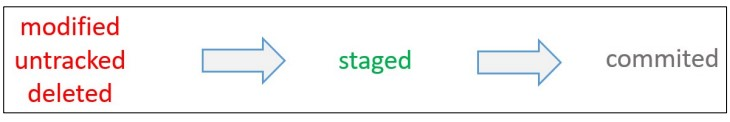

Conforme imagem, podemos ter três situações de arquivos:

- Aparecerão em **vermelho**:
  - **modified**: arquivos que já estão no repositório mas foram modificados e não estão na área de *stage*;
  - **untracked**: arquivos que não estão no repositório e não estão na área de *stage*;
  - **deleted**: arquivos que já estão no repositório porém foram deletados

- Aparecerão em **verde**
  - **staged**: arquivos que estão prontos na área de *stage* para serem salvos.

#### retirar arquivos do stage

```git reset```

### 130. Git diff e recurso source control do VS Code

**Git diff** é um comando que mostra a diferença entre arquivos modificados.

**Dica**: utilizar o VS Code, que mostra graficamente as diferenças

### 131. Git checkout

O **Git checkout** permite modificar temporariamente os arquivos do projeto ao estado de um dado commit ou branch.

#### Código do commit, HEAD

- Cada commit possui um código, que pode ser utilizado para referenciar o commit
- O último commit do histórico do branch corrente também pode ser referenciado pela palavra **HEAD**
- É possível referenciar um commit N versões antes do HEAD usando ~N, por exemplo:
  - HEAD~1 (Penúltimo commit)
  - HEAD~2 (Antepenúltimo commit)

#### Importante

Antes de fazer o checkout para voltar para HEAD, certifique-se de que não haja mudanças nos arquivos. Se você acidentalmente mudou alguma coisa, desfaça as modificações suando:

```powershell
git reset

git clean -df

git checkout -- .
```

### 132. Arquivo .gitignore

o **.gitignore** é um arquivo que indica o que **não** deve ser salvo pelo git.

Geralmente o arquivo .gitignore fica salvo na pasta principal do repositório. Mas também é possível salvar outros arquivos *.gitignore* em subpastas do repositório, para indicar o que deve ser ignorado por cada subpasta.

#### Casos comuns de arquivos que não devem ser salvos pelo Git:

- Arquivos compilados

Linguagens compiladas (C, C++, Java, C#, etc.) geram arquivos de código compilado para executar o programa
localmente.

- Arquivvos de bibliotecas externas usadas no projeto

Projetos reais utilizam bibliotecas externas (programas prontos disponíveis na Internet). Por exemplo, projetos
JavaScript com NPM tipicamente salvam uma subpasta "node_modules" na pasta do seu projeto

- Arquivos de configuração de sua IDE

IDE's podem salvar uma subpasta com arquivos de configuração na pasta do projeto (exemplo: .vscode).

- Arquivos de configuração de seu sistema

Por exemplo, sistemas Mac podem gravar uma subpasta .ds_store na pasta do projeto.

### 133. Visão geral da segunda parte

### 134. Removendo arquivos da área de stage

Comando ```git reset``` remove arquivos que foram colocados na área de stage.

```powershell
git status

git reset
```

### 135. Desfazendo modificações não salvas

Para desfazer modificações que ainda não estão salvas.

```powershell
git status

git reset

git clean -df

git checkout -- .
```

### 136. O que fazer quando abre o editor VIM

Estas ações podem abrir o editor VIM no terminal:

- Fazer um commit sem mensagem
- Fazer um merge de três vias

Para fechar devemos:

- Habilitar o modo de edição

```powershell
i
```

- Sair do VIM, salvando as alterações:

```powershell
<ESC>

:wq

<ENTER>
```

- Sair do VIM, destacartando as alterações

```powershell
<ESC>

:q!

<ENTER>
```

### 137. Deletando o último commit sem deletar modificações nos arquivos

```powershell
git status

git reset --soft HEAD~1
```

### 138. Deletando commits e também modificações nos arquivos

**Atenção**: após a realização dos comandos abaixo, não é possível recuperar os commits deletados.

- Voltar o projeto ao estado de um dado commit (deletar commits e alterações posteriores a esse commit)

```powershell
git status

git reset --hard <código do commit>
```

- Voltar o projeto ao estado do penúltimo commit:

```powershell
git status

git reset --hard HEAD~1
```

### 139. Como atualizar o repositório local em relação ao remoto

```powershell
git status

git pull <nome do remote> <nome do branch>
```

### 140. Como resolver push rejeitado por históricos diferentes

Não é permitido enviar um push se seu repositório local está atraso em relação ao histórico do repositório remoto! Por exemplo:

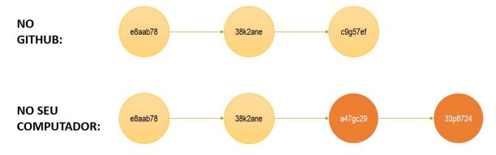

Neste caso, você tem que atualizar o repositório local:

```powershell
git pull <nome do remote> <nome do branch>
```

### 141. Resolvendo pull com conflito

- Análise de código fonte
- Faça as edições necessárias
- faça um novo commit

### 142. Como sobrescrever um histórico no Github

**Atenção**: após a realização dos comandos abaixo, não é possível recuperar os commits deletados.

Para sobrescrever um histórico no Github, ou seja, realizar o push dos arquivos locais sem resolver os conflitos com a versão remota:


```powershell
git push -f <nome do remote> <nome do branch>
```

### 143. Como apontar o projeto para outro repositório remoto

```powershell
gir remote -v # verifica qual é o servidor remoto

git remote set-url origin git@github.com:seuusuario/seurepositorio.git
```

## Seção 13: Enumerações, composição

### 144. Visão geral do capítulo Enumerações e Composição

### 145. Material de apoio do capítulo

[Material de apoio](Recursos/pdf/13-enumeracoes-composicao.pdf)

### 146. Enumerações

#### Checklist

- Definição / discussão
- Exemplo: estados de um pedido
- Conversão de String para enum
- Representação UML

#### Definição

**Enumerações** é um tipo especial que serve para especificar de forma literal um conjunto de constantes relacionadas.

A palavra chave em Java para criação de enumeração é **enum**.

- As vantagens do uso de enumerações
  - Melhor semântica
  - Código mais legível
  - auxílio do compilador

Referência: [https://docs.oracle.com/en/java/javase/17/docs/api/java.base/java/lang/Enum.html](https://docs.oracle.com/en/java/javase/17/docs/api/java.base/java/lang/Enum.html)

#### Exemplo

- Ciclo de vida de um pedido

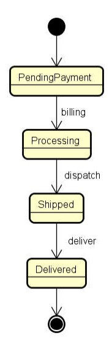

#### Conversão de String para enum

```java
OrderStatus os1 = OrderStatus.delivered;

OrderStatus os2 = OrderStatus.valueOf("Delivered");
```

#### Representação UML

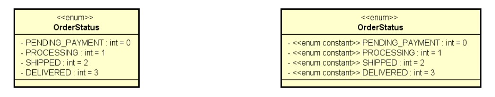

### 147. Vamos falar um pouco sobre design

#### Categorias de classes

- Em um sistema orientado a objetos, demodo geral "*tudo*" é objeto.

- Por questões de design tais como organização, flexibilidade, reuso, delegação, etc, há várias categorias de classes. Exemplos:
  - Views
  - Controllers
  - Entities
  - Services
  - Repositories

### 148. Composição

**Composição** é um tipo de associação que permite que um objeto contenha outro. Assim os objetos envolvidos possuem uma relação "*tem-um*" ou "*tem-vários*".

#### Vantagens

- Organização: divisão de responsabilidades
- Coesão
- Flexibilidade
- Reuso

**Nota**: Embora o símbolo **UML** para composição (*todo-parte*) seja o **diamente preto**, neste contexto estamos chamando de composição qualquer associação tipo "*tem-um*" e "*tem-vários*".

### 149. Exercício resolvido 1 - Parte 1

Ler os dados de um trabalhador com **N** contratos (N fornecido pelo usuário). Depois, solicitar do uauário um mês e mostrar qual foi o salário do funcionário nesse mês, conforme exemplo (próxima página).

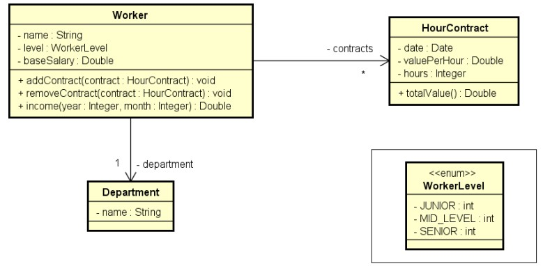

```powershell
Enter department/`s name: Design
Enter worker data:
Name: Alex
Level: MID_LEVEL
Base salary: 1200.00
How many contracts to this worker? 3
Enter contract #1 data:
Date (DD/MM/YYYY): 20/08/2018
Value per hour: 50.00
Duration (hours): 20
Enter contract #2 data:
Date (DD/MM/YYYY): 13/06/2018
Value per hour: 30.00
Duration (hours): 18
Enter contract #3 data:
Date (DD/MM/YYYY): 25/08/2018
Value per hour: 80.00
Duration (hours): 10

Enter month and year to calculate income (MM/YYYY): 08/2018
Name: Alex
Department: Design
Income for 08/2018: 3000.00
```

### 150. Exercício resolvido 1 - Parte 2

[Versão 1 - Utilizando Date e Calendar](Workspace/aula150_Exemplo_001)

[Versão 2 - Utilizando LocalDate](Workspace/aula150_Exemplo_001_v2)

### 151. Exercício resolvido 2 (demo StringBuilder)

Instancie manualmente (hard code) os objetos mostrados abaixo e mostre-os na tela do terminal conforme exemplo:

- Diagrama de classes

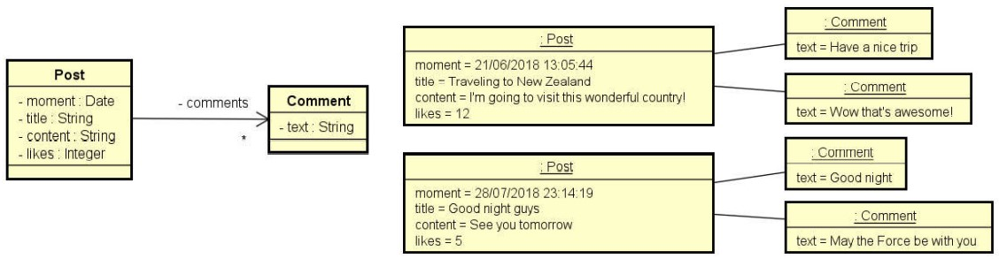

```powershell
Traveling to New Zealand
12 Likes - 21/06/2018 13:05:44
Im going to visit this wonderful country!
Comments:
Have a nice trip
Wow thats awesome!

Good night guys
5 Likes - 28/07/2018 23:14:19
See you tomorrow
Comments:
Good night
May the Force be with you
```

[Exercício resolvido](Workspace/aula152_Exemplo_001)

#### StringBuilder

A classe *StringBuilder* serve para concatenar uma quantidade maior de texto de forma otimizada. Segue exemplo de uso:

```java
@Override
public String toString() {

  StringBuilder sb = new StringBuilder();

  sb.append(title + "\n");
  sb.append(likes + " Likes - " + moment.format(dtf) + "\n");
  sb.append(content + "\n");
  sb.append("Comments:\n");
  for (Comment c : comments) {
    sb.append(c.getText() + "\n");
  }

  return sb.toString();
}
```

### 152. Exercício de fixação

Ler os dados de um pedido com N itens (N fornecido pelo usuário). Depois,  mostrar um sumário do pedido conforme exemplo. Nota: o instante do pedido deve ser o instante do sistema.

#### Diagrama de classes


#### Diagrama de objetos

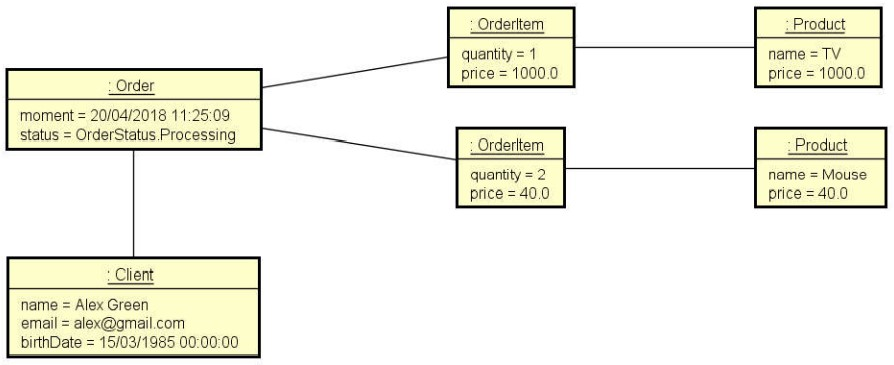

#### Exemplo

```powershell
Enter cliente data:
Name: Alex Green
Email: alex@gmail.com
Birth date (DD/MM/YYYY): 15/03/1985
Enter order data:
Status: PROCESSING
How many items to this order? 2
Enter #1 item data:
Product name: TV
Product price: 1000.00
Quantity: 1
Enter #2 item data:
Product name: Mouse
Product price: 40.00
Quantity: 2

ORDER SUMMARY:
Order moment: 20/04/2018 11:25:09
Order status: PROCESSING
Client: Alex Green (15/03/1985) - alex@gmail.com
Order items:
TV, $1000.00, Quantity: 1, Subtotal: $1000.00
Mouse, $40.00, Quantity: 2, Subtotal: $80.00
Total price: $1080.00
```

[Exercício de fixação](Workspace/aula153_Exercicio_001)

### 153. Correção em vídeo do exercício de fixação

[Link do youtube](https://www.youtube.com/watch?v=gj80JEqk5ms)

[Exercício corrigido](Workspace/aula154_Exercício_001)

## Seção 14: Herança e polimorfismo

### 154. Visão geral do capítulo Herança Se polimorfismo

### 155. Material de apoio do capítulo

[Material de apoio](Recursos/pdf/14-heranca-e-polimorfismo.pdf)

### 156. Herança

**Herança** é um tipo de associação que permite que uma classe herde **todos** os dados e comportamentos de outra.

- Vantagens
  - Reuso
  - Polimorfismo

- Sintaxe: ```class A extends B```

#### Exemplo de uso

Suponha um negócio de banco que possui uma conta comum e uma conta para empresas, sendo que a conta para empresa possui todos os membros da conta comum, mais um limite de empréstimo e uma operação para realizar emprestimo.

[Imagem 1](Recursos/images/aula156-img1.jpg)

Neste caso, considerando que a classe **BusinessAccount** possui todos os atributos e métodos da **Account**, apenas com alguns recursos extras, ao invés de criarmos duas clases, faremos com que a classe **businessAccount** herde da classe **account** os dados e comportamentso em comum.

[Imagem 2](Recursos/images/aula156-img2.jpg)

[Exemplo](Workspace/aula156_Exemplo_001)

#### Modificador de acesso protected

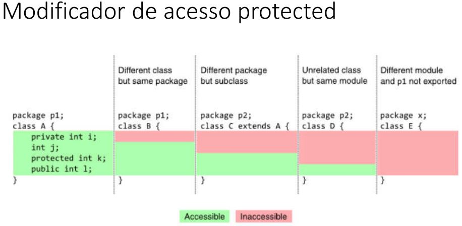

O modificador de acesso *Protected* permite que o atributo seja acessado:

- Em diferentes classes do mesmo pacote;
- Em diferentes pacotes havendo relação de herança.

#### Exemplo de uso

Ainda em relação ao exemplo de uso anterior, suponha que, para realizar um empréstimo, é descontada uma taxa no valor de 10.00.

isso resultaria em um erro:

```java
public void loan(double amount) {
  if (amount <= loanlimite) {
    balance += amount - 10; // Atributos privados, Não acessamos na subclasse.
  }
}
```

Para conseguirmos acessar, temos que modificar os atributos *balance* com o modificador *protected*

[Exemplo](Workspace/aula156_Exemplo_001)

#### Definições importantes

- Relação "*é-um*"
- Generalização/especialização
- superclasse (classe base) / subclasse (classe derivada)
- Herança / extensão
- Herança é uma associação entre classes (e não entre objetos)

### 157. Upcasting e downcasting

- **Upcasting**
  - *Casting* da subclasse para a superclasse
  - Uso comum: **polimorfismo**

- **Downcasting**
  - *Casting* da superclasse para a subclasse
  - palavra *instanceOf*
  - Uso comum: métodos que recebem prâmetros genéricos (ex. **equals**)

#### Exemplo de uso


[Exemplo 1](Workspace/aula157_Exemplo_001)

### 158. Sobreposição, palavra super e anotação @Override

#### Sobreposição ou sobrescrita

É a implementação de um método de uma superclasse na subclasse.

É fortemente recomendável usar a anotação @Override em um método sobrescrito.

- Vantagens
  - Facilita a leitura e compreensão do código
  - Avisamos ao compilador (boa prática)

#### Exemplo de uso

Suponha que a operação de saque possui uma taxa no valor de 5.0. Entretanto, se a conta for do tipo poupança, esta taxa não deve ser cobrada.

Como resolver isso?

Resposta: sobrescrevendo o método **withdraw** na subclasse **SavingsAccount**.

```java
// Método withdraw na classe Account
public void withdraw(Double amount) {
  balance -= amount + 5.0;
}

// Método withdraw sobrescrito na classe SavingsAccount
@Override
public void withdraw(Double amount) {
  balance -= amount;
}
```

[Exemplo 1](Workspace/aula158_Exemplo_001)

#### Palavra super

É possível chamar a implementação da superclasse usando a palavra **super**.

Exemplo: suponha que, na classe BusinessAcount, a regra para saque seja realizar o saque normalmente da superclasse, e descontar mais 2.0.

```java
@Override
public void withdraw(Double amount) {
  super.withdraw(amount);
  balance -= 2.0;
}
```

**Atenção**: é recomendável também a utilização do *super* nos construtores das subclasses para o aproveitamento da lógica da superclasse.

### 159. Classes e métodos final

- Palavra chave: **final**
- **Classe**: evita que a classe seja herdada
  - Exemplo: ```public final class SavingsAccount {```
- **Método**: evita que o método seja sobreposto

#### Exemplo de uso - Classe final

Suponha que você queira evitar que sejam cliadas subclasses de **SavingsAccount**. Ao transforma-la em uma classe final, garantimos que não poderá ser criada uma subclasse desta classe.

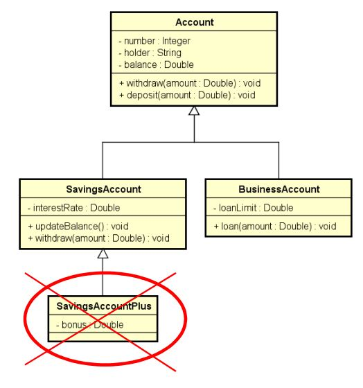

#### Exemplo de uso - Método final

Suponha que você não queira que o método *withdraw* de SavingsAccount seja sobreposto. Para isso basta transforma-lo em um método final:

```java
public final void withdraw(Double amount) {
  balance -= amount;
}
```

#### Motivos para utilização

- **Segurança**: dependendo das regras do negócio, às vezes é desejável garantir que uma classe não seja herdada, ou quue um método não seja sobreposto.
  - Geralmente convém acrescentar **final** em métodos sobrepostos, pois sobreposições múltiplas podem ser uma porta de entrada para inconsistências.
- **Performance**: atributo de tipo de uma classe final são analisados de forma mais rápida em tempo de execução
  - Exemplo clássico: *String*

### 160. Introdução ao polimorfismo

#### Pilares da Programação Orientada a Objetos (OOP)

- Encapsulamento
- Herança
- Polimorfismo

#### Polimorfismo

Em *Programação Orientada a Objetos*, **polimorfismo** é um recurso que permite que variáveis de um mesmo tipo mais genérico possam apontar para objetos de tipos específicos diferentes, tendo assim comportamentos diferentes conforme cada tipo específico

Exemplo:

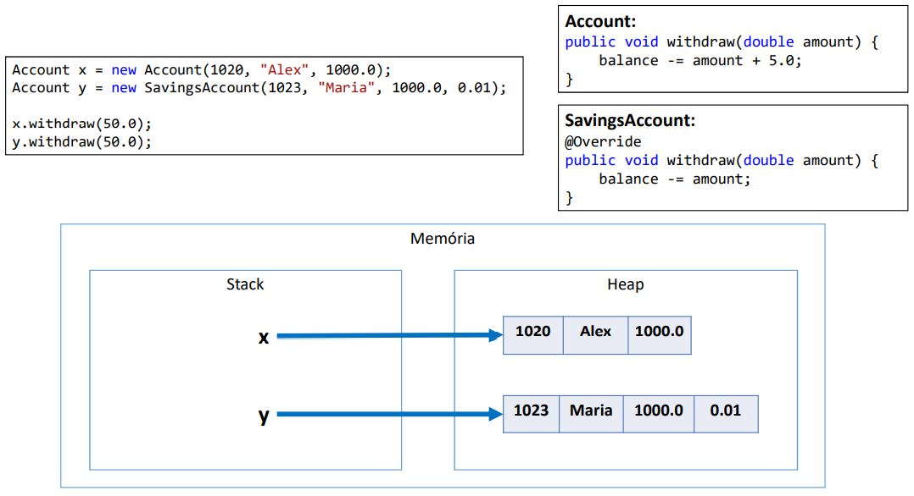

```java
Account x = new Account(1020, "Alex", 1000.0);
Account y = new SavingsAccount(1023, "Maria", 1000.0, 0.01);

x.withdraw(50.0);
y.withdraw(50.00);

System.out.println(x.getBalance()); // 945.0
System.out.println(y.getBalance()); // 950.0
```

[Exemplo 1](Workspace/aula160_Exemplo_001)

#### Importante entender

- A associação do tipo específico com o tipo genérico é feita em tempo de execução (*upcasting*)
- O compilador não sabe para qual tipo específico a chamada do método *withdraw* está sendo feita (Ele só sabe que são duas variáveis do tipo *Account*)

### 161. Exercício resolvido

Uma empresa possui funcionários próprios e terceirizados. Para cada funcionário, deseja-se registrar o nome, horas trabalhadas e valor por hora. Funcionários terceirizados possuem ainda uma despesa adicional.

O pagamento dos funcionários corresponde ao valor da hora multiplicado pelas horas trabalhadas, sendo que os funcionários terceirizados ainda recebem um bônus correspondednte a 110% de sua despesa adicional.

Fazer um programa para ler os dados de N funcionários (N fornecido pelo usuário) e armazená-los em uma lista. Depois de ler todos os dados, mostrar o nome e pagamento de cada funcionários na mesma ordem em que foram digitados.

Construa o programa conforme projeto abaixo e exemplo:

#### Projeto UML

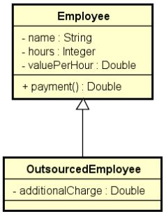

#### Exemplo do programa

```powersheel
Enter the number of employees: 3
Employee #1 data:
Outsourced (y/n)? n
Name: Alex
Hours: 50
Value per hour: 20.00
Employee #2 data:
Outsourced (y/n)? y
Name: Bob
Hours: 100
Value per hour: 15.00
Additional charge: 200.00
Employee #3 data:
Outsourced (y/n)? n
Name: Maria
Hours: 60
Value per hour: 20.00
PAYMENTS:
Alex - $ 1000.00
Bob - $ 1720.00
Maria - $ 1200.00
```

#### Exemplo dos objetos em memória


#### Exercício resolvido

[Exercício resolvido](Workspace/aula161_Exercicio_001)

### 162. Exercício de fixação

Fazer um programa para ler os dados de N produtos (N fornecido pelo usuário). Ao final, mostrar a etiqueta de proço de cada produto na mesma ordem em que foram digitados.

Todo o produto possui nome e preço. Produtos importados possuem uma taxa de alfândega, e produtos usados possuem data de fabricação. Estes dados específicos devem ser acrescentados na etiqueta de preço conforme exemplo abaixo. Para produtos importados, a taxa de alfândega deve ser acrescentada ao preço final do produto.

Favor implementar o programa conforme projeto a seguir.

#### Projeto UML

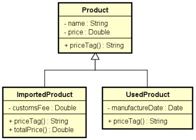

#### Exemplo do programa

```powershell
Enter the number of products: 3
Product #1 data:
Common, used or imported (c/u/i)? i
Name: Tablet
Price: 260.00
Customs fee: 20.00
Product #2 data:
Common, used or imported (c/u/i)? c
Name: Notebook
Price: 1100.00
Product #3 data:
Common, used or imported (c/u/i)? u
Name: Iphone
Price: 400.00
Manufacture date (DD/MM/YYYY): 15/03/2017

PRICE TAGS:
Tablet $ 280.00 (Customs fee: $ 20.00)
Notebook $ 1100.00
Iphone (used) $ 400.00 (Manufacture date: 15/03/2017)
```

#### Resposta do exercício

[Resolução do exercício](Workspace/aula162_Exercício_001)

### 163. Classes abstratas

**Classes abstratas** são classes que não podem ser instanciadas

É uma forma de garantir herança total: somente subclasses não abstratas podem ser instanciadas, mas nunca a superclasse abstrata.

#### Exemplo de uso

Suponha que em um negócio relacionado a banco, apenas contas poupança e contas para empresas são permitidas. Não existe conta comum.

Para garantir que contas comuns não possam ser instanciadas, basta acrescentarmos a palavra "*abstract*" na declaração de classe.

```java
public abstract class Account() {
  (...)
}
```

Em UML, as classes abstratas aparecem com o título em itálico:

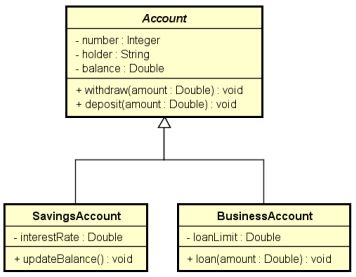

#### Questionamento

Se a classe **Account** não pode ser instanciada, por que simplesmente não criar somente **SavingsAccount** e **BusinessAccount**?

Resposta:

- Reuso
- Polimorfismo: a superclasse genérica nos permite tratar de forma fácil e uniforme todos os tipos de conta, inclusive com polimorfismo se for o caso (como fizemos nos últimos exercícios). Por exemplo, você pode colocar todos os tipos de contas em uma mesma coleção.
- Suponha que você queira totalizar os saldos de todas as contas ou depositar 10.00 em todas as contas, estas operações tornam-se simples com o aproveitamento do polimorfismo.

[Demonstração](Workspace/aula163_Exemplo_001)

### 164. Métodos abstrados

**Métodos abstrados** são aqueles que não possuem implementação.

Estes métodos são utilizados quando a classe é genérica demais para conter sua implementação.

Se uma classe possuir pelo menos um método abstrato, então esta classe também é abstrata.

**Notação UML**: *itálico*

#### Exemplo de uso

Fazer um programa para ler os dados de N figuras (N fornecido pelo usuário), e depois mostrar as áreas desta figuras na mesma ordem em que foram digitadas.

- Diagrama UML

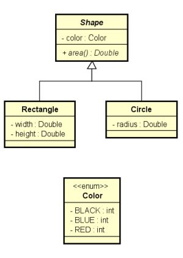

- Exemplo do programa

```powershell
Enter the number of shapes: 2
Shape #1 data:
Rectangle or Circle (r/c)? r
Color (BLACK/BLUE/RED): BLACK
Width: 4.0
Height: 5.0
Shape #2 data:
Rectangle or Circle (r/c)? c
Color (BLACK/BLUE/RED): RED
Radius: 3.0

SHAPE AREAS:
20.00
28.27
```

#### Exercício resolvido

[Exercício resolvido](Workspace\aula164_Exemplo_001)

### 165. Exercício de fixação

Fazer um programa para ler os dados de N contribuíntes (N fornecido pelo usuário), os quais podem ser pessoas físicas ou pessoas jurídicas, e depois mostrar o valor do imposto pago por cada um, bem como o total de imposto arrecadado.

Os dados de pessoa física são: *nome*, *renda anual* e *gastos com saúde*. Os dados de pessoa jurídica são: *nome*, *renda anual* e *número de funcionários*. As regras para cálculo de imposto são as seguintes:

**Pessoa física**: Pessoas cuja renda for abaixo de 20000.00 pagam 15% de imposto. Pessoas com renda de 20000.00 em diante pagam 25% de imposto. Se a pessoa teve gastos com saúde, 50% destes gastos são abatidos no imposto.

**Exemplo**: Uma pessoa cuja renda foi 50000.00 e teve 2000.00 em gastos com saúde, o imposto fica: (50000.00 * 25%) - (2000 * 50%) = **11500.00**

**Pessoa jurídica**: Pessoas jurídicas pagam 16% de imposto. Porém, se a empresa possuir mais de 10 funcionários, ela paga 14% de imposto.

**Exemplo**: uma empresa cuja renda foi 400000.00 e possui 25 funcionários, o imposto fica: 400000.00 * 14% = 56000.00.

#### Diagrama UML

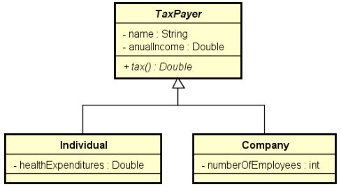

#### Exemplo do programa

```powershell
Enter the number of tax payers: 3
Tax payer #1 data:
Individual or company (i/c)? i
Name: Alex
Anual income: 50000.00
Health expenditures: 2000.00
Tax payer #2 data:
Individual or company (i/c)? c
Name: SoftTech
Anual income: 400000.00
Number of employees: 25
Tax payer #3 data:
Individual or company (i/c)? i
Name: Bob
Anual income: 120000.00
Health expenditures: 1000.00

TAXES PAID:
Alex: $ 11500.00
SoftTech: $ 56000.00
Bob: $ 29500.00

TOTAL TAXES: $ 97000.00
```

#### Implementação

[Exercício resolvido](Workspace/aula165_Exercicio_001)

### 166. Correção em vídeo do exercício de fixação

[Link Youtube](https://www.youtube.com/watch?v=eDsS3JM5iXw)

## Seção 15: Tratamento de exceções

### 167. Visão geral do capítulo Tratamento de Exceções

### 168. Material de apoio do capítulo

[Material de apoio](Recursos/pdf/15-tratamento-de-excecoes.pdf)

### 169. Discussão inicial sobre exceções

Uma **exceção** é qualquer condição de erro ou comportamento inseperado encontrado por um programa **em execução**

Em **Java**, uma exceção é um objeto herado da classe:

- **java.lang.Exception** - O compilador obriga a tratar ou propagar
- **java.lang.RuntimeException** - O compilador não obriga a tratar ou propagar

Quando é lançada, uma exceção é propagada na pilha de chamadas de métodos em execução, até que seja capturada (tratada) ou o programa seja encerrado.

#### Hierarquia de exceções do Java

[Documentação da Oracle](https://docs.oracle.com/en/java/javase/17/docs/api/java.base/java/lang/package-tree.html)

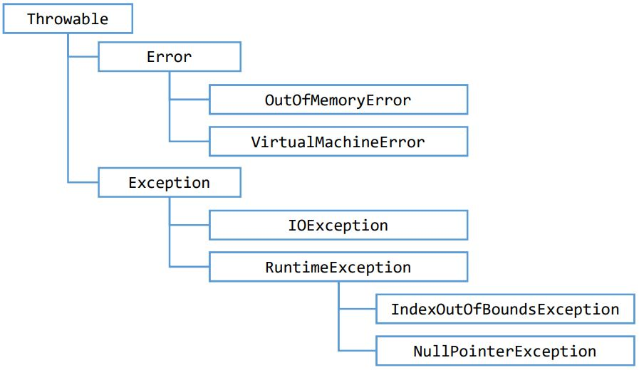

#### Por que exceções?

- O modelo de tratamento de exceções permite que erros sejam tratados de forma consistente e flexível, usando boas práticas

- Vantagens
  - Delega a lógica do erro para a classe responsável por conhecer as regras que cpodem ocasionar o erro;
  - Trata de forma organizada (inclusive hierarquicamente) exceções de tipos diferentes;
  - A exceção pode carregar dados quaisquer.

### 170. Estrutura try-catch

Esta estrutura possui dois blocos de códigos:

- Bloco **try**
  - Contém o código que representa a execução normal do trecho de código que **pode** acarretar em uma exceção

- Bloco **catch**
  - Contém o código a ser executado caso uma exceção ocorra
  - Deve ser especificado o tipo da exceção a ser tratada (upcasting é permitido)

#### Sintaxe

```java
try {

} catch (ExceptionType e) {

} catch (ExceptionType e) {

} catch (ExceptionType e) {

}
```

#### Exemplo de uso

```java
public class Program {

  public static void main(String[] args) {

    Scanner sc = new Scanner(System.in);
    
    String[] vect = sc.nextLine().split(" ");
    int position = sc.nextInt();
    System.out.println(vect[position]);
    
    sc.close();

  }

}
```

O trecho anterior pode gerar duas exceções dependendo da ação do usuário:

- Caso o usuário digite uma letra ao invés de um número - **InputMismatchException**;
- Caso o usuário digite um índice que não existe no vetor - **ArrayIndexOutOfBoundsException**;

Ambos os casos podem ser capturados e tratados com o **try-catch** conforme exemplo a seguir:

```java
public class Program {

  public static void main(String[] args) {

    Scanner sc = new Scanner(System.in);
    
    try {

      String[] vect = sc.nextLine().split(" ");
      int position = sc.nextInt();
      System.out.println(vect[position]);

    } catch (ArrayIndexOutOfBoundsException e) {

      System.out.println("Invalid position!");

    } catch (InputMismatchException e) {

      System.out.println("Input error!");

    }
    
    
    
    System.out.println("End of program");
    
    sc.close();

  }

}
```

[Exemplo](Workspace/aula170_Exemplo_001)

### 171. Pilha de chamadas de métodos (stack trace)

Exemplo de como é possível rastrear o local onde a exceção foi gerada com o uso do ```e.printStackTrace();``` dentro do bloco *catch*.

[Exemplo](Workspace/aula171_Exemplo_001)

### 172. Bloco finally

O block **finally** contém o código a ser executado independente de ter ocorrido ou não uma exceção.

Exemplo: fechar um arquivo, conexão de banco de dados, ou outro recurso específico do processamento.

#### Sintaxe

```java
try {

  (...)

} catch (exceptionType e) {

  (...)

} finally {
  
  (...)

}
```

#### Exemplo de uso

[Exemplo com finally](Workspace/aula172_Exemplo_001)

### 173. Criando exceções personalizadas

#### Sugestão para organização dos pacotes para o model

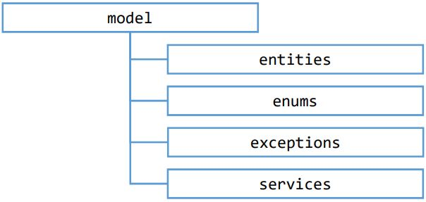

#### Problema exemplo

Fazer um programa para ler os dados de uma reserva de hotel (número de quarto, data de entrada e data de saída) e mostrar os dados da reserva, inclusive sua duração em dias. Em seguida, ler novas datas de entrada e saída, atualizar a reserva, e mostrar novamente a reserva com os dados atualizados. O programa não deve aceitar dados inválidos para a reserva, conforme as seguintes regras:

- Alterações de reserva só podem ocorrer para datas futuras
- A data de saída deve ser maior que a data de entrada

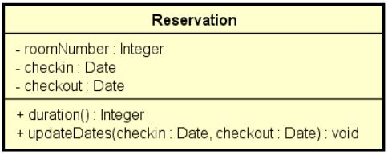

**Exemplos**:

```powershell
Room number: 8021
Check-in date (dd/MM/yyyy): 23/09/2019
Check-out date (dd/MM/yyyy): 26/09/2019
Reservation: Room 8021, check-in: 23/09/2019, check-out: 26/09/2019, 3 nights

Enter data to update the reservation:
Check-in date (dd/MM/yyyy): 24/09/2019
Check-out date (dd/MM/yyyy): 29/09/2019
Reservation: Room 8021, check-in: 24/09/2019, check-out: 29/09/2019, 5 nights
```

```powershell
Room number: 8021
Check-in date (dd/MM/yyyy): 23/09/2019
Check-out date (dd/MM/yyyy): 21/09/2019
Error in reservation: Check-out date must be after check-in date
```

```powershell
Room number: 8021
Check-in date (dd/MM/yyyy): 23/09/2019
Check-out date (dd/MM/yyyy): 26/09/2019
Reservation: Room 8021, check-in: 23/09/2019, check-out: 26/09/2019, 3 nights

Enter data to update the reservation:
Check-in date (dd/MM/yyyy): 24/09/2015
Check-out date (dd/MM/yyyy): 29/09/2015
Error in reservation: Reservation dates for update must be future dates
```

```powershell
Room number: 8021
Check-in date (dd/MM/yyyy): 23/09/2019
Check-out date (dd/MM/yyyy): 26/09/2019
Reservation: Room 8021, check-in: 23/09/2019, check-out: 26/09/2019, 3 nights

Enter data to update the reservation:
Check-in date (dd/MM/yyyy): 24/09/2020
Check-out date (dd/MM/yyyy): 22/09/2020
Error in reservation: Check-out date must be after check-in date
```

### 174. Primeira solução - muito ruim

Nesta solução, a lógica de validação estão todas no programa principal, sem delegar a classe *reserva*.

[Primeira solução](Workspace/aula174_Exemplo_001)

### 175. Segunda solução - ruim

Nesta solução, a lógica de validação é delegada para a classe reserva, contudo o método retorna uma String com o erro.

- A semântica da operação é prejudicada
  - retornar *String* não tem nada a ver com a atualização da reserva
  - E se a operação tivesse que retornar uma String?
- Ainda não é possível tratar exceções em construtores
- Ainda não há auxílio do compilador: o programador deve "*lembrar*" de verificar se houve erro.
- A lógica fica estruturada em condicionais aninhadas.

[Segunda solução](Workspace/aula175_Exemplo_001)

### 176. Terceira solução - boa

Nesta solução, usaremos o tratamento de exceções.

[Terceira solução](Workspace/aula176_Exemplo_001)

#### Resumo

- Cláusula **throws**: propaga a exceção ao invés de trata-la
- Cláusula **throws**: Lança a exceção, interrompendo a execução do método
- **Exception**: Compilador obriga a tratar ou propagar
- **RuntimeException**: Compilador não obriga
- O modelo de tratamento de exceções permite que erros sejam tratados de forma consistente e flexível, usando boas práticas
- Vantagens
  - Lógica delegada
  - Construtores podem ter tratamento de exceções
  - Possibilidade de auxílio do compilador (*exception*)
  - Código mais simples. Não há aninhamento de condicionais: a qualquer momento que uma exceção for disparada, a execução é interrompida e cai no bloco catch correspondente.
  - É possível capturar inclusive outras exceções de sistema

### 177. Exercício de fixação

Fazer um programa para ler os dados de uma conta bancária e depois realizar um saque nesta conta bancária, mostrando o novo saldo. Um saque não pode ocorrer ou se não houver saldo na connta, ou se o valor do saque for superior ao limite de saque da conta. Implemente a conta bancária conforme projeto abaixo:

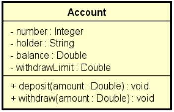

#### Exemplos de execução:

```powershell
Enter account data
Number: 8021
Holder: Bob Brown
Initial balance: 500.00
Withdraw limit: 300.00

Enter amount for withdraw: 100.00
New balance: 400.00
```

```powershell
Enter account data
Number: 8021
Holder: Bob Brown
Initial balance: 500.00
Withdraw limit: 300.00

Enter amount for withdraw: 400.00
Withdraw error: The amount exceeds withdraw limit
```

```powershell
Enter account data
Number: 8021
Holder: Bob Brown
Initial balance: 500.00
Withdraw limit: 300.00

Enter amount for withdraw: 800.00
Withdraw error: The amount exceeds withdraw limit
```

```powershell
Enter account data
Number: 8021
Holder: Bob Brown
Initial balance: 200.00
Withdraw limit: 300.00

Enter amount for withdraw: 250.00
Withdraw error: Not enough balance
```

#### Resolução

[Exercício resolvido](Workspace/aula177_Exemplo_001)

### 178. Correção do exercício de fixação

[link do youtube](177. Exercício de fixação)

## Seção 16: Projeto: Sistema jogo de xadrez

### 179. Visão geral do capítulo Sistema Jogo de Xadrez

#### Objetivo geral

Aplicar os conhecimentos apreendidos até o momento no curso para a construção de um projeto

#### Design do sistema (UML)


#### Link do projeto

Este projeto estará em uma versão única no link abaixo, porém serão realizados commits a cada nova aula possibilitando acompanhar a atualização do projeto.

[Chess System](Workspace/aula181_Chess_System)

### 180. Material de apoio do capítulo

[Material de apoio](Recursos/pdf/16-projeto-sistema-xadrez.pdf)

### 181. Criando projeto e repositório Git

#### Checklist:

- Github: create a new project
  - **Note**: choose **.gitignore** for type as Java
- Open a terminal in project folder, and perform the following commands:
  - ```git init```
  - ```git remote add origin https://github.com/acenelio/chess-system-java.git```
  - ```git pull origin master```
  - ```git add .```
  - ```git commit -m "Project created"```
  - ```git push -u origin master```

### 182. Primeira classe - Position

#### Checklist

- Class Position [public]
- **OOP Topics**:
  - Encapsulation
  - Constructors
  - toString (Object / Overriding)

### 183. Começando a implementar Board e Piece

#### Checklist

- Classes Piece, Board [public]
- **OOP Topics**
  - Associations
  - Encapsulation / Access Modifiers
- **Data Structures Topics**
  - Matrix

### 184. Camada Chess e imprimindo o tabuleiro

```java
8 - - - - - - - -
7 - - - - - - - -
6 - - - - - - - -
5 - - - - - - - -
4 - - - - - - - -
3 - - - - - - - -
2 - - - - - - - -
1 - - - - - - - -
  a b c d e f g h
```

#### Checklist

- Methods: Board.Piece(row, column) and Board.Piece(position)
- Enum Chess.Color
- Class Chess.ChessPiece [public]
- Class Chess.ChassMatch [public]
- Class ChessConsole.UI
- **OOP Topics**
  - Enumerations
  - Encapsulation / Access Modifiers
  - Inheritance
  - Downcasting
  - Static members
  - Layers pattern
- **Data Structures Topics**
  - Matrix

### 185. Colocando peças no tabuleiro

#### Checklist

- Method: Board.PlacePiece(peice, position)
- Classes: Rock, Kink [public]
- Method: ChessMatch.initialSetup
- **OOP Topics:**
  - inheritance
  - Overriding
  - Polymorphism (toString)

### 186. BoardException e programação defensiva

#### Checklist

- Class BoardException [public]
- Methods: Board.PositionExists, Board.ThereIsAPlace
- Implement defensive programming in Board Methods
- **OOP Topics**
  - Exceptions
  - Constructors (a String must be informed to the exception)

### 187. ChessException e ChessPosition

#### Checklist

- Class ChessException [public]
- Class chessPosition [public]
- Refactor ChessMatch.InitialSetup
- **OOP Topics**
  - Exceptions
  - Encapsulation
  - Constructors (a string must be informed to the exception)
  - Overriding
  - Static members
  - Layers pattern

### 188. Pequena melhoria na impressão do tabuleiro

#### Color in terminal

Windows: git bash
Mac: Google "osx terminal color"

#### Executando programa no terminal

- Acessar a pasta **bin** na pasta do projeto. Exemplo: ```cd Projetos\curso-java-1\Workspace\aula181_Chess_System\bin```
- Digitar o comando: ```java application/Program```

#### Checklist

- Place more pieces on the board
- Distinguish piece colors in UI PrintPiece method
- Referência para inclusão das cores: [link](https://stackoverflow.com/questions/5762491/how-to-print-color-in-console-using-system-out-println)

### 189. Movendo peças

#### Checklist

- Method Board.RemovePiece
- Method UI.ReadChessPosition
- Method ChessMatch.PerformChessMove
  - Method ChessMatch.MakeMove
  - Method ChessMatch.ValidadeSourcePosition
- Write basic logic on Program.cs
- **OOP Topics**
  - Exceptions
  - Encapsulation

### 190. Tratando exceções e limpando a tela

#### Clear screen using Java

Referência: [link](https://stackoverflow.com/questions/2979383/how-to-clear-the-console)

```java
public static void clearScreen() {
  System.out.print("\033[H\033[2J"); 
  System.out.flush();
}
```

#### Checklist

- ChessException
- InputMismatchException

### 191. Movimentos possíveis de uma peça

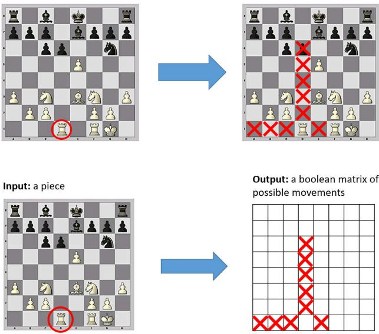

#### Checklist

- Methods in Piece:
  - PossibleMoves [abstract]
  - PossibleMove
  - IsThereAnyPossibleMove
- Basic PossibleMove implementation for Rook and King
- Update ChessMatch.ValidadeSourcePosition
- **OOP Topics**:
  - Abstract method / class
  - Exceptions

### 192. Implementando movimentos possíveis da Torre

#### Checklist

- Method ChessPiece.IsThereOpponentPiece(position) [protected]
- Implement Rook.PossibleMoves
- Method ChessMatch.ValidateTargetPosition
- **OOP Topics**:
  - Polymorphism
  - Encapsulation / access modifiers [protected]
  - Exceptions

### 193. Imprimindo os movimentos possíveis

#### Checklist

- Method ChessMatch.PossibleMoves
- Method UI.PrintBoard [overload]
- Refactor main program logic
- **OOP Topics**:
  - Overloading

### 194. Implementando os movimentos possíveis do Rei

#### Checklist

- Method King.CanMove(position) [private]
- Implement King.PossibleMoves
- **OOP Topics**:
  - Encapsulation
  - Polymorphism

### 195. Trocando de jogador a cada turno

#### Checklist

- Class ChessMatch:
  - Properties Turn, CurrentPlayer [private set]
  - Method NextTurn [private]
  - Update PerformChessMove
  - Update ValidadeSourcePosition
- Method UI.PrintMatch
- **OOP Topics**:
  - Encapsulation
  - Exceptions

### 196. Manipulando peças capturadas

- Method UI.PrintCapturedPieces
- Update UI.PrintMatch
- Update Program logic
- Lists in ChessMatch: _piecesOnTheBoard, _capturedPieces
  - Update PlaceNewPiece
  - Update constructor
  - Update MakeMove
- **OOP Topics**:
  - Encapsulation
  - Constructors
- **Data Structures Topics**:
  - List

### 197. Lógica de xeque - PARTE 1

#### Rules

- Check means your king is under threat by at least one opponet piece
- You can't put yourself in check

#### Checklist

- Property ChessPiece.ChessPosition [get]
- Class ChessMatch:
  - Method UndoMove
  - Property Check [private set]
  - Method Opponent [private]
  - Method King(color) [private]
  - Method TestCheck
  - Update PerformChessMove
- Update UI.PrintMatch

### 198. Lógica de xeque - PARTE 2

### 199. Lógica do xequemate

#### Checklist

- Class ChessMatch:
  - Property Checkmate [private set]
  - Method TestCheckmate [private]
  - Update PerformChessMove
- Update UI.PrintMatch
- Update Program logic

### 200. Contagem de movimentos das peças

#### Checklist

- Class ChessPiece:
  - Property MoveCount [private set]
  - Method IncreaseMoveCount [internal]
  - Method DecreaseMoveCount [internal]
- Class ChessMatch:
  - Update MakeMove
  - Update UndoMove
- **OOP Topics**:
  - Encapsulation

### 201. Peão

#### Checklist

- Class Pawn
- Update ChessMatch.InitialSetup
- **OOP Topics**:
  - Encapsulation
  - Inheritance
  - Polymorphism

### 202. Bispo

#### Checklist

- Class Bishop
- Update ChessMatch.InitialSetup
- **OOP Topics**:
  - Encapsulation
  - Inheritance
  - Polymorphism

### 203. Cavalo

#### Checklist

- Class Knight
- Update ChessMatch.InitialSetup
- **OOP Topics**:
  - Encapsulation
  - Inheritance
  - Polymorphism

### 204. Rainha

#### Checklist

- Class Queen
- Update ChessMatch.InitialSetup
- **OOP Topics**:
  - Encapsulation
  - Inheritance
  - Polymorphism

### 205. Jogada especial Roque - PARTE 1

#### Checklist

- Update King
- Update ChessMatch.MakeMove
- Update ChessMatch.UndoMove

### 206. Jogada especial Roque - PARTE 2

### 207. Jogada especial en passant - PARTE 1

#### Checklist

- Register a pawn which can be captured by en passant on next turn
  - Property ChessMatch.EnPassantVulnerable
  - Update ChessMatch.PerformChessMove
- Update Pawn.PossibleMoves
- Update ChessMatch.MakeMove
- Update ChessMatch.UndoMove
- Update ChessMatch.InitialSetup

### 208. Jogada especial en passant - PARTE 2

### 209. Jotada especial promoção

#### Checklist

- Property ChessMatch.Promoted
- Update ChessMatch.PerformChessMove
- Method ChessMatch.ReplacePromotedPiece
- Update Program logic

### 210. Atualização de compliance

### 211. Dando um tratamento melhor para a promoção

## Seção 17: Trabalhando com arquivos

### 212. Visão geral do capítulo trabalhando com arquivos

### 213. Material de apoio do capítulo

[Material de apoio](Recursos/pdf/17-arquivos.pdf)

### 214. Lendo arquivo texto com clesses File e Scanner

#### Classes

- File - Representação abstrata de um arquivo e seu caminho. [Documentação](https://docs.oracle.com/en/java/javase/17/docs/api/java.base/java/io/File.html)

- Scanner - Leitor de texto. [Documentação](https://docs.oracle.com/en/java/javase/17/docs/api/java.base/java/util/Scanner.html)

- IOException (Exception). [Documentação](https://docs.oracle.com/en/java/javase/17/docs/api/java.base/java/io/IOException.html)

[Exemplo 1](Workspace/aula214_Exemplo_001)

### 215. FileReader e BufferedReader

#### Classes

- FileReader (stream de leitura de caracteres a partir de arquivos). [Documentação](https://docs.oracle.com/en/java/javase/17/docs/api/java.base/java/io/FileReader.html)
  
- BufferedReader (mais rápidos). [Documentação](https://docs.oracle.com/en/java/javase/17/docs/api/java.base/java/io/BufferedReader.html)

- Diferenças entre as classes FileReader e BufferedReader. [Link](https://docs.oracle.com/en/java/javase/17/docs/api/java.base/java/io/BufferedReader.html)

[Exemplo 1](Workspace/aula215_Exemplo_001)

### 216. Bloco try-with-resources

- É um bloco *try* que declara um ou mais recursos, e garante que esses recursos serão fechados ao final do bloco.
- Este recurso está disponível do Java 7 em diante.

- [Documentação](https://docs.oracle.com/javase/tutorial/essential/exceptions/tryResourceClose.html)

[Exemplo 1](Workspace/aula216_Exemplo_002)

### 217. FileWriter e BufferedWriter

#### Classes

- FileWriter (stream de esc rita de caracteres em arquivos). [Documentação](https://docs.oracle.com/en/java/javase/17/docs/api/java.base/java/io/FileWriter.html)
  - Cria / recria o arquivo: ```new FileWriuter(path)```
  - Acrescenta ao arquivo existente: ```new FileWriter(path, true)```

- BufferedWriter (mais rápido). [Documentação](https://docs.oracle.com/en/java/javase/17/docs/api/java.base/java/io/BufferedWriter.html)

[Exemplo 1](Workspace/aula217_Exemplo_001)

### 218. Manipulando pastas com File

[Exemplo 1](Workspace/aula218_Exemplo_001)

### 219. Informações do caminho do arquivo

[Exemplo 1](Workspace/aula219_Exemplo_001)